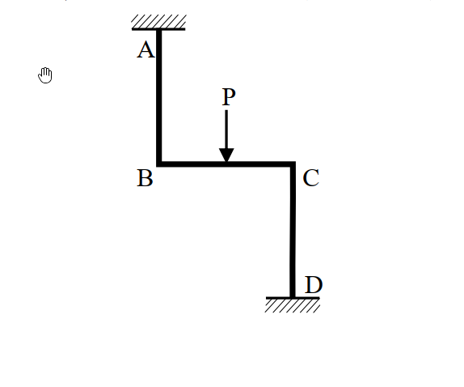

# 考題編號：SA-2018-2

**主分類：** 靜不定結構之矩陣分析法 (SA-U2-4)
**副分類：** 
**分析法：** 矩陣分析法
**標籤：** `直接勁度法` `勁度矩陣` `節點外力向量` `彎矩圖`

---

## 1. 原始題目重述 (Problem Restatement)
二、撓曲構架如下圖，在水平桿件 BC 中央承受向下外力 P 作用。假設所有桿件 EI 值固定且長度均為 L，軸向變形及剪力變形均可忽略。請畫結構圖並定義自由度編號，然後建立勁度矩陣及節點外力向量，並以直接勁度法求解各自由度位移（以其他方法計算不予計分）。接著，請繪製彎矩圖，必須標示所有桿件節點處、局部最大或最小處之值。（25 分）

*圖說：曲折構架 A-B-C-D，A 點為頂部固定端，AB 為垂直柱；B 點剛接 BC 水平樑，跨中受向下外力 P；C 點剛接 CD 垂直柱，D 點為底部固定端。各段長度皆為 L。*

## 2. 考題核心精神與出題者意圖 (Core Concepts & Examiner's Intent)
本題測驗考生對於**直接勁度法 (Direct Stiffness Method)** 的標準操作流程是否熟練。核心要求包含：
1. 正確選定並編號系統的獨立自由度（需判斷忽略軸向變形下的側移自由度）。
2. 組裝整體勁度矩陣 $[K]$（特別考驗左右兩根垂直柱因節點位置不同，對側移與旋轉耦合項 $K_{12}, K_{13}$ 的正負號判斷）。
3. 計算等效節點外力向量 $\{P\}$。
4. 解方程式求得位移後，回代求端彎矩並繪製精確的 BMD。

## 3. 解題戰略地圖與陷阱分析 (Strategic Roadmap & Trap Analysis)
- **戰略一：確認自由度**
  忽略軸向變形，A、D 固定，故 $v_B = v_A = 0$，$v_C = v_D = 0$。水平樑 BC 不可伸長，故 $u_B = u_C = u$。系統共有 3 個獨立自由度：側移 $u$、節點 B 旋轉 $\theta_B$、節點 C 旋轉 $\theta_C$。
- **戰略二：建立 $[K]$ 與 $\{P\}$**
  分別計算 AB 柱、BC 樑、CD 柱對各自由度的勁度貢獻，並利用 BC 跨中載重求固端彎矩，反向施加於節點得 $\{P\}$。
- **陷阱**：
  1. **座標系與符號約定**：AB 柱與 CD 柱的頂底關係不同。AB 柱是頂部固定、底部活動；CD 柱是頂部活動、底部固定。這會導致它們在側移 $u$ 時，引發的端點彎矩方向相反，進而使 $K_{12}$ 與 $K_{13}$ 的符號一正一負。若直接死背公式極易出錯。
  2. **對稱性誤判**：雖然載重與幾何形狀看起來有些對稱，但這是「點對稱 (反對稱)」構架，向下力會打破點對稱性，最終產生側移 $u \neq 0$。

## 3.5 變數層次分析 (Variable Hierarchy Analysis)

### 最終目標
建立 $[K]\{D\} = \{P\}$ 並求解位移 $D_1, D_2, D_3$，進而繪製全結構 BMD。

### 本題關鍵公式（依計算順序）
$$ [K] = \sum [K]_{member} $$
（組裝整體勁度矩陣）
$$ \boxed{\{P\}} = -\{FEM\} $$
（等效節點外力向量）
$$ \{D\} = \boxed{[K]}^{-1} \boxed{\{P\}} $$
（求解節點位移向量）
$$ M_{end} = M_{FEM} + \sum K_{ij} D_j $$
（回代求桿端彎矩）

### L1：題目直接給定
- 桿件長度 ∣ $L$ ∣ 所有桿件等長
- 彎曲剛度 ∣ $EI$ ∣ 固定常數
- 載重 ∣ $P$ ∣ BC 中點向下

### L2：需知識點推導
**局部勁度與固端力**
- 側移勁度 ∣ $12EI/L^3$, $6EI/L^2$ ∣ 柱件側移產生之剪力與彎矩
- 旋轉勁度 ∣ $4EI/L$, $2EI/L$ ∣ 節點旋轉產生之彎矩
- 固端彎矩 ∣ $PL/8$ ∣ 跨中集中力之 FEM

### L3：深層知識（不懂就卡住）
- 勁度符號判斷 ∣ AB 柱與 CD 柱對側移的耦合勁度 $K_{12}$ 與 $K_{13}$ 符號相反。 ∣

## 4. 步驟化詳細計算過程 (Step-by-Step Detailed Calculation)

### Step 1: 定義結構圖與自由度編號
為符合直接勁度法規範，定義以下 3 個系統自由度（正向約定：向右、逆時針為正）：
- $D_1 = u$：節點 B、C 的水平向右側移
- $D_2 = \theta_B$：節點 B 的逆時針旋轉角
- $D_3 = \theta_C$：節點 C 的逆時針旋轉角

### Step 2: 建立勁度矩陣 $[K]$
依序考慮給定單一自由度單位位移時，各節點所需之對應外力：

1. **令 $D_1 = 1$ ($u=1$, $\theta_B=0, \theta_C=0$)：**
   - AB 柱（頂部固定，底部右移）：需水平力 $12EI/L^3$、節點 B 需彎矩 $-6EI/L^2$ (順時針)。
   - CD 柱（底部固定，頂部右移）：需水平力 $12EI/L^3$、節點 C 需彎矩 $+6EI/L^2$ (逆時針)。
   - $K_{11} = \frac{12EI}{L^3} + \frac{12EI}{L^3} = \frac{24EI}{L^3}$
   - $K_{21} = -\frac{6EI}{L^2}$
   - $K_{31} = \frac{6EI}{L^2}$

2. **令 $D_2 = 1$ ($u=0$, $\theta_B=1, \theta_C=0$)：**
   - AB 柱：產生 B 端彎矩 $4EI/L$，並需水平力 $-6EI/L^2$ 以維持 $u=0$。
   - BC 樑：產生 B 端彎矩 $4EI/L$、C 端彎矩 $2EI/L$。
   - $K_{12} = -\frac{6EI}{L^2}$
   - $K_{22} = \frac{4EI}{L} + \frac{4EI}{L} = \frac{8EI}{L}$
   - $K_{32} = \frac{2EI}{L}$

3. **令 $D_3 = 1$ ($u=0$, $\theta_B=0, \theta_C=1$)：**
   - CD 柱：產生 C 端彎矩 $4EI/L$，並需水平力 $+6EI/L^2$ 以維持 $u=0$。
   - BC 樑：產生 C 端彎矩 $4EI/L$、B 端彎矩 $2EI/L$。
   - $K_{13} = \frac{6EI}{L^2}$
   - $K_{23} = \frac{2EI}{L}$
   - $K_{33} = \frac{4EI}{L} + \frac{4EI}{L} = \frac{8EI}{L}$

組裝得整體勁度矩陣：
$$ [K] = \begin{bmatrix} 
\frac{24EI}{L^3} & -\frac{6EI}{L^2} & \frac{6EI}{L^2} \\ 
-\frac{6EI}{L^2} & \frac{8EI}{L} & \frac{2EI}{L} \\ 
\frac{6EI}{L^2} & \frac{2EI}{L} & \frac{8EI}{L} 
\end{bmatrix} $$

### Step 3: 建立節點外力向量 $\{P\}$
BC 樑中點受向下力 P，其固端彎矩為：
- $FEM_{BC} = -\frac{PL}{8}$ (順時針)
- $FEM_{CB} = +\frac{PL}{8}$ (逆時針)

將固端力反向施加於節點形成等效節點載重：
- $P_1 = 0$ (無直接水平外力)
- $P_2 = -FEM_{BC} = \frac{PL}{8}$
- $P_3 = -FEM_{CB} = -\frac{PL}{8}$

$$ \{P\} = \begin{bmatrix} 0 \\ \frac{PL}{8} \\ -\frac{PL}{8} \end{bmatrix} $$

### Step 4: 求解各自由度位移
解矩陣方程式 $[K]\{D\} = \{P\}$：
1) $\frac{24EI}{L^3} D_1 - \frac{6EI}{L^2} D_2 + \frac{6EI}{L^2} D_3 = 0 \implies D_1 = \frac{L}{4}(D_2 - D_3)$
2) $-\frac{6EI}{L^2} D_1 + \frac{8EI}{L} D_2 + \frac{2EI}{L} D_3 = \frac{PL}{8}$
3) $\frac{6EI}{L^2} D_1 + \frac{2EI}{L} D_2 + \frac{8EI}{L} D_3 = -\frac{PL}{8}$

將 $D_1$ 代入 2) 與 3) 並兩式相加，可得 $10\frac{EI}{L}(D_2 + D_3) = 0 \implies D_3 = -D_2$。
代回原式解得：
$$ \boxed{ D_1 = u = \frac{PL^3}{48EI} } $$
$$ \boxed{ D_2 = \theta_B = \frac{PL^2}{24EI} } $$
$$ \boxed{ D_3 = \theta_C = -\frac{PL^2}{24EI} } $$

### Step 5: 繪製彎矩圖 (BMD)
計算各桿端彎矩 (以逆時針為正)：
- $M_{AB} = \frac{2EI}{L} \theta_B - \frac{6EI}{L^2} u = \frac{PL}{12} - \frac{PL}{8} = -\frac{PL}{24}$ (順時針，左側受拉)
- $M_{BA} = \frac{4EI}{L} \theta_B - \frac{6EI}{L^2} u = \frac{PL}{6} - \frac{PL}{8} = \frac{PL}{24}$ (逆時針，左側受拉)
- $M_{BC} = \frac{2EI}{L}(2\theta_B + \theta_C) - \frac{PL}{8} = \frac{PL}{12} - \frac{PL}{8} = -\frac{PL}{24}$ (順時針，上方受拉)
- $M_{CB} = \frac{2EI}{L}(2\theta_C + \theta_B) + \frac{PL}{8} = -\frac{PL}{12} + \frac{PL}{8} = \frac{PL}{24}$ (逆時針，上方受拉)
- $M_{CD} = \frac{2EI}{L}(2\theta_C) + \frac{6EI}{L^2} u = -\frac{PL}{6} + \frac{PL}{8} = -\frac{PL}{24}$ (順時針，左側受拉)
- $M_{DC} = \frac{2EI}{L}(\theta_C) + \frac{6EI}{L^2} u = -\frac{PL}{12} + \frac{PL}{8} = \frac{PL}{24}$ (逆時針，左側受拉)

**BC樑跨中最大彎矩：**
$M_{mid} = \frac{PL}{4} - \frac{PL}{24} = \frac{5PL}{24}$ (下方受拉)

> 📊 **彎矩圖 (BMD) 標示說明：**
> - **AB 柱**：全段均勻彎矩 $PL/24$，畫於柱**左側** (外側)。
> - **CD 柱**：全段均勻彎矩 $PL/24$，畫於柱**左側** (內側)。
> - **BC 樑**：B、C 兩端彎矩為 $PL/24$ 畫於樑**上方**；跨中最大正彎矩為 $5PL/24$ 畫於樑**下方**，呈兩段直線折線。
*(請參見系統生成的互動圖 SA-2018-2-sfd-bmd-viz.html)*

## 5. 關鍵爭議點與進階探討 (Critical Issues & Advanced Discussion)
- **剪力消失現象**：由算出的柱端彎矩可知，$M_{AB} + M_{BA} = 0$，這意味著 AB 柱的剪力為零；同理 CD 柱的剪力亦為零。這是一個非常優雅的力學結果：外加垂直載重在此特定「點對稱幾何」構架中，並未在柱中引發任何剪力，兩根柱子處於「純彎曲」狀態，進而產生側移 $u$。
- **對稱性迷思**：考生常會誤以為垂直載重置中，結構就不會發生側移。然而本題構架為 Z 字型（點對稱而非鏡像對稱），其勁度矩陣存在不平衡的耦合項，因此垂直力會誘發側向位移，不可將側移自由度 $u$ 假設為 0。
