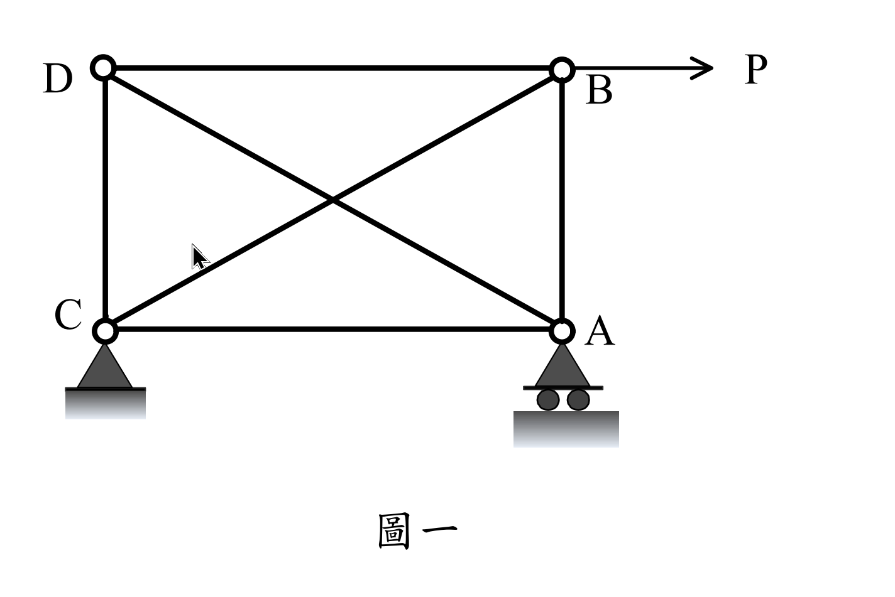

# 考題編號：SA-2019-1

**主分類：** `SA-U2-1` 靜不定結構最小功法
**副分類：** `SA-U1-1` 靜不定度與穩定性之判斷
**分析法：** 最小功法 / 靜定分析
**標籤：** `靜不定桁架` `最小功法` `破壞機構` `挫曲` `極限載重`

---

## 1. 原始題目重述 (Problem Restatement)

如圖一所示之桁架，各桿件都有相同之楊氏模數 $E$ 及斷面積 $A$。已知對角桿件長 $15\text{ m}$，水平桿件長 $12\text{ m}$，垂直桿件長 $9\text{ m}$。若各桿件之軸拉強度都為 $1250\text{ kN}$，而軸壓強度如下：對角桿件 $144\text{ kN}$、水平桿件 $225\text{ kN}$、垂直桿件 $400\text{ kN}$。今考慮 B 點受一向右之力 $P$，若 $P$ 由 0 逐漸加大，則 B 點之向右位移 $U_B$ 也會逐漸加大，直至最後桁架會形成破壞機構。試求出破壞機構形成時對應之極限外力，並且以 $P$ 為縱軸 $U_B$ 為橫軸，試繪出加載至破壞機構過程中 $P$ 對 $U_B$ 的定性（大致）關係圖。

假設各桿件強度達到之前都是線彈性，而強度達到後，張桿內力可以維持其強度但壓桿內力變為零，此外不論張或壓桿，強度達到後勁度都為零。（25 分）

*圖說：桁架寬 12m、高 9m，包含兩交叉對角桿長 15m。左下支承 C 為鉸接，右下支承 A 為滾支承。B 點受向右之外力 P。*

## 2. 考題核心精神與出題者意圖 (Core Concepts & Examiner's Intent)

本題旨在測驗考生對於**靜不定桁架的內力分析（最小功法）**以及**結構非線性行為（構件挫曲失效後的內力重分配）**的掌握。
出題者特別設定「壓桿強度達到後內力變為零（挫曲喪失承載力）」，考驗考生能否判斷出第一構件失效後，結構退化為靜定桁架，並繼續承受載重直到下一個構件失效形成「破壞機構」。同時，要求繪製 $P-U_B$ 關係圖，測驗對於「勁度變化」與「位移跳躍」等行為的物理直覺。

## 3. 解題戰略地圖與陷阱分析 (Strategic Roadmap & Trap Analysis)

1. **第一階段（靜不定分析）：**
   - 結構具有一根多餘桿件（一度靜不定），選定對角桿 DA 內力為贅力 $T$。
   - 利用節點法寫出各桿內力（以 $P$ 和 $T$ 表示）。
   - 利用最小功法（$\frac{\partial U}{\partial T} = 0$）解出 $T$ 與 $P$ 的關係，並求出第一階段的 $U_B$。
2. **第一破壞點尋找：**
   - 將 $T$ 代回各桿內力，找出最先達到強度極限的構件（需區分拉壓極限）。
   - 壓桿失效後內力歸零，求出此時的外力 $P_1$。
3. **第二階段（靜定分析與內力重分配）：**
   - 第一構件失效後，結構退化為靜定桁架。計算瞬間位移跳躍。
   - 繼續增加 $P$，直到下一個構件達到強度極限，此時結構無法維持平衡，即形成破壞機構。
   - 求出極限外力 $P_{ult}$ 及對應的最終位移。

> [!WARNING] **陷阱警告**
> 1. **壓桿失效行為：** 題目明訂「壓桿內力變為零」，而非維持降伏強度。這代表挫曲後會發生內力重分配與位移的瞬間跳躍（Snap-through）。
> 2. **底弦桿 AC 的存在：** 雖然 A 點為滾支承不提供水平反力，但 AC 桿仍是桁架系統的一部分，受力不為零，必須計入應變能中。

## 3.5 變數層次分析 (Variable Hierarchy Analysis)

> 複習提示：第一次解題後，在每個卡住的知識點旁標記 `⚠`；第二次複習時只看有 `⚠` 的項目。

### 最終目標
`計算各階段失效載重與位移，並繪製 P-UB 關係圖`

### 本題關鍵公式（依計算順序）

> $\boxed{\cdot}$ = 需由前步驟推導，非題目直接給定的變數

$$\text{Step 1: } \frac{\partial U}{\partial T} = \sum \left( \frac{F_i \cdot L_i}{EA} \cdot \frac{\partial F_i}{\partial T} \right) = 0$$

$$\text{Step 2: } P_1 = \min \left( \frac{\text{Capacity}_i}{| \boxed{F_i} |} \right)$$

$$\text{Step 3: } U_B = \sum \frac{\boxed{F_i} \cdot f_i \cdot L_i}{EA}$$

### L1：題目直接給定

| 符號 | 數值 | 說明 |
|------|------|------|
| $L_h$ | $12\text{ m}$ | 水平桿長度 |
| $L_v$ | $9\text{ m}$ | 垂直桿長度 |
| $L_d$ | $15\text{ m}$ | 對角桿長度 |

### L2：需知識點推導

**Step 1：最小功法求贅力**

| 符號 | 公式/來源 | 卡關? |
|------|----------|:-----:|
| $T$ | $\sum F_i \frac{\partial F_i}{\partial T} L_i = 0$ | |

**Step 2：位移計算**

| 符號 | 公式/來源 | 卡關? |
|------|----------|:-----:|
| $U_B$ | 單位力法 $U_B = \sum \frac{F_i f_i L_i}{EA}$ | |

### L3：深層知識（不懂就卡住）

| 知識點 | 說明 | 卡關? |
|--------|------|:-----:|
| 失效機制的轉換 | 壓桿挫曲後內力歸零，結構靜不定度降低一度，變為靜定結構。 | |
| 破壞機構的定義 | 靜定結構若再有一桿件失效，即無法維持靜力平衡，形成破壞機構。 | |

## 4. 步驟化詳細計算過程 (Step-by-Step Detailed Calculation)

### Step 1：靜不定桁架內力分析
設對角桿 DA 之內力為 $T$（張力為正）。以節點法推導各桿內力：
- **節點 D**：$\sum F_x = 0, \sum F_y = 0 \Rightarrow F_{DB} = -0.8T$, $F_{DC} = -0.6T$
- **節點 B**：外力 $P$ 向右，$\sum F_x = 0 \Rightarrow F_{BC} = 1.25P + T$；$\sum F_y = 0 \Rightarrow F_{AB} = -0.75P - 0.6T$
- **節點 A**：滾支承無水平反力，$\sum F_x = 0 \Rightarrow F_{AC} = -0.8T$

利用最小功法（卡氏第二定理）求 $T$：
$$\frac{\partial U}{\partial T} = \frac{1}{EA} \sum F_i \frac{\partial F_i}{\partial T} L_i = 0$$

列表計算：
| 桿件 | $L_i$ | $F_i$ | $\frac{\partial F_i}{\partial T}$ | $F_i \frac{\partial F_i}{\partial T} L_i$ |
|------|-------|-------|-----------------------------------|-------------------------------------------|
| DA | $15$ | $T$ | $1$ | $15 T$ |
| BC | $15$ | $1.25P + T$ | $1$ | $18.75 P + 15 T$ |
| DB | $12$ | $-0.8T$ | $-0.8$ | $7.68 T$ |
| AC | $12$ | $-0.8T$ | $-0.8$ | $7.68 T$ |
| DC | $9$ | $-0.6T$ | $-0.6$ | $3.24 T$ |
| AB | $9$ | $-0.75P - 0.6T$| $-0.6$ | $4.05 P + 3.24 T$ |

加總令其為零：
$$(15 + 15 + 7.68 + 7.68 + 3.24 + 3.24) T + (18.75 + 4.05) P = 0$$
$$51.84 T + 22.8 P = 0 \quad \Rightarrow \quad T = -\frac{22.8}{51.84} P = -\frac{95}{216} P \approx -0.44 P$$

代回求各桿內力與極限載重：
- **DA桿 (壓)**：$F_{DA} = -\frac{95}{216} P$，容量 $144\text{ kN} \Rightarrow P_1 = 144 \times \frac{216}{95} = 327.41\text{ kN}$ (最先失效)
- **AB桿 (壓)**：$F_{AB} = -\frac{105}{216} P$，容量 $400\text{ kN} \Rightarrow P = 400 \times \frac{216}{105} = 822.86\text{ kN}$
- **BC桿 (拉)**：$F_{BC} = \frac{175}{216} P$，容量 $1250\text{ kN} \Rightarrow P = 1250 \times \frac{216}{175} = 1542.86\text{ kN}$

此階段 B 點位移 $U_{B1}$（利用單位力法，或 $U_B = \frac{\partial U}{\partial P}$）：
$$U_{B1} = \frac{665}{36} \frac{P}{EA} \approx 18.47 \frac{P}{EA}$$
當 $P = 327.41\text{ kN}$ 時，$U_{B1} = \frac{6048}{EA}$。

### Step 2：第一構件失效後（靜定狀態）
當 $P$ 達到 $327.41\text{ kN}$，DA 桿挫曲，依題意**壓桿內力變為零**（$T=0$）。
結構退化為靜定桁架，內力發生瞬間重分配：
- $F_{BC} = 1.25P$
- $F_{AB} = -0.75P$
- 其餘桿件內力為 0

此時外力 $P$ 仍為 $327.41\text{ kN}$，計算重分配後的位移 $U_{B2}$：
$$U_{B2} = \sum \frac{F_i f_i L_i}{EA} = \frac{1}{EA} \left[ 15(1.25P)(1.25) + 9(-0.75P)(-0.75) \right] = 28.5 \frac{P}{EA}$$
瞬間跳躍位移為 $U_{B2} = 28.5 \times 327.41 / EA = \frac{9331.2}{EA}$。

### Step 3：載重增加至破壞機構
繼續增加 $P$，靜定結構的構件將達到極限：
- **AB桿 (壓)**：容量 $400\text{ kN} \Rightarrow P_{ult} = \frac{400}{0.75} = 533.33\text{ kN}$
- **BC桿 (拉)**：容量 $1250\text{ kN} \Rightarrow P = \frac{1250}{1.25} = 1000\text{ kN}$

AB 桿最先達到 $400\text{ kN}$ 而挫曲，內力歸零。
AB 桿失效後，節點 B 僅剩 BC 與 BD 桿，無法抵抗外力 $P$ 的垂直不平衡分量，形成**破壞機構**。
因此，**極限外力 $P_{ult} = 533.33\text{ kN}$**。
破壞時的最大位移：
$$U_{B,ult} = 28.5 \times \frac{533.33}{EA} = \frac{15200}{EA}$$

---

## 5. 關鍵爭議點與進階探討 (Critical Issues & Advanced Discussion)

- **挫曲後行為的假設：** 實務上，細長壓桿挫曲後仍保有殘餘強度（Post-buckling strength），但本題明確指示「壓桿內力變為零」，此屬理想化的脆性破壞假設。這會導致在 $P-U_B$ 圖中出現一條水平的位移跳躍線（Snap-through）。
- **$P-U_B$ 關係圖特徵：**
  1. $0 \le P \le 327.41\text{ kN}$：斜率較陡的彈性直線，勁度為 $\frac{EA}{18.47}$。
  2. $P = 327.41\text{ kN}$：DA 桿斷裂，外力不變下位移瞬間由 $\frac{6048}{EA}$ 噴發至 $\frac{9331.2}{EA}$。
  3. $327.41\text{ kN} < P \le 533.33\text{ kN}$：斜率變緩的彈性直線，勁度降為 $\frac{EA}{28.5}$。
  4. $P = 533.33\text{ kN}$：AB 桿斷裂，承載力歸零，形成機構。
