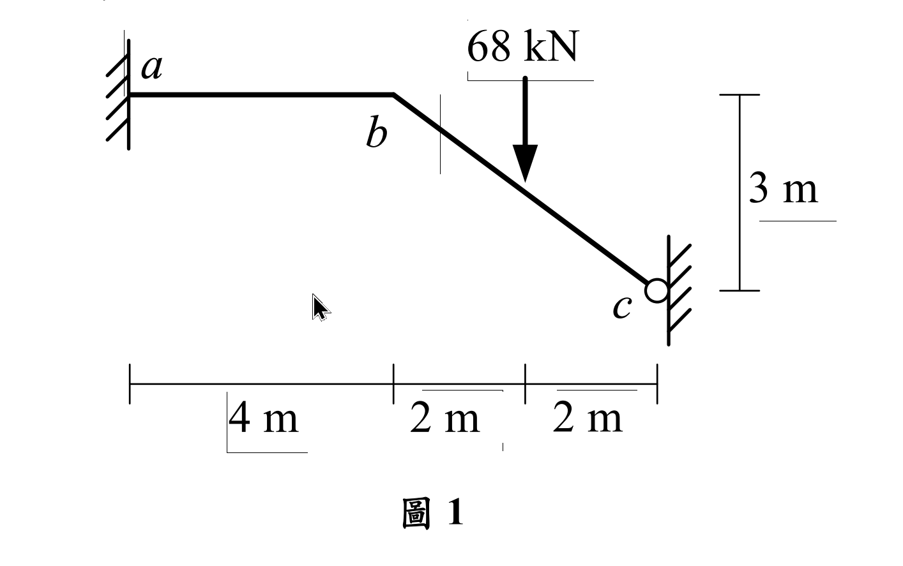

# 考題編號：SA-2020-1

**主分類：** `SA-U2` 靜不定結構分析
**副分類：** `SA-U2-3` 靜不定結構之傾角變位法
**分析法：** 傾角變位法
**標籤：** `傾角變位法` `無軸向變形` `垂直滾支承` `側移方程式`

---

## 1. 原始題目重述 (Problem Restatement)

如圖 1 所示結構，承受垂直集中載重 68 kN，$a$ 點為固定端，桿件 $ab$ 及 $bc$ 有相同之彈性模數 $E$ 與慣性矩 $I$。若不考慮桿件 $ab$ 及 $bc$ 的軸向變形，求 $ab$ 桿件端點彎矩及 $c$ 點反力。（25 分）

*圖說：節點 $a$ 位於原點為固定端，$ab$ 為斜桿，水平投影 $4\text{m}$、垂直落差 $3\text{m}$，實長 $5\text{m}$；$bc$ 為水平桿，長 $2\text{m}$；$c$ 點有垂直滑軌（垂直滾動支承，允許垂直移動但不可水平移動或旋轉）。$b$ 點承受 $68\text{ kN}$ 向下集中載重。所有桿件 $EI$ 相同，不考慮軸向變形。*

---

## 2. 考題核心精神與出題者意圖 (Core Concepts & Examiner's Intent)

本題的核心在於測驗考生對於**「不考慮軸向變形（剛性軸向）」**與**「特殊邊界條件（垂直滾支承）」**的幾何相容性判定能力。
出題者故意設計了一個帶有斜桿的剛架，並在 $c$ 端放置了一個平時較少見的「垂直滾支承（只能垂直平移，無水平平移與旋轉）」。如果考生無法準確畫出結構的可能變形位移（即各桿件的側移角 $\psi$），就會陷入未知的泥淖中。本題的「靈魂」在於推導出 $b, c$ 兩點的運動學限制。

---

## 3. 解題戰略地圖與陷阱分析 (Strategic Roadmap & Trap Analysis)

**解題步驟：**
1. **運動學分析（判斷未知數）：** 利用不考慮軸向變形的條件，分析 $b$ 與 $c$ 的可能位移，求出各桿件的側移角 $\psi$ 關係。
2. **建立傾角變位方程式：** 寫出各桿端的彎矩方程式，代入已知的邊界條件（$\theta_a = 0, \theta_c = 0$）。
3. **節點平衡與剪力平衡：** 利用節點 $b$ 的彎矩平衡，以及取整體結構力矩平衡（剪力方程式）建立聯立方程式。
4. **解聯立方程式：** 求出未知的節點旋轉角 $\theta_b$ 與側移參數，進而回代求出所有端點彎矩與 $c$ 點反力。

**陷阱分析：**
- **陷阱一：誤判 $c$ 點的支承性質。** 圖示 $c$ 點是牆壁上的滾輪，只能「上下」滑動。這代表 $u_c = 0$ 且 $\theta_c = 0$。若誤以為是鉸支承或一般滾支承，將導致全錯。
- **陷阱二：無法找出 $\psi_{ab}$ 與 $\psi_{bc}$ 的關係。** $bc$ 桿長度不變且 $u_c = 0$，表示 $u_b = 0$。因此 $b$ 點只能純粹「垂直下移」。若 $b$ 點垂直下移 $\Delta$，將導致斜桿 $ab$ 產生相對應的弦旋轉角 $\psi_{ab}$。但 $bc$ 桿由於只有純平移（兩端皆下移 $\Delta$），弦並未旋轉，故 $\psi_{bc} = 0$！這是本題最大的魔王關。
- **陷阱三：剪力方程式的建立。** 由於 $b$ 點發生側移（其實是垂直位移），必須要有第三個方程式。此時取 $ab$ 桿件分離體並針對 $a$ 點取力矩是最容易出錯的地方，必須考慮 $b$ 點的內力與外力關係。

---

## 3.5 變數層次分析 (Variable Hierarchy Analysis)

> 複習提示：第一次解題後，在每個卡住的知識點旁標記 `⚠`；第二次複習時只看有 `⚠` 的項目。

### 最終目標
`求出端點彎矩 M_{ab} 及支承反力 C_y`

### 本題關鍵公式（依計算順序）

> $\boxed{\cdot}$ = 需由前步驟推導，非題目直接給定的變數

$$\text{Step 1 (幾何分析): } \Delta_b = \Delta_c = \Delta \text{ (向下)} \Rightarrow \psi_{ab} = -\frac{4\Delta/5}{5} = -\frac{4\Delta}{25}, \quad \psi_{bc} = \boxed{0}$$

$$\text{Step 2 (傾角變位): } M_{AB} = \frac{2EI}{L}(2\theta_A + \theta_B - 3\boxed{\psi}) + M_{FAB}$$

$$\text{Step 3 (節點平衡): } \boxed{M_{ba}} + \boxed{M_{bc}} = 0$$

$$\text{Step 4 (剪力方程): } \Sigma M_a = 0 \Rightarrow \boxed{M_{ab}} + \boxed{M_{ba}} - V_{b,ab} \cdot L_{ab} = 0 \text{ (需轉換外力與內力)}$$

### L1：題目直接給定
_看到題目就能讀出的數字，不需要任何公式。_

| 符號 | 數值 | 說明 |
|------|------|------|
| $P$ | 68 kN | 集中載重向下 |
| $L_{ab}$ | 5 m | $ab$ 桿長 ($\sqrt{4^2+3^2}$) |
| $L_{bc}$ | 2 m | $bc$ 桿長 |
| $EI$ | 常數 | 各桿彈性模數與慣性矩乘積 |

### L2：需知識點推導
_需要知道公式名稱與適用條件，套入 L1 即可算出。_

**Step 1：固端彎矩計算**

| 符號 | 公式/來源 | 卡關? |
|------|----------|:-----:|
| $M_{FAB}$ | 集中載重直接作用在節點上，無節點間載重 | |

**Step 2：建立傾角變位方程式**

| 符號 | 公式/來源 | 卡關? |
|------|----------|:-----:|
| $\theta_a, \theta_c$ | 幾何邊界條件，固定端及垂直滑軌皆為 0 | |

### L3：深層知識（不懂就卡住）

| 知識點 | 說明 | 卡關? |
|--------|------|:-----:|
| 軸向剛性之位移諧合 | $bc$ 無軸向變形且 $u_c=0 \Rightarrow u_b=0$。故 $b$ 僅能垂直位移。 | |
| $\psi_{bc}$ 的判定 | 桿件弦旋轉角 $\psi = \Delta_\perp / L$。$bc$ 兩端皆下移 $\Delta$，相對垂直位移為0，故 $\psi_{bc} = 0$。 | |
| $\psi_{ab}$ 的判定 | $b$ 下移 $\Delta$，$ab$ 桿垂直於桿軸線的位移分量為 $\Delta \cdot (4/5)$，故 $\psi_{ab} = \frac{4\Delta/5}{5} = \frac{4\Delta}{25}$。 | |
| 側移（剪力）方程式 | 取整體 $abc$ 對 $a$ 取矩，或取 $ab$ 對 $a$ 取矩以找出包含彎矩與載重的關係式。 | |

---

## 4. 步驟化詳細計算過程 (Step-by-Step Detailed Calculation)

> 📊 互動圖：`SA-2020-1-slope-deflect-viz.html`

**Step 1: 幾何變位分析 (側移角 $\psi$)**
- $c$ 點為垂直滾支承：不可水平移動 ($u_c = 0$)，不可旋轉 ($\theta_c = 0$)，僅能垂直位移 ($v_c = \Delta \downarrow$)。
- $bc$ 桿無軸向變形：$u_b = u_c = 0$。因此 $b$ 點只能純粹垂直下移，令 $v_b = \Delta \downarrow$。
- 對於 $bc$ 桿，左右兩端皆下移 $\Delta$，相對側移為 0，故 $\mathbf{\psi_{bc} = 0}$。
- 對於 $ab$ 桿，端點 $b$ 下移 $\Delta$。將此位移分解為平行與垂直 $ab$ 桿的方向：
  垂直 $ab$ 的位移分量為 $\Delta_{\perp} = \Delta \cos\phi = \Delta \times \frac{4}{5} = 0.8\Delta$。
  $ab$ 桿的弦旋轉角 $\psi_{ab} = \frac{-\Delta_{\perp}}{L_{ab}} = \frac{-0.8\Delta}{5} = \mathbf{-0.16\Delta}$ （令逆時針為正，順時針為負）。

**Step 2: 建立傾角變位方程式**
令 $E K = \frac{EI}{1}$ 作為相對剛度基準：
- $k_{ab} = \frac{I}{5}$
- $k_{bc} = \frac{I}{2} = 2.5 k_{ab}$

為了計算方便，直接代入原公式：
$$M_{ab} = \frac{2EI}{5} (2\theta_a + \theta_b - 3\psi_{ab}) = \frac{2EI}{5} (\theta_b - 3(-0.16\Delta)) = \frac{2EI}{5}\theta_b + \frac{0.96EI}{5}\Delta$$
$$M_{ba} = \frac{2EI}{5} (2\theta_b + \theta_a - 3\psi_{ab}) = \frac{4EI}{5}\theta_b + \frac{0.96EI}{5}\Delta$$
$$M_{bc} = \frac{2EI}{2} (2\theta_b + \theta_c - 3\psi_{bc}) = EI(2\theta_b) = 2EI\theta_b$$
$$M_{cb} = \frac{2EI}{2} (2\theta_c + \theta_b - 3\psi_{bc}) = EI(\theta_b) = EI\theta_b$$
*(此處所有無桿節間載重，故 $M_F = 0$)*。

**Step 3: 建立平衡方程式**
(1) 節點 $b$ 的力矩平衡：
$$ \Sigma M_b = 0 \Rightarrow M_{ba} + M_{bc} = 0 $$
$$ \left( \frac{4EI}{5}\theta_b + \frac{0.96EI}{5}\Delta \right) + 2EI\theta_b = 0 $$
$$ \frac{14EI}{5}\theta_b + \frac{0.96EI}{5}\Delta = 0 \Rightarrow \mathbf{14\theta_b + 0.96\Delta = 0} \quad \text{--- (式1)} $$

(2) 剪力方程式 (取整體分離體圖或 $ab$ 桿分離體圖)：
觀察整體結構 $a-b-c$：
$a$ 點為固定端，有 $A_x, A_y, M_a$。
$c$ 點為垂直滾輪，有水平反力 $C_x$，及反力彎矩 $M_c$。**無垂直反力 ($C_y = 0$)**。
外力在 $b$ 點有 68 kN 向下。
- 取整體結構對 $a$ 取力矩：
  $\Sigma M_a = 0 \Rightarrow M_{ab} + M_{cb} - C_x(3\text{m}) - 68(4\text{m}) = 0$
- 因為 $bc$ 桿為水平桿且無橫向（水平）載重，取 $bc$ 桿分離體可知，軸力 $N_{bc} = -C_x$ (壓力)。
- 取 $ab$ 桿對 $a$ 點取矩：
  $\Sigma M_a = 0 \Rightarrow M_{ab} + M_{ba} + V_{b,ab} \times 5 = 0$ (若以順時針方向推導)
  更簡便的方式是直接利用虛功原理：
  假設發生虛位移 $\delta\Delta$，則內力虛功等於外力虛功：
  $W_{int} = M_{ab} \cdot \delta\theta_{ab} + M_{ba} \cdot \delta\theta_{ba} + M_{bc} \cdot \delta\theta_{bc} + M_{cb} \cdot \delta\theta_{cb}$
  此時令 $\delta\theta_b = 0$，僅發生機構虛側移 $\delta\Delta$：
  $\delta\psi_{ab} = -0.16 \delta\Delta$
  $W_{int} = (M_{ab} + M_{ba}) \cdot (-0.16 \delta\Delta)$
  外力虛功 $W_{ext} = P \cdot \delta\Delta = 68 \delta\Delta$
  令 $W_{int} + W_{ext} = 0$：
  $(M_{ab} + M_{ba})(-0.16) + 68 = 0 \Rightarrow \mathbf{M_{ab} + M_{ba} = 425} \quad \text{--- (式2)}$

**Step 4: 求解與代回**
將 $M_{ab}$ 與 $M_{ba}$ 展開代入 (式2)：
$$ \left( \frac{2EI}{5}\theta_b + \frac{0.96EI}{5}\Delta \right) + \left( \frac{4EI}{5}\theta_b + \frac{0.96EI}{5}\Delta \right) = 425 $$
$$ \frac{6EI}{5}\theta_b + \frac{1.92EI}{5}\Delta = 425 \Rightarrow \mathbf{6EI\theta_b + 1.92EI\Delta = 2125} \quad \text{--- (式3)} $$

聯立 (式1) 與 (式3)：
由 (式1) 得 $\Delta = -\frac{14}{0.96}\theta_b = -14.5833 \theta_b$
代入 (式3)：
$$ 6EI\theta_b + 1.92EI(-14.5833\theta_b) = 2125 $$
$$ 6EI\theta_b - 28EI\theta_b = 2125 \Rightarrow -22EI\theta_b = 2125 \Rightarrow EI\theta_b = -96.591 $$
$$ EI\Delta = -14.5833 \times (-96.591) = 1408.62 $$

代回求端點彎矩：
$$ \boxed{M_{ab}} = \frac{2}{5}(-96.591) + \frac{0.96}{5}(1408.62) = -38.636 + 270.455 = \mathbf{231.8 \text{ kN-m}} $$
$$ \boxed{M_{ba}} = \frac{4}{5}(-96.591) + \frac{0.96}{5}(1408.62) = -77.273 + 270.455 = \mathbf{193.2 \text{ kN-m}} $$
$$ M_{bc} = 2(-96.591) = -193.2 \text{ kN-m} \text{ (與 } M_{ba} \text{ 大小相等，符號相反，平衡！)} $$
$$ M_{cb} = 1(-96.591) = -96.6 \text{ kN-m} $$

求 $c$ 點反力：
因為 $c$ 為垂直滾動支承（滑軌），**不提供垂直反力**，所以垂直反力：
$$ \boxed{C_y = 0 \text{ kN}} $$
(所有 68 kN 的垂直外力皆由固定端 $a$ 承受，即 $A_y = 68 \text{ kN} \uparrow$)。

---

## 5. 關鍵爭議點與進階探討 (Critical Issues & Advanced Discussion)

- **$c$ 點支承性質的詮釋**：此題唯一可能引發爭議的是對 $c$ 點圖示的認知。在結構學圖學標準中，這種有上下兩條線夾住滾輪的圖案，代表「允許平行於牆面的移動，限制垂直於牆面的移動，並限制旋轉」。因此它是一個提供水平反力 $C_x$ 與彎矩 $M_c$，但不提供垂直反力 $C_y$ 的「垂直向滑動固定端 (Vertical Slider / Guided Roller)」。
- **虛功原理的優勢**：在計算側移方程式（如本題 Step 3）時，傳統的取分離體求力矩法極易發生外力漏算或方向弄反的失誤。強烈建議在傾角變位法中，涉及複雜側移時，統一使用**虛功原理 (Virtual Work Method)** 來建立側移（剪力）方程式，能有效確保內外力作功符號的一致性。
