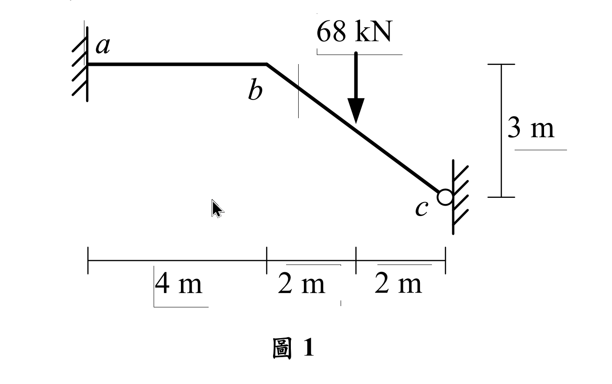
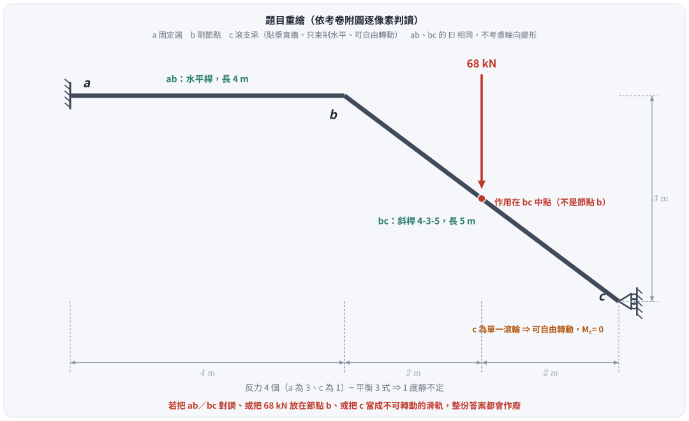
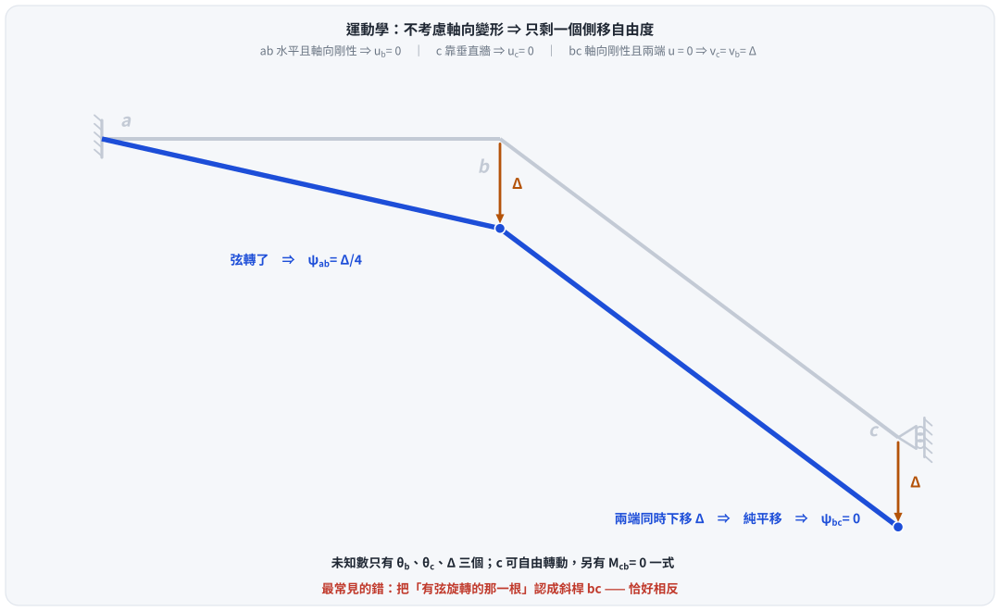
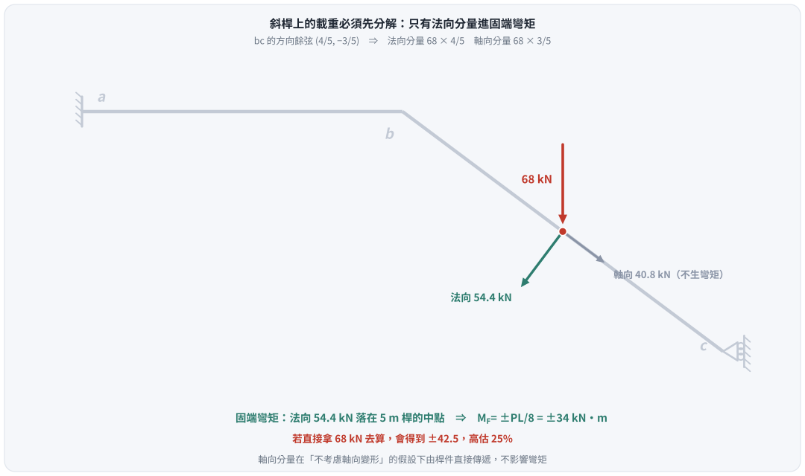
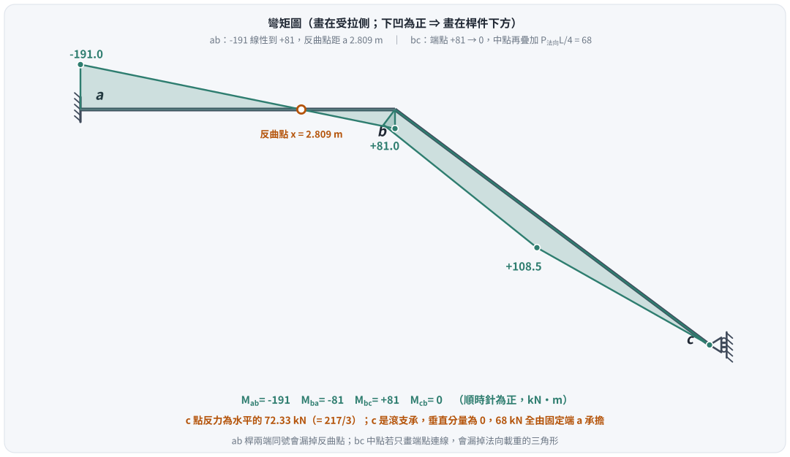

# 考題編號：SA-2020-1

**主分類：** `SA-U2-3` 靜不定結構之傾角變位法
**副分類：** 無
**分析法：** 傾角變位法
**標籤：** `傾角變位法` `無軸向變形` `斜桿載重分解` `滾支承` `側移方程式`

---

## 1. 原始題目重述 (Problem Restatement)

如圖 1 所示結構，承受垂直集中載重 68 kN，$a$ 點為固定端，桿件 $ab$ 及 $bc$ 有相同之彈性模數 $E$ 與慣性矩 $I$。若不考慮桿件 $ab$ 及 $bc$ 的軸向變形，求 $ab$ 桿件端點彎矩及 $c$ 點反力。（25 分）

*圖說：以 $a$ 為原點。**$ab$ 是水平桿，長 4 m**（$a(0,0) \to b(4,0)$）；**$bc$ 是斜桿**，水平 4 m、垂直落差 3 m，**實長 5 m**（$b(4,0) \to c(8,-3)$）。**68 kN 向下作用於 $bc$ 的中點**（$x = 6$ m）。$a$ 為固定端（貼左側垂直牆）；$c$ 為貼右側垂直牆的**滾支承**——只束制水平位移，可垂直滑動、**可自由轉動**。*

---

## 1.5 ⚠ 勘誤（2026-08-26）：舊版把附圖讀成了另一個結構

> 舊版 §1 的圖說與 §4 的全部計算建立在四項誤讀之上，**結論全部作廢**。

考卷附圖經逐像素掃描（尺寸刻度落在 $x = 0 / 4.00 / 5.99 / 7.99$；水平桿橫跨 $x = 0 \to 4.10$；載重箭頭實心三角中心 $x \approx 6.0$；$c$ 處為單一圓圈貼在垂直剖面線牆上）：

| 項目 | 舊版寫的 | 附圖實況 |
|---|---|---|
| 哪根是斜桿 | 「$ab$ 為斜桿，水平投影 4 m、垂直落差 3 m，實長 5 m」 | **$ab$ 是水平桿，長 4 m** |
| 另一根 | 「$bc$ 為水平桿，長 2 m」 | **$bc$ 是斜桿，4-3-5，長 5 m** |
| 載重位置 | 「$b$ 點承受 68 kN」 | **68 kN 在 $bc$ 的中點**（因此有固端彎矩） |
| $c$ 的支承 | 「垂直滑軌，**不可旋轉**」 | **單一滾輪 ⇒ 可自由轉動，$M_{cb}=0$** |

四項全錯，連帶的運動學（哪根桿有弦旋轉）、固端彎矩（舊版認為沒有）、未知數個數都不對。

| 量 | 舊版（錯） | 正確 |
|---|---|---|
| $M_{ab}$ | $+231.8$ kN·m | $\mathbf{-191}$ kN·m |
| $M_{ba}$ | $+193.2$ kN·m | $\mathbf{-81}$ kN·m |
| $c$ 點反力 | 「$C_y = 0$」 | **水平 $\dfrac{217}{3} \approx 72.33$ kN**（垂直分量確為 0，但題目要的是這個水平反力） |

---

## 2. 考題核心精神與出題者意圖 (Core Concepts & Examiner's Intent)

**核心：** 「不考慮軸向變形」＋「特殊邊界」共同決定了**只剩一個側移自由度**，而斜桿上的載重必須先分解。

1. **運動學相容性**：$ab$ 水平且軸向剛性 $\Rightarrow u_b = 0$；$c$ 靠垂直牆 $\Rightarrow u_c = 0$；$bc$ 軸向剛性且兩端 $u=0 \Rightarrow v_c = v_b$。三個條件鎖死之後，$b$ 與 $c$ **只能一起垂直下移同一個 $\Delta$**。
2. **弦旋轉在哪一根**：$b$、$c$ 同時下移 $\Delta$ $\Rightarrow$ **斜桿 $bc$ 是純平移，$\psi_{bc} = 0$**；反而是**水平桿 $ab$** 的弦轉了 $\psi_{ab} = \Delta/4$。這與直覺相反，是本題的魔王關。
3. **斜桿上的載重要先分解**：只有**垂直於桿軸**的分量才產生固端彎矩。
4. **滾支承可轉動**：$M_{cb} = 0$ 是第三條方程，$\theta_c$ 是未知數而非零。

---

## 3. 解題戰略地圖與陷阱分析 (Strategic Roadmap & Trap Analysis)

**解題步驟：**

1. **運動學**：由軸向剛性與邊界條件推出 $v_b = v_c = \Delta$、$\psi_{ab} = \Delta/4$、$\psi_{bc} = 0$。
2. **載重分解**：把 68 kN 分解成 $bc$ 的法向與軸向分量，只用法向分量算固端彎矩。
3. **傾角變位方程式**：寫出 $M_{ab}$、$M_{ba}$、$M_{bc}$、$M_{cb}$。
4. **三條平衡式**：節點 $b$ 的 $\Sigma M = 0$、滾支承的 $M_{cb} = 0$、側移方程（虛功法）。
5. **回代**求端彎矩與反力。

**陷阱分析：**

| 陷阱 | 為什麼會錯 | 正解 |
|---|---|---|
| **把 $ab$ 當斜桿** | 附圖左半段畫得較長，容易先入為主 | 尺寸線是 4 ｜ 2 ｜ 2；水平段就是前面那 4 m |
| **把 68 kN 當節點載重** | 箭頭離 $b$ 不遠 | 箭頭中心在 $x=6$，正好是 $bc$ 中點 $\Rightarrow$ **有固端彎矩** |
| **把 $c$ 當不可轉動的滑軌** | 滑軌與滾支承的圖例相近 | 單一圓圈 = 滾支承，**可轉動**；若當滑軌會少一個未知數、多一個約束 |
| **弦旋轉認錯桿** | 直覺以為「斜的那根才會轉」 | $b$、$c$ 同步下移 $\Rightarrow$ $bc$ 純平移；轉的是水平的 $ab$ |
| **直接拿 68 kN 算 FEM** | 忘了斜桿要分解 | 法向分量 $68 \times \frac45 = 54.4$ kN，用它算 $\pm PL/8$；直接用 68 會高估 25% |
| **只答「$C_y = 0$」** | 沒注意滾支承的反力方向 | 滾輪貼**垂直**牆 $\Rightarrow$ 反力是**水平**的 |

---

## 3.5 變數層次分析 (Variable Hierarchy Analysis)

> 複習提示：第一次解題後，在每個卡住的知識點旁標記 `⚠`；第二次複習時只看有 `⚠` 的項目。

### 最終目標

`求 ab 桿的端點彎矩 M_ab、M_ba，以及 c 點的反力`

### 本題關鍵公式（依計算順序）

> $\boxed{\cdot}$ ＝ 需由前步驟推導

$$\text{Step 1（運動學）：} \; v_b = v_c = \Delta \;\Rightarrow\; \psi_{ab} = \frac{\Delta}{4},\quad \boxed{\psi_{bc} = 0}$$

$$\text{Step 2（載重分解）：} \; P_\perp = P\cos\phi = 68 \times \tfrac45,\qquad M_F = \pm\frac{\boxed{P_\perp}\,L_{bc}}{8}$$

$$\text{Step 3（傾角變位）：} \; M_{nf} = \frac{2EI}{L}\left(2\theta_n + \theta_f - 3\psi\right) + M_F$$

$$\text{Step 4（三條方程）：} \; M_{ba} + M_{bc} = 0,\qquad \boxed{M_{cb}} = 0,\qquad M_{ab} + M_{ba} = -P\,L_{ab}$$

### L1：題目直接給定

| 符號 | 數值 | 說明 |
|---|---|---|
| $P$ | 68 kN（↓） | 集中載重，作用於 $bc$ 中點 |
| $L_{ab}$ | 4 m | **水平**桿 |
| $L_{bc}$ | 5 m | **斜**桿（4-3-5） |
| $EI$ | 兩桿相同 | 最終答案與 $EI$ 無關 |

### L2：需知識點推導

| 符號 | 公式／來源 | 卡關? |
|---|---|:--:|
| $\cos\phi,\ \sin\phi$ | $4/5,\ 3/5$（由 4-3-5） | |
| $P_\perp$ | $68 \times 4/5 = 54.4$ kN | |
| $P_\parallel$ | $68 \times 3/5 = 40.8$ kN（軸向，不生彎矩） | |
| $M_F^{bc},\,M_F^{cb}$ | $\mp P_\perp L_{bc}/8 = \mp 34$ kN·m | |
| $\psi_{ab},\ \psi_{bc}$ | $\Delta/4$ ，$0$ | |

### L3：深層知識（不懂就卡住）

| 知識點 | 說明 | 卡關? |
|---|---|:--:|
| 軸向剛性的連鎖推論 | 水平桿鎖住 $u$、斜桿加上兩端 $u=0$ 再鎖住 $v$ 的相對量，最後只剩一個 $\Delta$ | |
| 弦旋轉的定義 | $\psi = \dfrac{\text{兩端垂直於桿軸的相對位移}}{L}$；**兩端位移相同 $\Rightarrow$ 純平移 $\Rightarrow \psi = 0$** | |
| 斜桿載重分解 | 只有法向分量產生彎矩；軸向分量在「不考慮軸向變形」下由桿件直接傳遞 | |
| 滾支承 vs 滑軌 | 單一滾輪：束制 1 個平移、**可轉動**（$M=0$）；滑軌：束制 1 個平移 ＋ 轉動（$M \ne 0$） | |
| 側移方程（虛功法） | 給機構一個虛位移 $\delta\Delta$：$\sum (M_{nf}+M_{fn})\,\delta\psi_{nf} + \sum P\,\delta = 0$ | |

---

## 4. 步驟化詳細計算過程 (Step-by-Step Detailed Calculation)

> 📊 互動圖：`SA-2020-1-slope-deflect-viz.html`

### 4.0 幾何與靜不定度

*圖 1　題目重繪（向量版，幾何由附圖像素掃描而來）。這張圖攔本題最致命的三個誤讀：哪一根是斜桿、68 kN 在節點還是桿件中間、$c$ 是可轉動的滾支承還是不可轉動的滑軌——任一項錯了，整份答案作廢。*

反力：$a$ 為固定端（3 個）＋ $c$ 為滾支承（1 個）＝ 4；平衡方程 3 式 $\Rightarrow$ **1 度靜不定**。

### 4.1 運動學：只剩一個側移自由度

*圖 2　側移機構。這張圖攔的是「以為斜桿才會有弦旋轉」：$b$、$c$ 同步下移 $\Delta$，$bc$ 是純平移（$\psi_{bc}=0$），真正轉的是水平桿 $ab$。*

- $ab$ 為水平桿且軸向剛性 $\Rightarrow u_b = u_a = 0$
- $c$ 靠垂直牆的滾支承 $\Rightarrow u_c = 0$
- $bc$ 軸向剛性，其軸向方向為 $(\tfrac45, -\tfrac35)$：

$$(u_c - u_b)\tfrac45 + (v_c - v_b)\left(-\tfrac35\right) = 0 \;\xrightarrow{\;u_b=u_c=0\;}\; v_c = v_b$$

令 $b$、$c$ 同時下移 $\Delta$：

$$\boxed{\psi_{ab} = \frac{\Delta}{4}\ \text{（順時針為正）}}\qquad \boxed{\psi_{bc} = 0\ \text{（純平移）}}$$

**未知數：** $\theta_b$、$\theta_c$、$\Delta$ 三個。

### 4.2 斜桿上的載重分解與固端彎矩

*圖 3　載重分解。這張圖攔的是「直接拿 68 kN 去套 $PL/8$」：斜桿只有法向分量會彎它，直接用 68 會把固端彎矩高估 25%。*

$bc$ 的方向餘弦 $(\cos\phi, -\sin\phi) = (\tfrac45, -\tfrac35)$：

$$P_\perp = 68 \times \tfrac45 = 54.4\ \text{kN}\ \text{（法向，產生彎矩）}$$
$$P_\parallel = 68 \times \tfrac35 = 40.8\ \text{kN}\ \text{（軸向，不產生彎矩）}$$

法向載重落在 5 m 桿的**中點**：

$$M_F^{bc} = -\frac{P_\perp L_{bc}}{8} = -34\ \text{kN·m},\qquad M_F^{cb} = +34\ \text{kN·m}$$

### 4.3 傾角變位方程式

以順時針為正，$EI$ 為共同係數：

$$M_{ab} = \frac{2EI}{4}\left(\theta_b - 3\tfrac{\Delta}{4}\right) = 0.5EI\,\theta_b - 0.375EI\,\Delta$$
$$M_{ba} = \frac{2EI}{4}\left(2\theta_b - 3\tfrac{\Delta}{4}\right) = EI\,\theta_b - 0.375EI\,\Delta$$
$$M_{bc} = \frac{2EI}{5}\left(2\theta_b + \theta_c\right) - 34 = 0.8EI\,\theta_b + 0.4EI\,\theta_c - 34$$
$$M_{cb} = \frac{2EI}{5}\left(2\theta_c + \theta_b\right) + 34 = 0.8EI\,\theta_c + 0.4EI\,\theta_b + 34$$

### 4.4 三條平衡方程式

**（1）節點 $b$ 力矩平衡：** $M_{ba} + M_{bc} = 0$

$$1.8\,EI\theta_b + 0.4\,EI\theta_c - 0.375\,EI\Delta = 34 \tag{1}$$

**（2）滾支承：$c$ 可自由轉動 $\Rightarrow M_{cb} = 0$**

$$0.4\,EI\theta_b + 0.8\,EI\theta_c = -34 \tag{2}$$

**（3）側移方程（虛功法）：** 給機構虛位移 $\delta\Delta$（$b$、$c$ 同時下移），則 $\delta\psi_{ab} = \delta\Delta/4$、$\delta\psi_{bc} = 0$，而 68 kN 隨 $bc$ 剛體平移下降 $\delta\Delta$：

$$(M_{ab} + M_{ba})\cdot\frac{\delta\Delta}{4} + 68\,\delta\Delta = 0
\;\Longrightarrow\; \boxed{M_{ab} + M_{ba} = -272} \tag{3}$$

展開 (3)：$1.5\,EI\theta_b - 0.75\,EI\Delta = -272$

### 4.5 解聯立

由 (2)：$EI\theta_c = -42.5 - 0.5\,EI\theta_b$。代入 (1)：

$$1.6\,EI\theta_b - 0.375\,EI\Delta = 51 \tag{1'}$$

$(1')\times 2 - (3)$：$1.7\,EI\theta_b = 374 \Rightarrow \boxed{EI\theta_b = 220}$

$$EI\Delta = \frac{1.5(220) + 272}{0.75} = \frac{602}{0.75} = \frac{2408}{3} \approx 802.67$$
$$EI\theta_c = -42.5 - 110 = -152.5$$

### 4.6 端點彎矩與反力

$$\boxed{M_{ab} = 0.5(220) - 0.375\!\left(\tfrac{2408}{3}\right) = 110 - 301 = -191\ \text{kN·m}}$$
$$\boxed{M_{ba} = 220 - 301 = -81\ \text{kN·m}}$$
$$M_{bc} = +81\ \text{kN·m}\quad(\text{節點 } b \text{ 平衡 ✓}),\qquad M_{cb} = 0\ \checkmark$$

（順時針為正。$M_{ab} = -191$ 代表固定端 $a$ 對桿件施加 191 kN·m 的**逆時針**彎矩。）

**$c$ 點反力：** $c$ 是貼**垂直**牆的滾支承，反力方向為**水平**。由整體對 $a$ 取矩（逆時針正）：

$$M_a + 3C_x - 68 \times 6 = 0,\qquad M_a = 191\ \text{（逆時針）}$$
$$\boxed{C_x = \frac{408 - 191}{3} = \frac{217}{3} \approx 72.33\ \text{kN}}$$

$c$ 為滾支承，**垂直反力為 0**；68 kN 全部由固定端 $a$ 承擔（$A_y = 68$ kN ↑，$A_x = -72.33$ kN）。

### 4.7 彎矩圖

*圖 4　彎矩圖（畫在受拉側）。這張圖攔兩件事：把 $ab$ 桿當成全段同號（它在距 $a$ 2.809 m 處變號），以及在 $bc$ 只把兩端點連線（會漏掉法向載重造成的三角形，中點少了 68 kN·m）。*

| 位置 | $a$ | $ab$ 反曲點 | $b$ | $bc$ 中點 | $c$ |
|:--|:--:|:--:|:--:|:--:|:--:|
| 彎矩（下凹為正） | $-191$ | $0$（距 $a$ 2.809 m） | $+81$ | $+108.5$ | $0$ |

### 4.8 驗算

- 節點 $b$：$M_{ba} + M_{bc} = -81 + 81 = 0$ ✓
- 滾支承：$M_{cb} = 0$ ✓
- $\Sigma F_y$：$A_y = 68$ ✓　$\Sigma F_x$：$A_x + C_x = -72.33 + 72.33 = 0$ ✓
- $\Sigma M_a$：$191 + 3(72.33) - 68(6) = 191 + 217 - 408 = 0$ ✓
- 側移方程：$M_{ab} + M_{ba} = -191 - 81 = -272 = -68 \times 4$ ✓

---

## 5. 關鍵爭議點與進階探討 (Critical Issues & Advanced Discussion)

### 5.1 $c$ 點支承性質的判定

考卷圖上 $c$ 處是**單一圓圈**貼在垂直剖面線牆上 —— 這是標準的**滾支承**：束制垂直於牆面的位移（此處為水平），允許沿牆面滑動（垂直），**且允許轉動**。

若誤讀成「滑軌／導引支承」（兩條平行線夾住滾輪，額外束制轉動），會多出一個 $M_c \ne 0$ 的約束、少一個 $\theta_c$ 未知數，方程組整組改變。兩者的圖例差別就在**滾輪是一個還是一排、外面有沒有再包一層平行滑板**。

### 5.2 為什麼「純平移」的桿沒有弦旋轉

$\psi$ 的定義是「兩端**垂直於桿軸**的相對位移除以桿長」。$bc$ 兩端都下移同一個 $\Delta$，相對位移為零，因此 $\psi_{bc} = 0$ —— **與桿件是不是斜的無關**。反而是 $ab$：$a$ 不動、$b$ 下移 $\Delta$，相對位移就是 $\Delta$，$\psi_{ab} = \Delta/4$。

判斷 $\psi$ 的唯一可靠方法是**先把位移場解出來，再逐桿計算相對位移**，不要靠「哪根看起來會轉」。

### 5.3 側移方程用虛功法最不容易錯

本題的側移機構是「$b$、$c$ 一起垂直下移」，用自由體取矩很容易漏掉 $bc$ 上的 68 kN 或弄反方向。改用虛功：

$$\sum_{\text{桿}} (M_{nf} + M_{fn})\,\delta\psi_{nf} + \sum P\,\delta = 0$$

只要虛位移場與 $\psi$ 用同一組符號，內外功的符號自動一致。本題 $bc$ 的 $\delta\psi = 0$，整式只剩 $ab$ 一項，一行就寫完。

### 5.4 驗算紀錄（2026-08-26）

本題以「傾角變位法手算」與「剛架有限元（$EA$ 取極大以模擬不考慮軸向變形）」兩條獨立路徑求解，端彎矩、轉角、位移、反力**全部相符**（$M_{ab} = -191.00$、$M_{ba} = -81.00$、$C_x = 72.3333 = 217/3$、$EI\theta_b = 220.00$、$EI\theta_c = -152.50$、$EI\Delta = 802.66$）。

---

## 6. 本題知識點索引

| 知識點 | 概念 ID |
|---|---|
| 傾角變位法 | [[SLOPE-DEFLECTION-EQUATION]] |
| 固定端彎矩 | [[FIXED-END-MOMENT]] |
| 側移方程式 | [[SWAY-EQUATION]] |
| 虛功原理 | [[VIRTUAL-WORK]] |

---

## CHANGELOG

| 日期 | 變更 | 原因 |
|---|---|---|
| 2026-07-02 | 初版解析 | — |
| 2026-08-26 | **全題重做** | 附圖遭四項誤讀（$ab$／$bc$ 對調、載重位置、支承型式），舊版結論全部作廢。改以逐像素判讀的幾何重解，並補四張向量圖 |

---

*解析日期：2026-07-02　｜　全題重做＋圖解：2026-08-26（幾何經附圖逐像素掃描確認；傾角變位法手算與剛架有限元兩條獨立路徑相符；向量圖腳本 `gen_SA-2020-1.py`，可重跑）*
