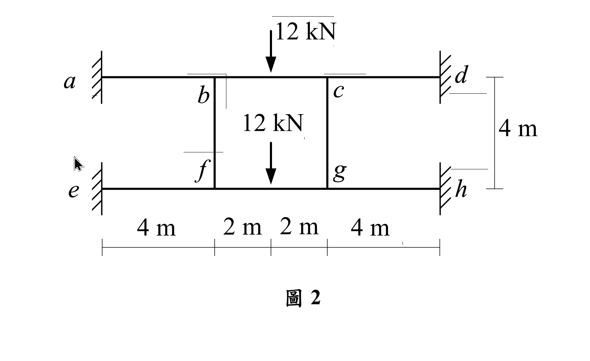

# 考題編號：SA-2020-2

**主分類：** `SA-U2-3` 靜不定結構分析
**副分類：** 無
**分析法：** 傾角變位法 / 對稱性利用
**標籤：** `傾角變位法` `對稱性` `剛架分析` `降維分析`

---

## 1. 原始題目重述 (Problem Restatement)

如圖 2 所示之平面剛架結構，$a, d, e, h$ 點為固定端，$b, c, f, g$ 點為剛性接頭，各桿件有相同之彈性模數 $E$ 與慣性矩 $I$，且 $EI = 20000 \text{ kN-m}^2$。不考慮各桿件的軸向變形，求 $b$ 點垂直位移、轉角及 $ab$ 桿件的端點彎矩。（25 分）

*圖說：此結構為上下兩層、左右三跨的對稱平面剛架。上層梁 $a-b-c-d$ 中，$b, c$ 為剛接點，$a, d$ 為固定端；下層梁 $e-f-g-h$ 中，$f, g$ 為剛接點，$e, h$ 為固定端。中間由柱 $bf$ 及 $cg$ 連接。梁跨度分別為 4m, 2m, 4m，柱高 4m。上層梁中央 $bc$ 段及下層梁中央 $fg$ 段各有向下集中載重 12 kN。*

---

## 2. 考題核心精神與出題者意圖 (Core Concepts & Examiner's Intent)

本題考驗考生是否具備**「觀察對稱性」**的慧眼。
此結構不僅在幾何上完全左右對稱，載重也完全左右對稱。此外，頂層（梁 $ad$）與底層（梁 $eh$）在幾何、邊界條件及受力狀態上也幾乎雷同（只是柱的連接稍有不同）。如果考生按部就班設立所有未知數（$\theta_b, \theta_c, \theta_f, \theta_g$, 加上側移），將面對龐大且易錯的聯立方程組。
出題者真正的意圖是：**利用載重與結構的對稱性，進行大幅度的降維簡化。** 特別是柱 $bf$ 的變形特徵，是解開這題的「密碼」。

---

## 3. 解題戰略地圖與陷阱分析 (Strategic Roadmap & Trap Analysis)

**解題步驟：**
1. **利用對稱性：** 左右對稱（反對稱變形），得出 $\theta_c = -\theta_b, \theta_g = -\theta_f$；垂直位移 $v_c = v_b, v_g = v_f$；水平側移 $\Delta = 0$。
2. **分析上下層關聯：** 頂層與底層的受力與邊界條件完全一致，且由柱 $bf, cg$ 垂直相連。可以推斷出，頂層與底層的變形模式必然一模一樣，亦即 $\theta_f = \theta_b$，$v_f = v_b$。
3. **判斷柱內力：** 由於 $b$ 點與 $f$ 點發生相同的垂直位移（$v_b = v_f$），柱 $bf$ 的長度不變，且兩端無相對垂直位移，因此柱 $bf$ 內 **軸力為零**！這意味著 $bf$ 柱不會提供頂層或底層任何垂直反力支援。
4. **建立傾角變位方程式：** 以 $\theta_b$ 與 $v_b$ 為僅存的兩個未知數，列出 $ab, bc, bf$ 桿件的彎矩方程式。
5. **節點平衡求解：** 利用 $b$ 點的旋轉平衡與垂直力平衡求解，最後代回求得變位及端點彎矩。

**陷阱分析：**
- **陷阱一：忽略對稱性。** 若無看出對稱，會寫出多達 4 個角變位和 1 個未知位移的方程組，計算量極大且易算錯。
- **陷阱二：忽略上下層的聯動關係。** 即使看出左右對稱，若沒發現上下層變形一致（$v_b = v_f$），就會多出一個垂直位移未知數，且無法輕易算出 $bf$ 的軸力。
- **陷阱三：剪力平衡式的取法。** 在考慮垂直位移時，必須取適當的分離體（如取 $b$ 點，或取半結構梁）進行垂直力平衡。必須精確計算出各桿件的端點剪力（由端點彎矩與固端剪力疊加而得）。

---

## 3.5 變數層次分析 (Variable Hierarchy Analysis)

> 複習提示：第一次解題後，在每個卡住的知識點旁標記 `⚠`；第二次複習時只看有 `⚠` 的項目。

### 最終目標
`求出 b 點垂直位移、轉角，以及 ab 桿件的端點彎矩`

### 本題關鍵公式（依計算順序）

> $\boxed{\cdot}$ = 需由前步驟推導，非題目直接給定的變數

$$\text{Step 1 (對稱性簡化): } \theta_c = -\theta_b, \quad v_c = v_b = \Delta \downarrow \quad \theta_f = \theta_b, \quad v_f = v_b = \Delta \downarrow$$

$$\text{Step 2 (傾角變位): } M_{AB} = \frac{2EI}{L}(2\theta_A + \theta_B - 3\boxed{\psi}) + \boxed{M_{FAB}}$$

$$\text{Step 3 (旋轉平衡): } \Sigma M_b = 0 \Rightarrow \boxed{M_{ba}} + \boxed{M_{bc}} + \boxed{M_{bf}} = 0$$

$$\text{Step 4 (剪力平衡): } \Sigma F_y = 0 (\text{於 } b \text{ 點}) \Rightarrow V_{ba} + V_{bc} = 0 \quad (\text{因 } N_{bf} = 0)$$

### L1：題目直接給定
_看到題目就能讀出的數字，不需要任何公式。_

| 符號 | 數值 | 說明 |
|------|------|------|
| $EI$ | 20000 | 彈性模數與慣性矩乘積 |
| $L_{ab}, L_{bc}, L_{bf}$ | 4m, 2m, 4m | 各桿件長度 |
| $P$ | 12 kN | 集中載重向下 (於 $bc$ 中點) |

### L2：需知識點推導
_需要知道公式名稱與適用條件，套入 L1 即可算出。_

**Step 1：固端彎矩與剪力計算**

| 符號 | 公式/來源 | 卡關? |
|------|----------|:-----:|
| $M_{Fbc}$ | $-PL/8 = -(12 \times 2)/8 = -3$ | |
| $V_{Fbc}$ | 簡支反力 = $P/2 = 6$ | |

**Step 2：桿端剪力與彎矩關係**

| 符號 | 公式/來源 | 卡關? |
|------|----------|:-----:|
| $V_{ba}$ | $V_{ba} = \frac{M_{ba}+M_{ab}}{L_{ab}}$ | |
| $V_{bc}$ | $V_{bc} = V_{Fbc} - \frac{M_{bc}+M_{cb}}{L_{bc}}$ | |

### L3：深層知識（不懂就卡住）

| 知識點 | 說明 | 卡關? |
|--------|------|:-----:|
| 雙重對稱性判斷 | 左右對稱 $\Rightarrow \theta_c = -\theta_b$；上下同構且同載重 $\Rightarrow \theta_f = \theta_b, v_f = v_b$。 | |
| $bf$ 柱軸力為零 | 因 $v_b = v_f$，柱長不變，故無軸力。 $b$ 點的垂直支撐僅靠 $ab$ 剪力。 | |
| 側移角 $\psi$ 的正負號 | 梁 $ab$: $b$ 下沉 $\Delta$，順時針轉，$\psi_{ab} = \Delta/4$；梁 $bc$: 平移無轉，$\psi_{bc} = 0$。柱 $bf$: 無平移，$\psi_{bf} = 0$。 | |

---

## 4. 步驟化詳細計算過程 (Step-by-Step Detailed Calculation)

> 📊 互動圖：`SA-2020-2-slope-deflect-viz.html`

**Step 1: 幾何與對稱性簡化**
- **左右對稱**：$\theta_c = -\theta_b$，$v_c = v_b = \Delta \downarrow$ (令 $\Delta$ 為向下位移，值為正)。無水平側移。
- **上下對稱 (變形模式相同)**：$\theta_f = \theta_b$，$v_f = v_b = \Delta \downarrow$。
- **側移角 $\psi$ 計算**：
  - $ab$ 桿：$b$ 點下沉 $\Delta$，故弦順時針旋轉 $\psi_{ab} = \frac{\Delta}{4}$。
  - $bc$ 桿：兩端皆下沉 $\Delta$，弦無旋轉 $\psi_{bc} = 0$。
  - $bf$ 柱：兩端皆下沉 $\Delta$，弦無旋轉 $\psi_{bf} = 0$。且兩端無相對位移，**柱軸力 $N_{bf} = 0$**。

**Step 2: 建立傾角變位方程式**
- 固端彎矩 (僅 $bc$ 桿有外載，於中點施加 12 kN)：
  $M_{Fbc} = \frac{-PL}{8} = \frac{-12 \times 2}{8} = -3 \text{ kN-m}$
  $M_{Fcb} = \frac{+PL}{8} = +3 \text{ kN-m}$
- 桿端彎矩方程式：
  $$M_{ab} = \frac{2EI}{4}(2(0) + \theta_b - 3(\Delta/4)) = 0.5EI\theta_b - 0.375EI\Delta$$
  $$M_{ba} = \frac{2EI}{4}(2\theta_b + 0 - 3(\Delta/4)) = 1.0EI\theta_b - 0.375EI\Delta$$
  $$M_{bc} = \frac{2EI}{2}(2\theta_b + (-\theta_b) - 3(0)) - 3 = 1.0EI\theta_b - 3$$
  $$M_{bf} = \frac{2EI}{4}(2\theta_b + \theta_b - 3(0)) = 1.5EI\theta_b$$

**Step 3: 節點旋轉平衡方程式**
取 $b$ 點彎矩平衡：
$$ \Sigma M_b = 0 \Rightarrow M_{ba} + M_{bc} + M_{bf} = 0 $$
$$ (1.0EI\theta_b - 0.375EI\Delta) + (1.0EI\theta_b - 3) + 1.5EI\theta_b = 0 $$
$$ \mathbf{3.5EI\theta_b - 0.375EI\Delta = 3} \quad \text{--- (式1)} $$

**Step 4: 節點垂直力（剪力）平衡方程式**
取節點 $b$ 為分離體進行垂直力平衡。因為柱 $bf$ 的軸力為 0，所以 $b$ 點的垂直平衡僅與 $ab$ 桿和 $bc$ 桿的端點剪力有關：
$$ \Sigma F_y = 0 \Rightarrow V_{ba} + V_{bc} = 0 $$
(設向上為正)
- **計算 $V_{ba}$**：取 $ab$ 桿分離體，$V_{ba}$ 為 $b$ 端的向上剪力。
  對 $a$ 點取矩 $\Sigma M_a = 0 \Rightarrow M_{ab} + M_{ba} - V_{ba} \times 4 = 0 \Rightarrow V_{ba} = \frac{M_{ab} + M_{ba}}{4}$
  代入：$V_{ba} = \frac{1.5EI\theta_b - 0.75EI\Delta}{4} = 0.375EI\theta_b - 0.1875EI\Delta$
- **計算 $V_{bc}$**：取 $bc$ 半桿分離體。
  載重分配到 $b$ 端的固端剪力為 $12/2 = 6 \text{ kN}$ (向上抗力)。
  考量兩端彎矩修正，向上剪力 $V_{bc} = 6 - \frac{M_{bc} + M_{cb}}{2}$。
  但因對稱，$\theta_c = -\theta_b$，故 $M_{cb} = 1.0EI\theta_c + 3 = -1.0EI\theta_b + 3 = -M_{bc}$。
  因此 $M_{bc} + M_{cb} = 0$，也就是彎矩不改變 $bc$ 桿的剪力分配。
  所以 $V_{bc} = 6 \text{ kN}$ (向上)。

代回 $\Sigma F_y = 0$：
$$ (0.375EI\theta_b - 0.1875EI\Delta) + 6 = 0 $$
$$ \mathbf{0.375EI\theta_b - 0.1875EI\Delta = -6} \quad \text{--- (式2)} $$

**Step 5: 聯立求解**
由 (式2) 乘以 2：
$$ 0.75EI\theta_b - 0.375EI\Delta = -12 \quad \text{--- (式2')} $$
將 (式1) 減去 (式2')：
$$ (3.5 - 0.75)EI\theta_b = 3 - (-12) $$
$$ 2.75EI\theta_b = 15 \Rightarrow EI\theta_b = \frac{15}{2.75} = \frac{60}{11} \approx 5.4545 $$
代回 (式2') 求 $\Delta$：
$$ 0.75\left(\frac{60}{11}\right) - 0.375EI\Delta = -12 $$
$$ \frac{45}{11} + 12 = 0.375EI\Delta \Rightarrow \frac{177}{11} = \frac{3}{8}EI\Delta \Rightarrow EI\Delta = \frac{177 \times 8}{33} = \frac{59 \times 8}{11} = \frac{472}{11} \approx 42.909 $$

代入已知 $EI = 20000$：
- $b$ 點轉角：$\boxed{\theta_b = \frac{60}{11 \times 20000} = \frac{3}{11000} \approx \mathbf{0.0002727 \text{ rad (逆時針)}}}$
- $b$ 點垂直位移：$\boxed{v_b = \Delta = \frac{472}{11 \times 20000} = \frac{59}{27500} \text{ m} \approx \mathbf{0.002145 \text{ m} = 2.145 \text{ mm} \text{ (向下)}}}$

**Step 6: 計算 $ab$ 桿端點彎矩**
代入求得之 $EI\theta_b$ 與 $EI\Delta$：
$$ \boxed{M_{ab}} = 0.5\left(\frac{60}{11}\right) - 0.375\left(\frac{472}{11}\right) = \frac{30 - 177}{11} = \frac{-147}{11} \approx \mathbf{-13.36 \text{ kN-m}} $$
$$ \boxed{M_{ba}} = 1.0\left(\frac{60}{11}\right) - 0.375\left(\frac{472}{11}\right) = \frac{60 - 177}{11} = \frac{-117}{11} \approx \mathbf{-10.64 \text{ kN-m}} $$

---

## 5. 關鍵爭議點與進階探討 (Critical Issues & Advanced Discussion)

- **能否不利用上下層對稱性解題？** 可以，但必須多設一個變數。若只用左右對稱，會有 $\theta_b, \theta_f, v_b, v_f$ 四個未知數，配合垂直方向的柱軸向力平衡，將導致聯立方程式暴增，大大增加計算錯誤的風險。在國考中，這種「幾何與載重雙重對稱」的題目，直接運用對稱性降維是必須具備的直覺。
- **對稱軸的切法**：對於偶數跨的結構，對稱軸會切過中間跨的中央。這使得我們在處理 $bc$ 桿時，可以利用 $\theta_c = -\theta_b$ 來簡化其彎矩式，這是分析對稱結構時極為標準且強大的技巧。
