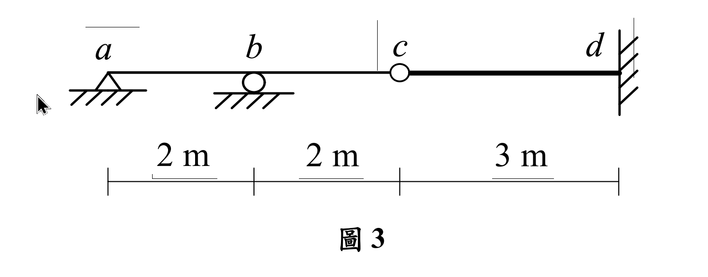

# 考題編號：SA-2020-3

**主分類：** `SA-U3-2` 影響線
**副分類：** 無
**分析法：** 柔度法 (Flexibility Method) 與 Müller-Breslau 原理
**標籤：** `影響線` `靜不定結構` `最大值` `反力影響線`

---

## 1. 原始題目重述 (Problem Restatement)

如圖 3 所示靜不定梁結構，桿件 $ab, bc$ 及 $cd$ 有相同彈性模數為 $E$，桿件 $ab$ 及 $bc$ 慣性矩為 $I$，而桿件 $cd$ 慣性矩為 $1.5I$。繪出 $b$ 點反力影響線的示意圖，並求此反力影響線的最大值及其在 $c$ 點的數值。（25 分）

*圖說：結構總長 $7\text{m}$。$a$ 端為鉸支承，$b$ 點為滾動支承，$c$ 點為內部鉸接 (internal hinge)，$d$ 端為固定支承。跨度：$ab = 2\text{m}$，$bc = 2\text{m}$，$cd = 3\text{m}$。斷面性質：$ab$ 與 $bc$ 段 $EI$ 為常數 $EI$；$cd$ 段 $EI$ 為 $1.5EI$。*

---

## 2. 考題核心精神與出題者意圖 (Core Concepts & Examiner's Intent)

本題為標準的**「靜不定結構影響線」**進階題。
考驗考生是否能靈活運用 **Müller-Breslau 原理**，將「求影響線」的問題轉換為「求結構在單位位移下的彈性變形曲線」。
出題者特別在 $c$ 點加入內部鉸接，並將 $cd$ 段的慣性矩設為 $1.5I$，目的是要測驗考生能否正確分離靜定/靜不定結構的邊界條件，並正確處理變截面桿件的積分。這題若使用單位載重法或直接積分法，需要非常小心的變形相容處理。

---

## 3. 解題戰略地圖與陷阱分析 (Strategic Roadmap & Trap Analysis)

**解題步驟：**
1. **釋放多餘束制：** 根據 Müller-Breslau 原理，要求 $b$ 點垂直反力 $B_y$ 的影響線，需先移除 $b$ 點的垂直支承。
2. **基本結構分析：** 移除 $b$ 點後，結構變為由 $ac$ 簡支梁與 $cd$ 懸臂梁於 $c$ 點鉸接所組成的「靜定結構」。在 $b$ 點施加向上單位力 $F_b = 1$。
3. **求彎矩方程式：** 計算靜定基本結構在 $F_b = 1$ 作用下的彎矩方程式 $m(x)$。注意 $ac$ 對 $cd$ 會產生傳遞剪力。
4. **求變形曲線 $v(x)$：** 利用 $EI v'' = m_{sagging}$ 對各段積分，求出整個梁的彈性變形曲線 $v(x)$，並代入 $x=2$ 求得柔度係數 $f_{bb}$（即 $v_b$）。
5. **歸一化得到影響線：** 影響線函數 $I.L.\ B_y(x) = \frac{v(x)}{f_{bb}}$。
6. **求極值與特定點值：** 利用微積分求各段極值，並代入 $x=4$ 得 $c$ 點數值。

**陷阱分析：**
- **陷阱一：忽略 $cd$ 段的 $1.5I$。** 若積分時未將 $cd$ 段的剛度改為 $1.5EI$，後續 $c$ 點變位與整條變形曲線將完全錯誤。
- **陷阱二：內部鉸接 $c$ 點的變形相容。** $c$ 點允許旋轉不連續，但垂直位移 $v_c$ 必須連續。$ac$ 段的積分邊界條件必須包含 $v_a = 0$ 與 $v_c$ 的值，絕不可將 $v_c$ 誤設為 0。
- **陷阱三：Müller-Breslau 變形正負號。** 由於 $b$ 點是施加向上單位位移，所有的變形曲線若以向上為正，彎矩方程式必須取「下緣受拉為正 (sagging)」，才能確保 $EI v'' = M$ 積分出正確的曲率。

---

## 3.5 變數層次分析 (Variable Hierarchy Analysis)

> 複習提示：第一次解題後，在每個卡住的知識點旁標記 `⚠`；第二次複習時只看有 `⚠` 的項目。

### 最終目標
`求出 b 點反力影響線方程式，並找出最大值與 c 點之值`

### 本題關鍵公式（依計算順序）

> $\boxed{\cdot}$ = 需由前步驟推導，非題目直接給定的變數

$$\text{Step 1 (基本結構): 施加 } F_b = 1 (\uparrow) \Rightarrow V_c = 0.5 (\downarrow \text{ on ac}) \Rightarrow V_c = 0.5 (\uparrow \text{ on cd})$$

$$\text{Step 2 (彈性曲線): } EI v'' = \boxed{M(x)} \Rightarrow v(x) = \int\int \frac{\boxed{M(x)}}{EI} dx dx$$

$$\text{Step 3 (柔度係數): } f_{bb} = v(x)\Big|_{x=x_b}$$

$$\text{Step 4 (影響線): } I.L.\ B_y(x) = \frac{\boxed{v(x)}}{\boxed{f_{bb}}}$$

### L1：題目直接給定
_看到題目就能讀出的數字，不需要任何公式。_

| 符號 | 數值 | 說明 |
|------|------|------|
| $L_{ab}, L_{bc}, L_{cd}$ | 2m, 2m, 3m | 各段跨度 |
| $EI_{ab}, EI_{bc}, EI_{cd}$ | $EI, EI, 1.5EI$ | 各段彎曲剛度 |

### L2：需知識點推導
_需要知道公式名稱與適用條件，套入 L1 即可算出。_

**Step 1：基本結構彎矩方程式 (施加 $F_b = 1 \uparrow$)**

| 符號 | 公式/來源 | 卡關? |
|------|----------|:-----:|
| $m_{ab}(x)$ | $0 \le x \le 2$: 支承反力 $V_a = 0.5 \downarrow \Rightarrow -0.5x$ | |
| $m_{bc}(x)$ | $2 \le x \le 4$: $-0.5x + 1(x-2) = 0.5x - 2$ | |
| $m_{cd}(x_2)$| $0 \le x_2 \le 3$: $c$ 點受向上 $0.5$ 剪力傳遞 $\Rightarrow 0.5x_2$ | |

**Step 2：柔度係數驗算 (單位力法)**

| 符號 | 公式/來源 | 卡關? |
|------|----------|:-----:|
| $f_{bb}$ | $\int \frac{m(x)^2}{EI} dx = \int_0^4 \frac{(-0.5x)^2}{EI}dx + \int_0^3 \frac{(0.5x_2)^2}{1.5EI}dx$ | |

### L3：深層知識（不懂就卡住）

| 知識點 | 說明 | 卡關? |
|--------|------|:-----:|
| $ac$ 對 $cd$ 的剪力傳遞 | 簡支梁 $ac$ 受向上外力，反力 $V_c$ 為向下。故 $ac$ 壓在 $c$ 支承的力為向下，但 $cd$ 作為支承對 $ac$ 的力為向下，根據作用與反作用力，$ac$ 對 $cd$ 施加的是「向上」的力！ | |
| $v_c$ 的位移邊界 | 先積懸臂梁 $cd$ 求出 $v_c$。再將 $v_c$ 作為簡支梁 $ac$ 積分的邊界條件 $v(4) = v_c$。 | |
| 影響線極值找法 | 對各段影響線方程式進行微分 $d(I.L.)/dx = 0$，解出 $x$ 並確認是否在該段區間內，比較各段極值。 | |

---

## 4. 步驟化詳細計算過程 (Step-by-Step Detailed Calculation)

> 📊 互動圖：`SA-2020-3-influence-line-viz.html`

**Step 1: 建立基本結構與彎矩方程式**
移除 $b$ 點垂直支承。結構變為 $a$ (鉸支承) 至 $c$ (內部鉸) 的簡支梁，搭載於 $c$ (自由端) 至 $d$ (固定端) 的懸臂梁上。
在 $b$ 點 ($x=2$) 施加向上單位力 $F_b = 1$。
- **$ac$ 梁段受力**：受向上集中力 $1$，$a, c$ 兩端反力皆為 $0.5 (\downarrow)$。
  這代表支承對梁的力是向下的。根據反作用力，梁對 $c$ 點（即懸臂梁端點）施加向上 $0.5 (\uparrow)$ 的力。
- **彎矩方程式 $m(x)$** (令下緣受拉為正)：
  - $ab$ 段 ($0 \le x \le 2$): $m_{ab}(x) = -0.5x$
  - $bc$ 段 ($2 \le x \le 4$): $m_{bc}(x) = -0.5x + 1(x-2) = 0.5x - 2$
  - $cd$ 段 (令 $x_2 = x-4$, $0 \le x_2 \le 3$): 懸臂梁受自由端向上 $0.5$ 作用， $m_{cd}(x_2) = 0.5x_2$

**Step 2: 計算變形曲線 $v(x)$ (向上為正)**
利用 $EI v'' = m(x)$ 進行積分。

- **$cd$ 段 ($EI = 1.5EI$)**：
  $1.5 EI v_{cd}'' = 0.5 x_2 \Rightarrow EI v_{cd}'' = \frac{1}{3} x_2$
  $EI v_{cd}' = \frac{1}{6} x_2^2 + C_1$
  $EI v_{cd} = \frac{1}{18} x_2^3 + C_1 x_2 + C_2$
  邊界條件 $d$ 點 ($x_2 = 3$) 固定端：$v(3)=0, v'(3)=0$。
  $v'(3) = 0 \Rightarrow \frac{1}{6}(9) + C_1 = 0 \Rightarrow C_1 = -1.5$
  $v(3) = 0 \Rightarrow \frac{1}{18}(27) - 1.5(3) + C_2 = 0 \Rightarrow 1.5 - 4.5 + C_2 = 0 \Rightarrow C_2 = 3$
  $$EI v_{cd}(x_2) = \frac{1}{18} x_2^3 - 1.5 x_2 + 3$$
  得知 $c$ 點位移 $v_c = v_{cd}(0) = \frac{3}{EI}$ (向上)。

- **$ac$ 段 ($EI$)**：
  $ab$: $EI v_{ab}'' = -0.5x \Rightarrow EI v_{ab}' = -0.25x^2 + C_3 \Rightarrow EI v_{ab} = -\frac{1}{12}x^3 + C_3 x + C_4$
  $bc$: $EI v_{bc}'' = 0.5x - 2 \Rightarrow EI v_{bc}' = 0.25x^2 - 2x + C_5 \Rightarrow EI v_{bc} = \frac{1}{12}x^3 - x^2 + C_5 x + C_6$
  邊界條件：
  (1) $v(0) = 0 \Rightarrow C_4 = 0$
  (2) $v(4) = v_c = \frac{3}{EI} \Rightarrow \frac{64}{12} - 16 + 4C_5 + C_6 = 3 \Rightarrow 4C_5 + C_6 = 19 - \frac{16}{3} = \frac{41}{3}$
  (3) $b$ 點位移連續 $v_{ab}(2) = v_{bc}(2) \Rightarrow -\frac{8}{12} + 2C_3 = \frac{8}{12} - 4 + 2C_5 + C_6 \Rightarrow 2C_3 = -\frac{8}{3} + 2C_5 + C_6$
  (4) $b$ 點斜率連續 $v'_{ab}(2) = v'_{bc}(2) \Rightarrow -1 + C_3 = 1 - 4 + C_5 \Rightarrow C_3 = -2 + C_5$
  解聯立：
  將 $C_3$ 代入 (3): $2(-2 + C_5) = -\frac{8}{3} + 2C_5 + C_6 \Rightarrow -4 = -\frac{8}{3} + C_6 \Rightarrow C_6 = -4 + \frac{8}{3} = -\frac{4}{3}$
  代入 (2): $4C_5 - \frac{4}{3} = \frac{41}{3} \Rightarrow 4C_5 = 15 \Rightarrow C_5 = \frac{15}{4}$
  回代 $C_3$: $C_3 = \frac{15}{4} - 2 = \frac{7}{4} = \frac{21}{12}$
  故：
  $$EI v_{ab}(x) = \frac{1}{12}(-x^3 + 21x)$$
  $$EI v_{bc}(x) = \frac{1}{12}(x^3 - 12x^2 + 45x - 16)$$

- **計算 $b$ 點柔度係數 $f_{bb}$**：
  代入 $x=2$：
  $EI v_{ab}(2) = \frac{1}{12}(-8 + 42) = \frac{34}{12} = \frac{17}{6}$
  故 $\boxed{f_{bb} = \frac{17}{6 EI}}$

**Step 3: 歸一化得到影響線 $I.L.\ B_y(x)$**
$$I.L.\ B_y(x) = \frac{v(x)}{f_{bb}} = \frac{6 EI}{17} v(x)$$
- $ab$ 段 ($0 \le x \le 2$): **$I.L.\ B_y(x) = \frac{1}{34} (-x^3 + 21x)$**
- $bc$ 段 ($2 \le x \le 4$): **$I.L.\ B_y(x) = \frac{1}{34} (x^3 - 12x^2 + 45x - 16)$**
- $cd$ 段 ($0 \le x_2 \le 3$): **$I.L.\ B_y(x_2) = \frac{1}{51} (x_2^3 - 27 x_2 + 54)$**

**Step 4: 求極值與 $c$ 點數值**
1. **在 $c$ 點的數值**：
   代入 $x=4$ (即 $x_2=0$)：
   $$I.L.\ B_y(4) = \frac{1}{51} (0 - 0 + 54) = \boxed{\frac{18}{17}} \quad (\approx 1.0588)$$

2. **尋找影響線最大值**：
   - 檢查 $ab$ 段：微積分求極值發生在 $x = \sqrt{7} \approx 2.64 > 2$，不在區間內，故最大值在邊界 $x=2$ 處，數值為 $1$。
   - 檢查 $bc$ 段：
     $$ \frac{d}{dx} (x^3 - 12x^2 + 45x - 16) = 3x^2 - 24x + 45 = 0 $$
     $$ x^2 - 8x + 15 = 0 \Rightarrow (x-3)(x-5) = 0 $$
     極值發生在 $x=3$ (在區間內)。代入 $x=3$：
     $$ I.L.\ B_y(3) = \frac{1}{34} (27 - 108 + 135 - 16) = \boxed{\frac{19}{17}} \quad (\approx 1.1176) $$
   - 檢查 $cd$ 段：極值發生在 $x_2 = 3$，數值為 $0$ (最小值)。
   - 比較可知，**影響線的最大值為 $\frac{19}{17}$**。

---

## 5. 關鍵爭議點與進階探討 (Critical Issues & Advanced Discussion)

- **Müller-Breslau 原理的正負號一致性**：求垂直反力 $B_y$ 的影響線，若假定 $B_y$ 向上為正，則必須在 $b$ 點施加「向上」的單位位移。若圖形積分不熟練，非常容易在第一步「判定 $ac$ 對 $cd$ 施加的作用力方向」就出錯，導致整個 $v(x)$ 的正負號顛倒。建議以單位力法驗算 $f_{bb}$（必定恆正）來確認自己的變形方向是否推導正確。
- **影響線的峰值位置**：連續梁的反力影響線，其最大值不一定發生在支承正上方。本題由於右側有懸臂梁的柔性支撐帶動，導致當載重移動至 $bc$ 段中央時，整個結構向上的翹起程度大於停在 $b$ 點本身，這也是結構相容變形的趣味所在。
