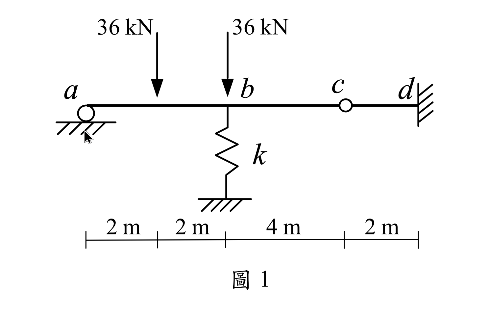

### 考題編號：SA-2021-1

**主分類：** `SA-U2` 靜不定結構與位移
**副分類：** `SA-U2-3`
**分析法：** 傾角變位法
**標籤：** `傾角變位法` `彈簧支承` `內部鉸` `連續梁` `沈陷`

---

## 1. 原始題目重述 (Problem Restatement)

如圖所示之一維梁結構，總長度 10 m。
- $a$ 點為滾支承（$x = 0$）
- $b$ 點下方有彈簧支承，彈簧係數 $k = 15000 \text{ kN/m}$（$x = 4\text{ m}$）
- $c$ 點為內部鉸接（$x = 8\text{ m}$）
- $d$ 點為固定端（$x = 10\text{ m}$）
- 載重：在 $a, b$ 中點（$x = 2\text{ m}$）有向下集中載重 $36\text{ kN}$；在 $b$ 點（$x = 4\text{ m}$）有向下集中載重 $36\text{ kN}$。
- 斷面性質：$EI = 10000 \text{ kN-m}^2$。

求梁桿件的彎矩圖 (BMD)、$b$ 點轉角 $\theta_b$ 及 $b$ 點垂直位移 $\Delta_b$。

*圖說：連續梁 $a-b-c-d$，跨距分別為 4m、4m、2m。$a$ 滾支承，$b$ 彈簧 $k$ 與 36kN 載重，$c$ 內部鉸，$d$ 固定端。$ab$ 中點有一 36kN 載重。*

## 2. 考題核心精神與出題者意圖 (Core Concepts & Examiner's Intent)

本題測驗考生處理「混合複雜邊界條件」的能力，結合了彈簧支承（柔性支承）與內部鉸接。出題者的核心意圖在於：
1. **等效剛度簡化**：能否看出右側懸臂段 $cd$ 可等效為 $c$ 點的彈簧支承。
2. **對稱跨距的奇妙性質**：$ab$ 與 $bc$ 跨距相同，且兩端 $a, c$ 皆無彎矩，這會使得 $b$ 點的內力剪力相互抵銷，讓 $\Delta_b$ 能夠直接由垂直平衡求出，大幅降低解聯立方程式的複雜度。

## 3. 解題戰略地圖與陷阱分析 (Strategic Roadmap & Trap Analysis)

**解題策略：**
1. **右段簡化**：先單獨分析 $cd$ 段，將其對 $c$ 點的支撐效果轉化為等效彈簧常數 $k_c$。
2. **傾角變位法**：對 $a-b-c$ 段列出傾角變位方程式。因 $a, c$ 彎矩為零，直接使用修正版傾角變位公式（鉸端修正）。
3. **節點平衡**：
   - $b$ 點彎矩平衡（求 $\theta_b$ 與 $\Delta_c$ 關係）
   - $b$ 點垂直力平衡（可獨立求出 $\Delta_b$）
   - $c$ 點垂直力平衡（求 $\Delta_c$ 與 $M_{bc}$ 關係）
4. **解聯立並繪圖**：求出所有未知變位後，代回求端彎矩並繪製 BMD。

**陷阱分析：**
- **陷阱 1：忽略 $b$ 點的雙重載重效果**：$b$ 點除了有彈簧，還有一個直接作用在節點上的 36 kN 外力，列垂直平衡時極易遺漏。
- **陷阱 2：變位正負號混淆**：同時存在 $\Delta_b$ 與 $\Delta_c$，在計算弦旋轉角 $\psi$ 時，若未統一符號約定（如統一向下為正），極易在方程式中寫反。

## 3.5 變數層次分析 (Variable Hierarchy Analysis)

> 複習提示：第一次解題後，在每個卡住的知識點旁標記 `⚠`；第二次複習時只看有 `⚠` 的項目。

### 最終目標
`求出 b 點位移與轉角，並解出各桿端彎矩以繪製 BMD`

### 本題關鍵公式（依計算順序）

$$\text{Step 1: } k_c = \frac{3EI}{L_{cd}^3}$$

$$\text{Step 2: } M_{Fba}^{mod} = M_{Fba} - \frac{1}{2} M_{Fab}$$

$$\text{Step 3: } M_{ba} = \frac{3EI}{L_{ab}} \left( \theta_b - \frac{\Delta_b}{L_{ab}} \right) + \boxed{M_{Fba}^{mod}}$$

$$\text{Step 4: } \sum F_{yb} = 0 \Rightarrow V_{ba} + V_{bc} + P_b = k_b \Delta_b$$

### L1：題目直接給定
_看到題目就能讀出的數字，不需要任何公式。_

| 符號 | 數值 | 說明 |
|------|------|------|
| $EI$ | 10000 kN-m² | 梁抗彎剛度 |
| $k_b$ | 15000 kN/m | $b$ 點彈簧常數 |
| $L_{ab}, L_{bc}$ | 4 m, 4 m | $ab$ 與 $bc$ 桿長 |

### L2：需知識點推導
_需要知道公式名稱與適用條件，套入 L1 即可算出。_

**Step 1：懸臂等效剛度**

| 符號 | 公式/來源 | 卡關? |
|------|----------|:-----:|
| $k_c$ | $3EI / L_{cd}^3$ (懸臂梁端點受力變位公式倒數) | |

**Step 2：固端彎矩與修正**

| 符號 | 公式/來源 | 卡關? |
|------|----------|:-----:|
| $M_{Fba}^{mod}$ | $(+PL/8) - 0.5(-PL/8) = 3PL/16$ | |

### L3：深層知識（不懂就卡住）
_L2 中某些公式本身需要背景概念才能正確應用的知識點。_

| 知識點 | 說明 | 卡關? |
|--------|------|:-----:|
| 連續梁中間支承反力性質 | 當相鄰兩跨長度相同且外端皆為鉸接時，節點不平衡彎矩產生的剪力會完全抵銷。 | |
| 弦旋轉角 $\psi$ 的相對性 | $\psi_{bc} = (\Delta_c - \Delta_b) / L_{bc}$，需嚴格遵守幾何相對位移關係。 | |

## 4. 步驟化詳細計算過程 (Step-by-Step Detailed Calculation)

> 📊 互動圖：`SA-2021-1-sfd-bmd-viz.html`

**Step 1：處理右側懸臂段 $cd$**
$c-d$ 為長度 $L_{cd}=2\text{ m}$ 的桿件，$d$ 端固定。$c$ 點受垂直向下力 $V_c$ 時的位移為 $\Delta_c = \frac{V_c L_{cd}^3}{3EI}$。
將其視為 $c$ 點的等效彈簧支承，其彈簧常數為：
$$k_c = \frac{3EI}{L_{cd}^3} = \frac{3(10000)}{2^3} = 3750 \text{ kN/m}$$

**Step 2：計算固端彎矩 (FEM)**
對 $a-b$ 桿件，中點受集中載重 $P = 36\text{ kN}$，因 $a$ 為鉸支承，採用修正固端彎矩：
$$M_{Fba}^{mod} = M_{Fba} - \frac{1}{2} M_{Fab} = \frac{PL}{8} - \frac{1}{2}\left(-\frac{PL}{8}\right) = \frac{3PL}{16}$$
$$M_{Fba}^{mod} = \frac{3(36)(4)}{16} = 27 \text{ kN-m}$$
$b-c$ 桿件無跨中載重，故 $M_{Fbc}^{mod} = 0$。

**Step 3：列傾角變位方程式**
設向下位移 $\Delta$ 為正，順時針轉角為正。
對於 $a-b$ 桿件（$a$ 鉸接，修正版）：
$$M_{ba} = \frac{3EI}{L_{ab}} (\theta_b - \psi_{ab}) + M_{Fba}^{mod} = \frac{3(10000)}{4} \left( \theta_b - \frac{\Delta_b}{4} \right) + 27 = 7500 \theta_b - 1875 \Delta_b + 27$$
對於 $b-c$ 桿件（$c$ 鉸接，修正版）：
$$M_{bc} = \frac{3EI}{L_{bc}} (\theta_b - \psi_{bc}) = \frac{3(10000)}{4} \left( \theta_b - \frac{\Delta_c - \Delta_b}{4} \right) = 7500 \theta_b - 1875 \Delta_c + 1875 \Delta_b$$

**Step 4：節點 $b$ 垂直力平衡（求解 $\Delta_b$）**
節點 $b$ 的向下總力包含：外力 36 kN，以及來自 $ab$、$bc$ 桿件施加的剪力。
桿件對節點的向下作用力，等於單純梁反力加上兩端彎矩造成的剪力修正：
$$V_{b\text{向下}} = \left( \frac{36}{2} - \frac{M_{ba}}{4} \right) + \left( 0 - \frac{M_{bc}}{4} \right) = 18 - \frac{M_{ba} + M_{bc}}{4}$$
因節點 $b$ 無外加力矩，彎矩平衡 $\sum M_b = 0 \Rightarrow M_{ba} + M_{bc} = 0$。
故桿件對節點 $b$ 的向下總力正好等於單純梁反力 $18\text{ kN}$。
總向下力與彈簧力平衡：
$$18 + 36 = k_b \Delta_b \Rightarrow 54 = 15000 \Delta_b \Rightarrow \boxed{\Delta_b = 0.0036 \text{ m} = 3.6 \text{ mm (向下)}}$$

**Step 5：節點 $c$ 垂直力平衡（求解 $\Delta_c$ 與 $M_{bc}$ 關係）**
桿件 $bc$ 對節點 $c$ 的向下作用力為：
$$V_{c\text{向下}} = 0 + \frac{M_{bc}}{4}$$
此力由 $c$ 點等效彈簧支撐平衡：
$$k_c \Delta_c = \frac{M_{bc}}{4} \Rightarrow 3750 \Delta_c = \frac{M_{bc}}{4} \Rightarrow M_{bc} = 15000 \Delta_c$$

**Step 6：解聯立方程式（求解 $\theta_b, \Delta_c$）**
將 $\Delta_b = 0.0036$ 代入 $M_{bc}$ 方程式：
$$M_{bc} = 7500 \theta_b - 1875 \Delta_c + 1875(0.0036) = 7500 \theta_b - 1875 \Delta_c + 6.75$$
代入 $M_{bc} = 15000 \Delta_c$：
$$7500 \theta_b - 16875 \Delta_c + 6.75 = 0 \quad \text{--- (式1)}$$
再利用節點彎矩平衡 $M_{ba} + M_{bc} = 0$：
$$(7500 \theta_b - 1875(0.0036) + 27) + 15000 \Delta_c = 0 \Rightarrow 7500 \theta_b + 15000 \Delta_c + 20.25 = 0 \quad \text{--- (式2)}$$
(式2) 減 (式1)：
$$31875 \Delta_c + 13.5 = 0 \Rightarrow \Delta_c = -\frac{13.5}{31875} = -\frac{9}{21250} \text{ m} \approx -0.424 \text{ mm (向上)}$$
代回 (式2) 求 $\theta_b$：
$$7500 \theta_b = -20.25 - 15000 \left( -\frac{9}{21250} \right) = -20.25 + 6.353 = -13.897$$
$$\boxed{\theta_b = -\frac{63}{34000} \text{ rad} \approx -0.00185 \text{ rad (逆時針)}}$$

**Step 7：計算桿端彎矩與繪圖**
代回求桿端彎矩：
$$M_{bc} = 15000 \left( -\frac{9}{21250} \right) = -\frac{108}{17} \text{ kN-m} \approx -6.35 \text{ kN-m}$$
$$M_{ba} = -M_{bc} = \frac{108}{17} \text{ kN-m} \approx 6.35 \text{ kN-m}$$
$ab$ 跨中彎矩（距 $a$ 點 2m 處）：
$$R_a = 18 - \frac{M_{ba}}{4} = 18 - \frac{27}{17} = \frac{279}{17} \text{ kN}$$
$$M_{mid} = R_a \times 2 = \frac{558}{17} \text{ kN-m} \approx 32.82 \text{ kN-m}$$
$d$ 點彎矩：$c$ 點受向上力 $V_c = 27/17\text{ kN}$，產生 $d$ 點彎矩（下緣受拉，為正彎矩）：
$$M_d = \frac{27}{17} \times 2 = \frac{54}{17} \text{ kN-m} \approx 3.18 \text{ kN-m}$$

## 5. 關鍵爭議點與進階探討 (Critical Issues & Advanced Discussion)

1. **獨立解耦的位移**：本題 $b$ 點的位移之所以能獨立求解，前提是相鄰兩跨長度相等（$L_{ab} = L_{bc} = 4\text{m}$），且兩外側端點彎矩為零（鉸接）。若長度不等，則 $M_{ba}/L_{ab}$ 與 $M_{bc}/L_{bc}$ 無法完全抵銷，$\Delta_b$ 將會與 $\theta_b$ 產生耦合，必須解三元一次聯立方程式。這考驗考生對力學平衡深層本質的直覺。
2. **正負號與物理意義的驗證**：計算得出 $\Delta_c$ 為負值（向上），這在直覺上是合理的。因為 $ab$ 段受載向下變形，帶動 $b$ 點下沉；但 $bc$ 段無載重，為了維持 $b$ 點的轉角與變形諧合，這根「蹺蹺板」的右端 $c$ 點勢必會被向上翹起，導致 $cd$ 懸臂梁承受向上拉力。
