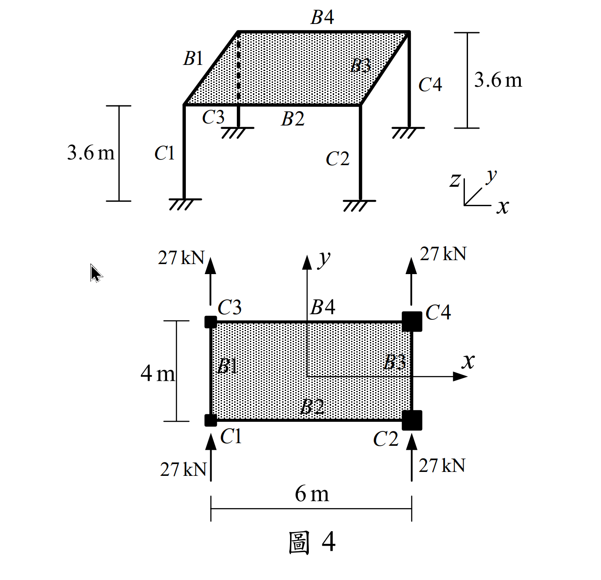

### 考題編號：SA-2021-4

**主分類：** `SA-U5` 側力分配與剛性樓板
**副分類：** `SA-U5-1`
**分析法：** 剛心法 (Center of Rigidity Method)
**標籤：** `剛性樓板` `平移與扭轉` `剛心位置` `扭轉勁度` `柱剪力分配`

---

## 1. 原始題目重述 (Problem Restatement)

如圖所示一層樓建築結構，共有四根柱及四根梁，不考慮桿件的軸向變形：
- 樓高 $h = 3.6 \text{ m}$
- 屋頂樓板視為**剛性樓板**（平面內剛度無限大）
- 梁桿件斷面慣性矩為無限大（柱端視為固定端）
- 柱斷面性質：$C1, C3$ 慣性矩為 $I_d$，$2EI_d = 9720 \text{ kN-m}^2$；$C2, C4$ 慣性矩為 $I_e$，$2EI_e = 48600 \text{ kN-m}^2$。所有柱在二個方向 ($X,Y$) 慣性矩相同。
- 載重：四根柱在一樓柱頂各承受 $Y$ 向水平力 $27 \text{ kN}$。
- 不考慮柱的扭轉勁度。

求 $C3$ 及 $C4$ 柱桿件在柱底端點的 $X, Y$ 向剪力，及柱頂 $X, Y$ 向水平位移。（25 分）

## 2. 考題核心精神與出題者意圖 (Core Concepts & Examiner's Intent)

本題測驗結構動力學與耐震設計中最經典的**「剛性樓板側力分配」**問題。
由於樓板具無限大平面內剛度，整塊樓板僅有三個自由度：$X$ 平移、$Y$ 平移、繞 $Z$ 軸旋轉 $\theta$。
出題者精心設計了柱的 $EI$ 值，使其經過 $k = 12EI/h^3$ 轉換後，勁度呈現完美的整數比（$1250$ 與 $6250$，即 $1:5$）。
解題關鍵在於：
1. 算出各柱側向勁度。
2. 尋找**剛心 (Center of Rigidity, CR)** 座標。
3. 計算總側向力對剛心的**扭轉力矩 (Torsional Moment)**。
4. 計算整體的**扭轉勁度 (Torsional Stiffness, $K_\theta$)**。
5. 求出整體平移與旋轉量後，反推各柱的局部位移與剪力。

## 3. 步驟化詳細計算過程 (Step-by-Step Detailed Calculation)

> 📊 互動圖：`SA-2021-4-slab-viz.html`

### Step 1：計算柱側向勁度
因梁剛度無限大且底部固定，柱為雙向固定，其側向勁度為 $k = \frac{12EI}{h^3}$。
- $C1, C3$ 柱：$EI_d = 4860 \text{ kN-m}^2$
  $$k_d = \frac{12 \times 4860}{3.6^3} = \frac{58320}{46.656} = 1250 \text{ kN/m}$$
- $C2, C4$ 柱：$EI_e = 24300 \text{ kN-m}^2$
  $$k_e = \frac{12 \times 24300}{3.6^3} = \frac{291600}{46.656} = 6250 \text{ kN/m}$$
令 $k = 1250 \text{ kN/m}$，則 $C1, C3$ 勁度為 $k$，$C2, C4$ 勁度為 $5k$。

### Step 2：建立座標系與尋找剛心 (CR)
以幾何中心為原點 $(0,0)$，各柱座標為：
$C1(-3, -2)$，$C2(3, -2)$，$C3(-3, 2)$，$C4(3, 2)$。
$X$ 向與 $Y$ 向總勁度均為：$\sum K_x = \sum K_y = k + 5k + k + 5k = 12k$
計算剛心座標 $(x_r, y_r)$：
$$x_r = \frac{\sum K_{yi} x_i}{\sum K_y} = \frac{k(-3) + 5k(3) + k(-3) + 5k(3)}{12k} = \frac{24k}{12k} = 2 \text{ m}$$
$$y_r = \frac{\sum K_{xi} y_i}{\sum K_x} = \frac{k(-2) + 5k(-2) + k(2) + 5k(2)}{12k} = 0 \text{ m}$$
剛心 $CR$ 位於 $(2, 0)$。

### Step 3：計算總側力與扭矩
- 總 $Y$ 向力：$F_y = 27 \times 4 = 108 \text{ kN}$
- 總 $X$ 向力：$F_x = 0$
四個力對稱分佈，合力作用於幾何中心 $(0,0)$。
力臂為 $x_{force} - x_r = 0 - 2 = -2 \text{ m}$。
扭轉力矩 $M_t = F_y \cdot (-2) = 108 \times (-2) = -216 \text{ kN-m}$ （順時針）。

### Step 4：計算結構扭轉勁度 $K_\theta$
各柱相對於剛心的座標 $(x'_i = x_i - x_r, y'_i = y_i - y_r)$：
- $C1: (-5, -2)$
- $C2: (1, -2)$
- $C3: (-5, 2)$
- $C4: (1, 2)$
$$K_\theta = \sum K_{xi} (y'_i)^2 + \sum K_{yi} (x'_i)^2$$
$$= \left[ k(-2)^2 + 5k(-2)^2 + k(2)^2 + 5k(2)^2 \right] + \left[ k(-5)^2 + 5k(1)^2 + k(-5)^2 + 5k(1)^2 \right]$$
$$= [4k + 20k + 4k + 20k] + [25k + 5k + 25k + 5k]$$
$$= 48k + 60k = 108k$$
代入 $k=1250$，得 $K_\theta = 108 \times 1250 = 135000 \text{ kN-m/rad}$。

### Step 5：計算樓板總體位移
- $Y$ 向平移：$\Delta y_r = \frac{F_y}{\sum K_y} = \frac{108}{12 \times 1250} = \frac{108}{15000} = 0.0072 \text{ m} = 7.2 \text{ mm}$
- $X$ 向平移：$\Delta x_r = 0$
- 樓板扭轉角：$\theta = \frac{M_t}{K_\theta} = \frac{-216}{135000} = -0.0016 \text{ rad}$ （順時針）

### Step 6：計算 C3, C4 柱之位移與剪力
各柱端地位移公式：$u_i = \Delta x_r - \theta \cdot y'_i$， $v_i = \Delta y_r + \theta \cdot x'_i$

**對於 C3 柱：**
$x'_3 = -5$，$y'_3 = 2$
$u_3 = 0 - (-0.0016)(2) = 0.0032 \text{ m} = \mathbf{3.2 \text{ mm (向右)}}$
$v_3 = 0.0072 + (-0.0016)(-5) = 0.0072 + 0.0080 = 0.0152 \text{ m} = \mathbf{15.2 \text{ mm (向上)}}$
剪力 $V_{x3} = K_{x3} u_3 = 1250 \times 0.0032 = \mathbf{4 \text{ kN}}$
剪力 $V_{y3} = K_{y3} v_3 = 1250 \times 0.0152 = \mathbf{19 \text{ kN}}$

**對於 C4 柱：**
$x'_4 = 1$，$y'_4 = 2$
$u_4 = 0 - (-0.0016)(2) = 0.0032 \text{ m} = \mathbf{3.2 \text{ mm (向右)}}$
$v_4 = 0.0072 + (-0.0016)(1) = 0.0072 - 0.0016 = 0.0056 \text{ m} = \mathbf{5.6 \text{ mm (向上)}}$
剪力 $V_{x4} = K_{x4} u_4 = 6250 \times 0.0032 = \mathbf{20 \text{ kN}}$
剪力 $V_{y4} = K_{y4} v_4 = 6250 \times 0.0056 = \mathbf{35 \text{ kN}}$

---

## 5. 結論答案整理

**【C3 柱】**
- 柱頂 X 向位移：$3.2 \text{ mm}$ (向右)
- 柱頂 Y 向位移：$15.2 \text{ mm}$ (向上)
- 柱底 X 向剪力：$4 \text{ kN}$
- 柱底 Y 向剪力：$19 \text{ kN}$

**【C4 柱】**
- 柱頂 X 向位移：$3.2 \text{ mm}$ (向右)
- 柱頂 Y 向位移：$5.6 \text{ mm}$ (向上)
- 柱底 X 向剪力：$20 \text{ kN}$
- 柱底 Y 向剪力：$35 \text{ kN}$
