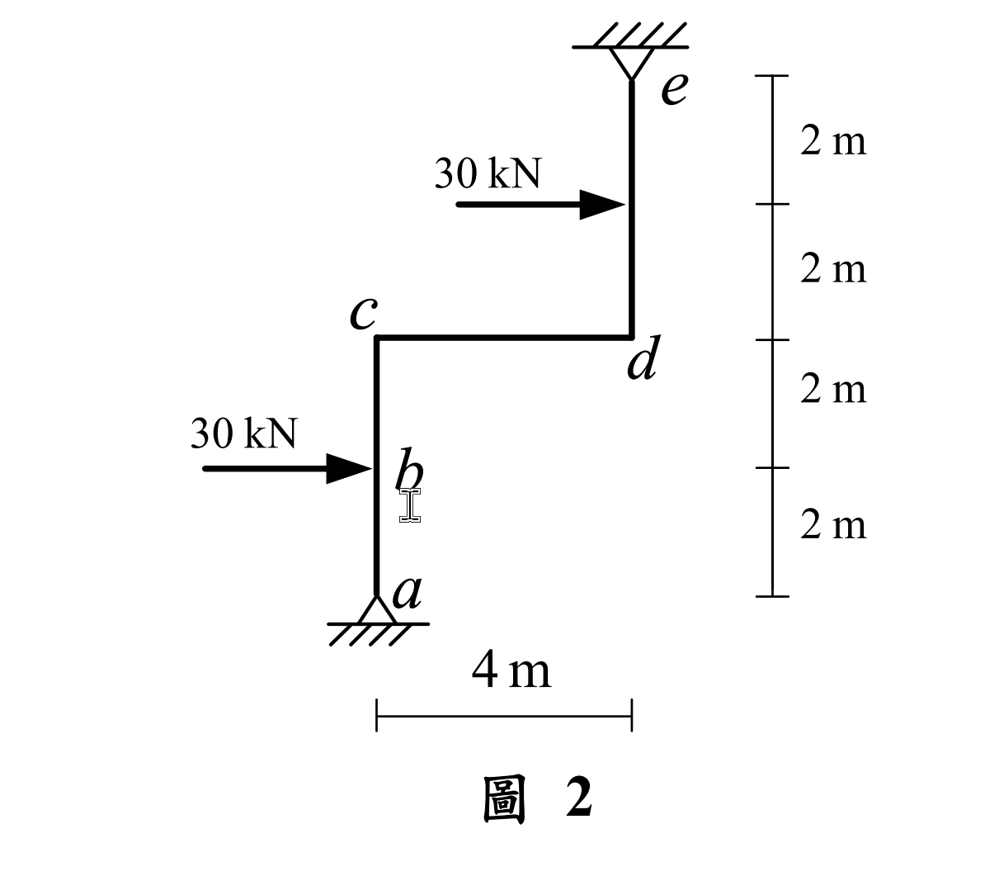

# 考題編號：SA-2022-2

**主分類：** `SA-U2-3` 靜不定結構與位移
**副分類：** 無
**分析法：** 傾角變位法 (Slope-Deflection Method)
**標籤：** `傾角變位法` `有側移剛架` `側移方程式` `修正固端彎矩` `疊加法`

---

## 1. 原始題目重述 (Problem Restatement)

如圖 2 所示剛架結構，不考慮桿件的軸向變形，$a$ 點及 $e$ 點為鉸支承，桿件有相同彈性模數 $E$ 與慣性矩 $I$，且 $EI = 40000 \text{ kN-m}^2$。求 $cd$ 梁桿件的彎矩圖、$b$ 點及 $c$ 點的水平位移。（25 分）

*圖說：本題為一階梯型剛架。節點 $a, e$ 為鉸支承。柱 $a-c$ 高度 4m，在 $b$ 點（距底 2m 處）受水平向右 30 kN 集中力；梁 $c-d$ 長 4m；柱 $d-e$ 高度 4m，在距 $d$ 點 2m 處受水平向右 30 kN 集中力。$c, d$ 皆為剛節點。*

## 2. 考題核心精神與出題者意圖 (Core Concepts & Examiner's Intent)

**核心精神：**
1. **有側移剛架分析**：本結構受兩股同向之水平載重，必然產生側移 $\Delta$。考驗考生使用傾角變位法設立包含側移未知數的平衡方程式。
2. **側移方程式 (Sway Equation) 的建立**：由於右側柱 $d-e$ 的鉸支承位於頂端，考生須利用整體結構的水平力平衡（或單柱游離體力矩平衡）來建立正確的 $\Delta$ 關係式。
3. **節點絕對位移與桿件彈性位移的疊加**：求 $b$ 點位移時，需將柱的「弦旋轉（剛體位移）」與「桿件本身的彈性彎曲位移」精確疊加，這是區分考生觀念是否清晰的鑑別點。

## 3. 解題戰略地圖與陷阱分析 (Strategic Roadmap & Trap Analysis)

**戰略步驟：**
1. **判斷自由度**：不考慮軸向變形下，$c, d$ 兩點有相同的水平側移，設為 $\Delta$（向右）。未知數共三個：$\theta_c, \theta_d, \Delta$。
2. **計算固端彎矩 (FEM)**：針對 $a-c$ 與 $d-e$ 兩柱段，利用「一端固定一端鉸接」的修正固端彎矩公式，計算中點集中載重產生的 FEM。
3. **建立傾角變位方程式**：寫出各桿端彎矩的方程式。特別注意 $a-c$ 與 $d-e$ 因支承位置不同，弦轉角 $\psi$ 的正負號相反。
4. **節點與剪力平衡**：利用 $\sum M_c = 0$, $\sum M_d = 0$ 以及全體水平剪力平衡 $\sum F_x = 0$ 建立三元一次方程組並求解。
5. **計算彎矩圖與位移**：代回求得彎矩，繪製 $cd$ 梁彎矩圖；並利用共軛梁法計算 $b$ 點的彈性位移，疊加弦位移求得總位移。

**陷阱分析：**
- **陷阱一：弦轉角 $\psi$ 的正負號判斷**。$a-c$ 柱底部固定於 $a$，頂部 $c$ 向右移 $\Delta$，弦轉角為順時針，$\psi_1 = +\Delta/L$；但 $d-e$ 柱底部 $d$ 向右移 $\Delta$，頂部 $e$ 為固定不變的鉸支承，弦轉角為逆時針，$\psi_3 = -\Delta/L$。符號弄錯全盤皆輸。
- **陷阱二：$b$ 點位移的計算**。傾角變位法直接解出的是節點 $c$ 的位移。$b$ 點位於桿件中段，其位移不可直接按比例內插（那是純剛體位移），必須加上桿件受載重彎曲產生的彈性變形。

## 3.5 變數層次分析 (Variable Hierarchy Analysis)

### 最終目標
`求 cd 梁彎矩圖`、`b 點水平位移` $\Delta_b$、`c 點水平位移` $\Delta_c$

### 本題關鍵公式（依計算順序）

> $\boxed{\cdot}$ = 需由前步驟推導，非題目直接給定的變數

$$\text{Step 1: } M_{Fca}^a = M_{Fca} - 0.5 M_{Fac}$$

$$\text{Step 2: } M_{ca} = \frac{3EI}{L} \left(\theta_c - \psi_1\right) + \boxed{M_{Fca}^a}$$

$$\text{Step 3: } \sum F_x = 0 \Rightarrow H_a + H_e + \sum P_x = 0 \Rightarrow f(\boxed{M_{ca}}, \boxed{M_{de}}) = 0$$

$$\text{Step 4: } \Delta_b = \Delta_{b,rigid} + \Delta_{b,elastic} = \frac{\boxed{\Delta_c}}{2} + \delta_{elastic}$$

### L1：題目直接給定
| 符號 | 數值 | 說明 |
|------|------|------|
| $EI$ | $40000 \text{ kN-m}^2$ | 桿件抗彎剛度 |
| $L$  | $4 \text{ m}$ | 所有桿件長度 |
| $P$  | $30 \text{ kN}$ | 作用於兩柱中點的水平力 |

### L2：需知識點推導
| 符號 | 公式/來源 | 卡關? |
|------|----------|:-----:|
| $\psi_1$ | $+\Delta/4$ | $a-c$ 柱弦轉角 |
| $\psi_3$ | $-\Delta/4$ | $d-e$ 柱弦轉角 |
| $\theta_c, \theta_d, \Delta$ | 解三元一次聯立方程式 | |

## 4. 步驟化詳細計算過程 (Step-by-Step Detailed Calculation)

**Step 1：設定自由度與相對勁度**
令節點 $c$ 向右側移量為 $\Delta$。因不考慮軸向變形，節點 $d$ 亦向右側移 $\Delta$。
令相對勁度 $K = \frac{EI}{L} = \frac{EI}{4}$。
弦轉角：
- $a-c$ 柱（下端不動，上端右移）：$\psi_1 = +\frac{\Delta}{4}$ (順時針為正)
- $c-d$ 梁：無相對垂直位移，$\psi_2 = 0$
- $d-e$ 柱（上端不動，下端右移）：$\psi_3 = -\frac{\Delta}{4}$ (逆時針為負)

**Step 2：計算修正固端彎矩 (Modified FEM)**
$a$ 與 $e$ 皆為鉸支承，採用修正傾角變位方程式以簡化計算。
- **$a-c$ 柱**：承受中點向右 30 kN。標準雙端固定之 FEM 為 $M_{Fac} = -PL/8 = -15 \text{ kN-m}$，$M_{Fca} = +15 \text{ kN-m}$。
  修正後 $c$ 端固端彎矩：$M_{Fca}^a = M_{Fca} - 0.5 M_{Fac} = 15 - 0.5(-15) = +22.5 \text{ kN-m}$。
- **$d-e$ 柱**：承受中點向右 30 kN。標準雙端固定之 FEM 為 $M_{Fde} = -15 \text{ kN-m}$，$M_{Fed} = +15 \text{ kN-m}$。
  修正後 $d$ 端固端彎矩：$M_{Fde}^e = M_{Fde} - 0.5 M_{Fed} = -15 - 0.5(15) = -22.5 \text{ kN-m}$。

**Step 3：建立傾角變位方程式**
$$M_{ca} = 3K \left( \theta_c - \frac{\Delta}{4} \right) + 22.5 = 3K \theta_c - 0.75K \Delta + 22.5$$
$$M_{cd} = 2K \left( 2\theta_c + \theta_d \right) = 4K \theta_c + 2K \theta_d$$
$$M_{dc} = 2K \left( 2\theta_d + \theta_c \right) = 4K \theta_d + 2K \theta_c$$
$$M_{de} = 3K \left( \theta_d - \left(-\frac{\Delta}{4}\right) \right) - 22.5 = 3K \theta_d + 0.75K \Delta - 22.5$$

**Step 4：建立平衡方程式**
1. 節點 $c$ 力矩平衡 ($\sum M_c = 0 \Rightarrow M_{ca} + M_{cd} = 0$)：
   $$(3K \theta_c - 0.75K \Delta + 22.5) + (4K \theta_c + 2K \theta_d) = 0$$
   $$7K \theta_c + 2K \theta_d - 0.75K \Delta = -22.5 \quad \text{--- (式 1)}$$
2. 節點 $d$ 力矩平衡 ($\sum M_d = 0 \Rightarrow M_{dc} + M_{de} = 0$)：
   $$(4K \theta_d + 2K \theta_c) + (3K \theta_d + 0.75K \Delta - 22.5) = 0$$
   $$2K \theta_c + 7K \theta_d + 0.75K \Delta = 22.5 \quad \text{--- (式 2)}$$
3. 整體水平剪力平衡 ($\sum F_x = 0$)：
   整體水平支承反力 $H_a$ 與 $H_e$ 加上外力必為零：$H_a + H_e + 30 + 30 = 0$。
   取 $a-c$ 柱游離體對 $c$ 取力矩：$M_{ca} - H_a \times 4 - 30 \times 2 = 0 \Rightarrow H_a = \frac{M_{ca} - 60}{4}$
   取 $d-e$ 柱游離體對 $d$ 取力矩：$-M_{de} - H_e \times 4 - 30 \times 2 = 0 \Rightarrow H_e = \frac{-M_{de} - 60}{4}$
   代入整體平衡：
   $$\frac{M_{ca} - 60}{4} + \frac{-M_{de} - 60}{4} = -60 \Rightarrow M_{ca} - M_{de} = -120$$
   代入傾角變位方程式：
   $$(3K \theta_c - 0.75K \Delta + 22.5) - (3K \theta_d + 0.75K \Delta - 22.5) = -120$$
   $$3K \theta_c - 3K \theta_d - 1.5K \Delta = -165 \quad \text{--- (式 3)}$$

**Step 5：求解方程式**
令 $x = K \theta_c$，$y = K \theta_d$，$z = K \Delta$。
(1) $7x + 2y - 0.75z = -22.5$
(2) $2x + 7y + 0.75z = 22.5$
(3) $3x - 3y - 1.5z = -165$

(1)+(2) 得 $9x + 9y = 0 \Rightarrow y = -x$。代回 (1) 與 (3)：
(1') $5x - 0.75z = -22.5$
(3') $6x - 1.5z = -165$
將 (1') 乘以 2 得 $10x - 1.5z = -45$，減去 (3') 得 $4x = 120 \Rightarrow x = 30$。
解得：
$K \theta_c = 30$
$K \theta_d = -30$
$K \Delta = 230$

**Step 6：計算彎矩圖與 $c$ 點位移**
已知 $K = EI / 4 = 10000 \text{ kN-m}^2$。
- $c$ 點水平位移：$\Delta_c = \Delta = \frac{230}{10000} = 0.023 \text{ m} = \mathbf{23 \text{ mm (向右)}}$
- $cd$ 梁端彎矩：
  $$M_{cd} = 4(30) + 2(-30) = \mathbf{60 \text{ kN-m}}$$
  $$M_{dc} = 4(-30) + 2(30) = \mathbf{-60 \text{ kN-m}}$$
  這代表 $cd$ 梁左端受順時針 60 kN-m，右端受逆時針 60 kN-m。此受力狀態在全梁產生均勻之 **60 kN-m 正彎矩（致使梁上方受拉）**，剪力為零。
  **$cd$ 梁彎矩圖為一均勻矩形，大小 60 kN-m，全線繪於桿件上方（受拉側）。**

**Step 7：計算 $b$ 點位移**
$b$ 點位移 $\Delta_b$ 由「弦之剛體側移」與「柱的彈性彎曲」疊加：
1. 弦側移：$c$ 點右移 23 mm，$b$ 點位於中點，故剛體右移 $\Delta_{b,rigid} = 11.5 \text{ mm}$。
2. 彈性彎曲：將 $a-c$ 柱視為簡支梁，受中點 30 kN 向右外力，及 $c$ 端 CCW 60 kN-m 彎矩作用。
   利用共軛梁法，其實際彎矩圖為 0 至 2m 三角形（最大值 60，左側受拉），2m 至 4m 矩形（常數 60，左側受拉）。
   共軛梁受載重 $M/EI$，解得跨中彎矩 $M_b^* = \frac{100}{EI}$。
   $\Delta_{b,elastic} = \frac{100}{40000} = 0.0025 \text{ m} = 2.5 \text{ mm (向右)}$。
3. 總位移：$\Delta_b = 11.5 + 2.5 = \mathbf{14 \text{ mm (向右)}}$。

## 5. 關鍵爭議點與進階探討 (Critical Issues & Advanced Discussion)
本題計算 $b$ 點位移時，最常犯的錯誤是直接認定為頂端位移的一半（11.5 mm）。實際上，由於側向力直接作用於 $b$ 點，桿件本身會發生顯著的彎曲變形。利用疊加原理（Superposition），將變形拆解為「節點平移造成的弦旋轉」與「桿件相對於弦的彈性撓度」，是處理此類問題最標準且不易出錯的方法。
