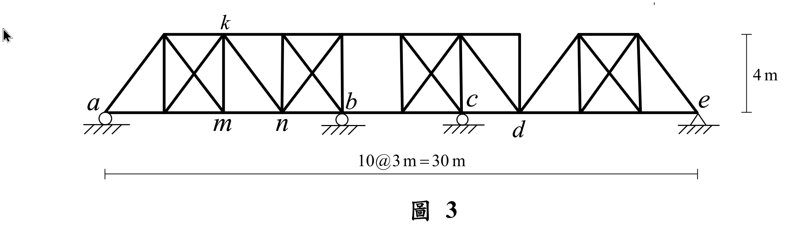

# 考題編號：SA-2022-3

**主分類：** `SA-U1` 靜定結構分析
**副分類：** `SA-U1-3` 影響線分析
**分析法：** 影響線 (Influence Lines)、細長拉桿 (Counters) 分析
**標籤：** `影響線` `桁架` `細長拉桿` `內部鉸` `移動載重`

---

## 1. 原始題目重述 (Problem Restatement)

如圖 3 所示桁架結構，承受一下方行駛的單位移動載重，請繪出 $a$ 點反力以及 $km$ 桿、$kn$ 桿、$mn$ 桿內力的影響線。（25 分）

*圖說：本題為一長度 30m 之連續桁架，分為 10 個 3m 寬的嵌板，高度為 4m。底部有四個支承（由左至右分別位於 x=0, 12, 18, 30m 處）。部分嵌板具有交叉斜桿（X-bracing）。待求桿件皆位於 x=6m 至 x=9m 之區間。*

## 2. 考題核心精神與出題者意圖 (Core Concepts & Examiner's Intent)

**核心精神：**
1. **靜定條件判斷**：本結構外觀看似多跨連續且具交叉斜桿之高次靜不定桁架。但考題未給定桿件斷面積 ($EA$)，暗示必須以**靜定結構**求解。這要求考生能敏銳觀察出結構的「內部鉸」（如 $d$ 點上方弦桿斷開），並合理推斷交叉斜桿為「細長拉桿 (Counters)」。
2. **細長拉桿 (Counters) 的影響線**：X 型交叉斜桿在移動載重下，會隨嵌板剪力方向改變而切換「作用中」的拉桿。考驗考生計算剪力變號點 (零剪力點) 的能力。
3. **間接載重傳遞**：單位載重行駛於下方，必須透過節點（底梁）將力傳遞至主桁架，這會影響嵌板內部的剪力變化與影響線的線性轉折。

## 3. 解題戰略地圖與陷阱分析 (Strategic Roadmap & Trap Analysis)

**戰略步驟：**
1. **確立結構靜定模型**：
   - 辨識支承位置：$a(0m)$, $b(12m)$, $c(18m)$, $e(30m)$。
   - 辨識內部鉸：$d(21m)$ 處明顯無頂弦桿。配合無 $EA$ 需靜定求解之條件，推斷在支承 $b(12m)$ 處亦具備鉸接性質，使得 $0\sim 12m$ 區段成為一**獨立簡支桁架**。
   - 確認待求的 $a, km, kn, mn$ 皆位於此 $0\sim 12m$ 簡支段內，故後續分析只需針對此簡支段。
2. **$a$ 點反力影響線**：直接以簡支梁反力公式繪製。
3. **尋找剪力變號點**：針對 $6\sim 9m$ 嵌板，找出使其剪力為零的載重位置，判斷兩條交叉斜桿的作用時機。
4. **繪製桿件影響線**：
   - **$kn$ 桿**（斜桿）：僅在受拉時有值，受壓時為 0。
   - **$mn$ 桿**（底弦桿）：利用力矩法，隨作用斜桿不同而切換力矩中心，找出影響線的轉折點。
   - **$km$ 桿**（垂直桿）：透過節點 $k$ 的垂直力平衡，分析左右相鄰兩嵌板斜桿的作用狀態來求解。

**陷阱分析：**
- **陷阱一：被整體圖形嚇到而放棄**。誤以為是高階靜不定結構。關鍵在於看出 $0\sim 12m$ 可獨立解題。
- **陷阱二：忽略細長拉桿的特性**。若不考慮斜桿只能受拉，會無法畫出正確的轉折影響線。
- **陷阱三：$km$ 垂直桿的受力分析**。垂直桿受力受到左右兩側嵌板斜桿狀態的雙重影響，會產生極特殊的「雙凹陷」形狀影響線，非常考驗觀念。

## 3.5 變數層次分析 (Variable Hierarchy Analysis)

### 最終目標
`繪製 Va, km, kn, mn 之影響線 (Influence Lines, I.L.)`

### 本題關鍵公式（依計算順序）

> $\boxed{\cdot}$ = 需由前步驟推導，非題目直接給定的變數

$$\text{Step 1: } V_a(x) = \frac{12-x}{12} \quad (0 \le x \le 12)$$

$$\text{Step 2: } V_{panel}(x) = V_a - R_{left} = 0 \Rightarrow \text{找尋變號點 } \boxed{x_{zero}}$$

$$\text{Step 3: } F_{kn} = \begin{cases} 0 & (V_{panel} < 0) \\ V_{panel} / \sin\theta & (V_{panel} > 0) \end{cases}$$

$$\text{Step 4: } F_{mn} = \frac{\sum M_{center}}{h} \quad (\text{力矩中心隨作用斜桿切換})$$

### L1：題目直接給定
| 符號 | 數值 | 說明 |
|------|------|------|
| $L$  | $12 \text{ m}$ | 左側簡支桁架段總長 |
| $h$  | $4 \text{ m}$ | 桁架高度 |
| $\lambda$ | $3 \text{ m}$ | 單一嵌板寬度 |

### L2：需知識點推導
| 符號 | 公式/來源 | 卡關? |
|------|----------|:-----:|
| $\sin\theta$ | $4/5 = 0.8$ | 斜桿幾何關係 ($3-4-5$ 直角三角形) |
| $x_{zero}$ | $x=8 \text{ m}$ | $6\sim 9m$ 嵌板剪力變號點 |

## 4. 步驟化詳細計算過程 (Step-by-Step Detailed Calculation)

### Step 1：確立 $a$ 點反力 ($V_a$) 影響線
$a-b$ 段為跨度 12m 之簡支桁架。
- 當單位載重 $P=1$ 於 $0 \le x \le 12$ 移動時：$V_a = \frac{12-x}{12}$。
- 當載重移至 $x > 12$ 時，不影響 $a-b$ 段，故 $V_a = 0$。
- **$V_a$ I.L.**：於 $x=0$ 為 1，至 $x=12$ 線性遞減至 0，其餘區段皆為 0。

### Step 2：分析 $6\sim 9m$ 嵌板之剪力與斜桿狀態
嵌板介於 $m(x=6)$ 與 $n(x=9)$ 之間。設向下的剪力為負（左側相對於右側下沉）。
嵌板剪力 $V_{panel}$ 在載重於嵌板內 ($6 < x < 9$) 時：
$$V_{panel} = V_a - R_m = \frac{12-x}{12} - \frac{9-x}{3} = \frac{x-8}{4}$$
- 剪力變號點：$x=8\text{ m}$ 時，$V_{panel} = 0$。
- 當 $x < 8$：$V_{panel} < 0$，需由左下至右上的斜桿 (此處為 $k'm$) 受拉以抵抗負剪力。此時 $kn$ 桿不受力。
- 當 $x > 8$：$V_{panel} > 0$，需由左上至右下的斜桿 ($kn$) 受拉以抵抗正剪力。此時 $k'm$ 桿不受力。

### Step 3：$kn$ 桿內力影響線
- $x \le 8$：$kn$ 桿未作用，$F_{kn} = 0$。
- $8 \le x \le 9$：$kn$ 桿作用，內力由垂直分力平衡 $F_{kn} \sin\theta = V_{panel} \Rightarrow F_{kn} = \frac{V_{panel}}{0.8} = 1.25 \left(\frac{x-8}{4}\right)$。
  - $x=9$ 時，$F_{kn} = 1.25(1/4) = 5/16$ (拉力)。
- $9 \le x \le 12$：載重在右側，$V_{panel} = V_a = \frac{12-x}{12}$。
  - $F_{kn} = 1.25 V_a = 1.25 \frac{12-x}{12}$。
  - $x=9$ 時，$F_{kn} = 1.25(3/12) = 5/16$。$x=12$ 時為 0。
- **$kn$ I.L.**：$0\sim 8$ 為 0；$8\sim 9$ 直線上揚至 $\mathbf{5/16}$；$9\sim 12$ 直線下降至 0。（皆為拉力正值）

### Step 4：$mn$ 桿內力影響線 (底弦桿)
利用截面法求底弦桿，力矩中心取決於「作用中」的斜桿：
- **當 $x \le 8$ ($k'm$ 斜桿作用)**：截面切過頂弦、底弦與 $k'm$。力矩中心為頂弦與 $k'm$ 交點，即 $k'(9,4)$。
  取右半部自由體，$\sum M_{k'} = 0 \Rightarrow V_b \times 3 - F_{mn} \times 4 = 0$。
  $F_{mn} = \frac{3}{4} V_b = \frac{3}{4} \left(\frac{x}{12}\right) = \frac{x}{16}$。
  $x=8$ 時，$F_{mn} = 8/16 = 0.5$ (拉力)。
- **當 $x \ge 8$ ($kn$ 斜桿作用)**：力矩中心為 $k(6,4)$。
  取左半部自由體，$\sum M_{k} = 0 \Rightarrow V_a \times 6 - F_{mn} \times 4 = 0$。
  $F_{mn} = 1.5 V_a = 1.5 \left(\frac{12-x}{12}\right) = \frac{12-x}{8}$。
  $x=8$ 時，$F_{mn} = 4/8 = 0.5$；$x=9$ 時，$3/8$。
- **$mn$ I.L.**：$0\sim 8$ 直線上揚至 $\mathbf{0.5}$；$8\sim 12$ 直線下降至 0。（皆為拉力正值，頂點特殊地發生在 $x=8$）

### Step 5：$km$ 桿內力影響線 (垂直桿)
分析節點 $k(6,4)$ 的垂直平衡。需同時考慮 $3\sim 6m$ (面板 1) 與 $6\sim 9m$ (面板 2) 的斜桿狀態。
- 面板 1 變號點：$V_1 = \frac{x-4}{4}=0 \Rightarrow x=4$。
  - $x < 4$：斜桿 (3,0)-(6,4) 作用。連至 $k$ 點，向下拉 $k$。
  - $x > 4$：斜桿 (3,4)-(6,0) 作用。不連至 $k$ 點。
- 面板 2 變號點：$x=8$。
  - $x < 8$：斜桿 (9,4)-(6,0) 作用。不連至 $k$ 點。
  - $x > 8$：斜桿 $kn$ (6,4)-(9,0) 作用。連至 $k$ 點，向下拉 $k$。
- **狀態討論**：
  1. $0 \le x < 4$：僅面板 1 斜桿拉 $k$ 點。$F_{km} = -F_{diag1}\sin\theta = -(-V_1) = V_1 = \frac{x-4}{4}$。
     ($x=3$ 時達到極值 $\mathbf{-0.25}$)
  2. $4 \le x \le 8$：兩側斜桿皆不連接 $k$ 點。$\mathbf{F_{km} = 0}$。
  3. $8 < x \le 12$：僅面板 2 斜桿拉 $k$ 點。$F_{km} = -F_{kn}\sin\theta = -V_2$。
     ($x=9$ 時達到極值 $\mathbf{-0.25}$)
- **$km$ I.L.**：$0\sim 4$ 為一負值三角形（頂點 $x=3$, 值 $-0.25$）；$4\sim 8$ 為 0；$8\sim 12$ 為一負值三角形（頂點 $x=9$, 值 $-0.25$）。（皆為壓力負值）

## 5. 關鍵爭議點與進階探討 (Critical Issues & Advanced Discussion)
本題是影響線的經典高階題型。若未將交叉斜桿視為「只能受拉的細長桿 (Counters)」，會誤以為是高次靜不定而無法下手。Counters 的特質使得結構行為隨載重位置作非線性切換（即結構拓樸改變），因此影響線（如 $mn$ 桿）的最高點會飄移至非節點位置（$x=8$），這是本題最具鑑別度與結構美學之處。
