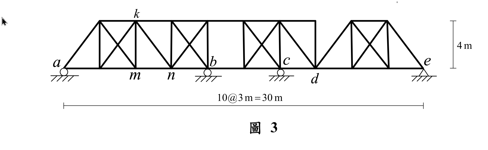
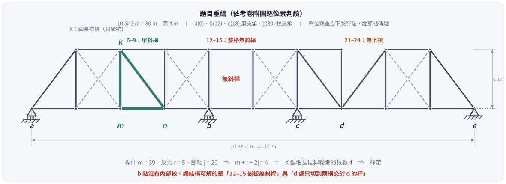
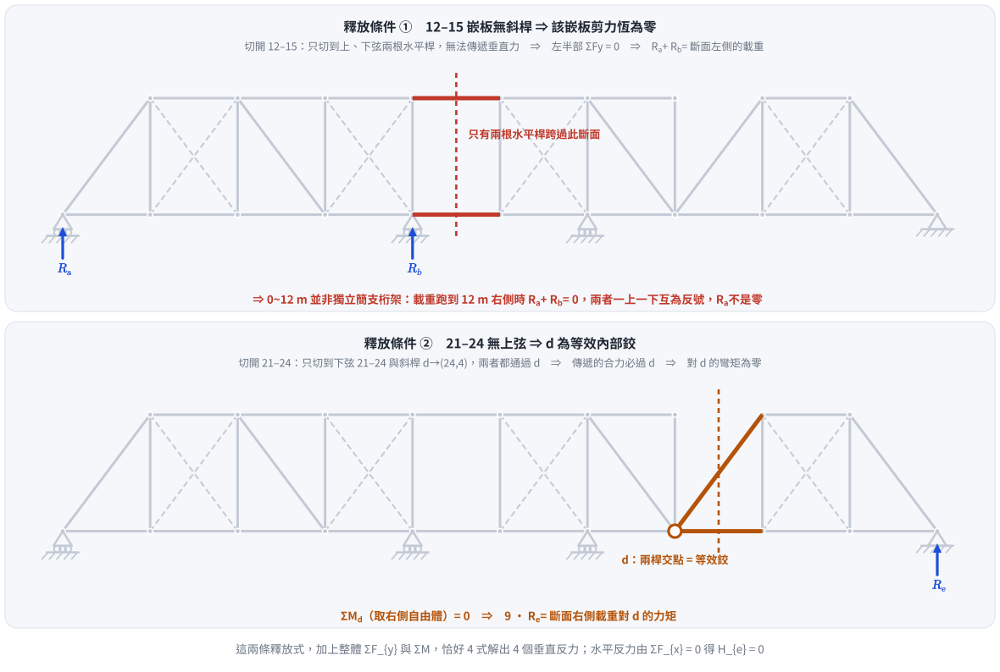
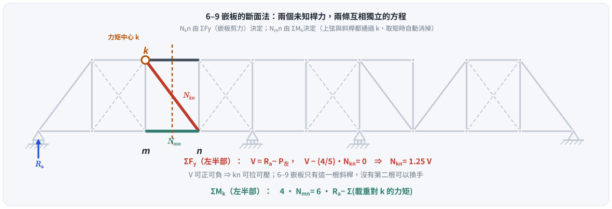
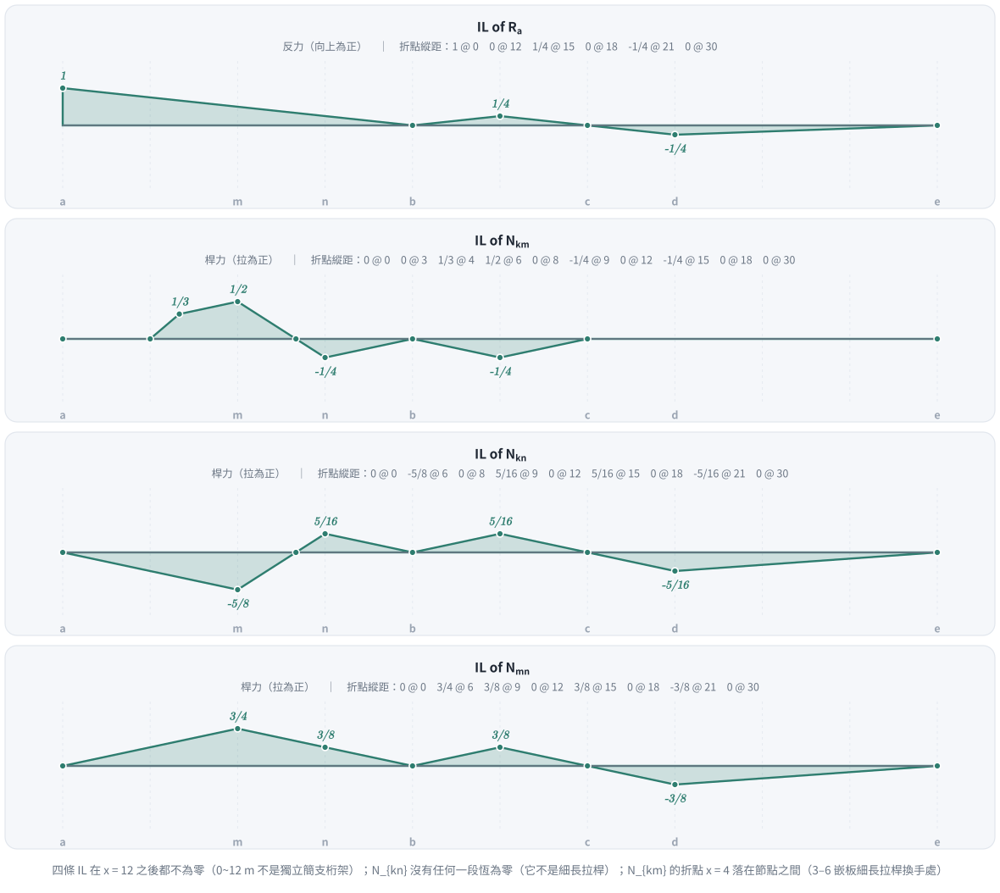

# 考題編號：SA-2022-3

**主分類：** `SA-U1-3` 靜定及靜不定結構影響線
**副分類：** 無
**分析法：** 影響線（Influence Lines）、斷面法、細長拉桿（Counters）
**標籤：** `影響線` `桁架` `細長拉桿` `等效內鉸` `間接載重` `無斜桿嵌板`

---

## 1. 原始題目重述 (Problem Restatement)

如圖 3 所示桁架結構，承受一下方行駛的單位移動載重，請繪出 $a$ 點反力以及 $km$ 桿、$kn$ 桿、$mn$ 桿內力的影響線。（25 分）

*圖說：跨長 30 m，10 @ 3 m 嵌板，桁架高 4 m。下弦節點位於 $x = 0,3,\dots,30$；上弦節點位於 $x = 3\sim21$ 與 $x = 24,27$。支承：$a(0)$、$b(12)$、$c(18)$ 為滾支承，$e(30)$ 為鉸支承。所求桿件 $k(6,4)$、$m(6,0)$、$n(9,0)$。*

---

## 1.5 ⚠ 附圖的三個判讀重點（本題成敗全在這裡）

考卷附圖線條密集，最容易看走眼。以下配置係對附圖**逐像素掃描**（取上弦所在列與半高列的暗像素分佈）確認，非目視推測：

| 掃描結果 | 意義 |
|---|---|
| 上弦連續段為 $x=3\to21$ 與 $x=24\to27$ | **21～24 之間沒有上弦**；$3\sim21$ 全段連續，**$b(12)$ 處沒有任何斷開** |
| 半高交會點：1.5、4.5、7.5、10.5、16.5、19.5、22.5、25.5、28.5 | **12～15 之間沒有任何斜桿** |
| 4.5、10.5、16.5、25.5 為兩線交會 | 3–6、9–12、15–18、24–27 四格為 **X 型交叉斜桿** |
| 7.5、19.5、22.5、1.5、28.5 為單線 | 0–3、**6–9**、18–21、21–24、27–30 為**單斜桿** |

由此得到三個關鍵事實：

1. **$kn$ 是 6–9 嵌板唯一的斜桿**，不是交叉細長拉桿。它沒有換手的對象，剪力變號時只能自己從受拉轉成受壓 —— $IL_{N_{kn}}$ **沒有任何一段恆為零**。
2. **12–15 嵌板整格沒有斜桿**，該嵌板剪力恆為零。這才是讓結構可解的釋放條件。
3. **$b$ 點沒有內部鉸**，$0\sim12$ m 也**不是**一段獨立的簡支桁架。載重跑到 $x>12$ 時 $R_a$ 仍然有值（而且會變號）。

*圖 1　題目重繪（向量版，幾何由附圖像素掃描而來）。這張圖攔的是本題三個致命誤讀：把 6–9 當成交叉斜桿、把 12–15 當成有斜桿、在 $b$ 點捏造內部鉸 —— 任一項錯了，四條影響線全部作廢。*

---

## 2. 考題核心精神與出題者意圖 (Core Concepts & Examiner's Intent)

**核心精神：**

1. **靜定性的來源不是「看起來像」，而是數得出來。** 桿件 $m=39$、反力 $r=5$、節點 $j=20$，$m+r-2j=4$。恰好有 4 格 X 型交叉斜桿；把細長拉桿（只受拉、受壓即鬆弛）視為每格只有一根作用，剛好消掉 4 個贅餘 $\Rightarrow$ 靜定。題目未給 $EA$，正是這個暗示。
2. **兩個「結構自己給的」靜力條件。** 4 個垂直反力只有 2 條整體平衡式可用，還差 2 條：
    - 12–15 嵌板無斜桿 $\Rightarrow$ 該嵌板剪力恆為零；
    - 21–24 只切到兩根交於 $d$ 的桿 $\Rightarrow$ $d$ 為等效內部鉸。
3. **單斜桿與細長拉桿的分辨。** 前者可拉可壓、影響線連續；後者只受拉、影響線會出現「恆為零的平台」，且平台邊界（換手點）可能落在**節點之間**。本題兩種都有：$kn$ 是前者，$km$ 的形狀則被 3–6 嵌板的後者牽動。
4. **間接載重傳遞。** 載重行駛於下弦，經節點傳入桁架，故影響線在節點之間為直線 —— 唯一例外是細長拉桿換手的位置（本題 $N_{km}$ 在 $x=4$）。

---

## 3. 解題戰略地圖與陷阱分析 (Strategic Roadmap & Trap Analysis)

**戰略步驟：**

1. **判定靜定性**：數 $m$、$r$、$j$，確認 $m+r-2j$ 等於 X 型嵌板數。
2. **找出兩個釋放條件**：掃描每一格，找「無斜桿的嵌板」與「只切到兩根共點桿的斷面」。
3. **解 $R_a$ 影響線**：以兩個釋放條件加整體 $\Sigma F_y$、$\Sigma M$ 求四個垂直反力。
4. **斷面法求三根桿**：
    - $N_{kn}$（斜桿）$\to$ 6–9 嵌板 $\Sigma F_y$；
    - $N_{mn}$（下弦）$\to$ 對 $k(6,4)$ 取矩（上弦與斜桿都通過 $k$）；
    - $N_{km}$（垂直桿）$\to$ 節點 $k$ 的 $\Sigma F_y$，須同時考慮 3–6 嵌板細長拉桿的作用狀態。

**陷阱分析：**

| 陷阱 | 為什麼會錯 | 正解 |
|---|---|---|
| **在 $b$ 點捏造內部鉸** | 想湊出「$0\sim12$ m 是簡支桁架」的簡單模型 | 上弦 $3\to21$ 連續，$b$ 只是滾支承。真正的釋放在 12–15 嵌板與 $d$ 點 |
| **以為 $x>12$ 後 $R_a=0$** | 承上，把左段當獨立結構 | $R_a$ 在 $x=15$ 回升到 $+1/4$、在 $x=21$ 變號到 $-1/4$（a 支承被拔起） |
| **把 $kn$ 當細長拉桿** | 看到旁邊幾格是 X 型就類推 | 6–9 只有一根斜桿，$N_{kn}$ 在 $x=6$ 達到最大**壓力** $-5/8$ |
| **假設 IL 折點必落在節點** | 間接載重的常規直覺 | $N_{km}$ 在 $x=4$ 有折點 —— 那是 3–6 嵌板剪力變號、細長拉桿換手的位置 |
| **忽略 21～30 的貢獻** | 覺得離 $km,kn,mn$ 太遠 | 經由 $d$ 的等效鉸傳遞，三根桿在 $21\sim30$ 都有非零（且為反號）的縱距 |

---

## 3.5 變數層次分析 (Variable Hierarchy Analysis)

### 最終目標

`繪製 R_a、N_km、N_kn、N_mn 四條影響線（載重沿下弦由 a 走到 e）`

### 本題關鍵公式（依計算順序）

> $\boxed{\cdot}$ ＝ 需由前步驟推導，非題目直接給定

$$\text{Step 0: } m + r - 2j = \boxed{4} = \text{X 型嵌板數} \;\Rightarrow\; \text{靜定}$$

$$\text{Step 1: } R_a + R_b = P_{\text{左}}\big|_{\text{12–15 斷面}} \quad\text{（無斜桿嵌板）}$$

$$\text{Step 2: } 9\,R_e = \textstyle\sum P_{\text{右}}\,(x-21) \quad\text{（}d\text{ 等效內鉸）}$$

$$\text{Step 3: } \boxed{R_a}\;\text{由 Step 1、2 加整體 } \Sigma F_y,\ \Sigma M_a \text{ 解出}$$

$$\text{Step 4: } V(x) = \boxed{R_a} - P_{\text{左}}, \qquad N_{kn} = \tfrac{5}{4}\boxed{V}$$

$$\text{Step 5: } 4\,N_{mn} = 6\boxed{R_a} - \textstyle\sum(\text{載重對 }k\text{ 的力矩})$$

$$\text{Step 6: } N_{km} = \min(\boxed{V_{3\text{–}6}},\,0) - \boxed{V_{6\text{–}9}}$$

### L1：題目直接給定

| 符號 | 數值 | 說明 |
|---|---|---|
| $\lambda$ | $3\text{ m}$ | 嵌板寬（10 @ 3 m = 30 m） |
| $h$ | $4\text{ m}$ | 桁架高 |
| 支承 | $a(0)$、$b(12)$、$c(18)$ 滾，$e(30)$ 鉸 | 4 個垂直反力 + 1 個水平反力 |

### L2：需知識點推導

| 符號 | 公式／來源 | 卡關? |
|---|---|:--:|
| $m,r,j$ | 由附圖數出：$39,\;5,\;20$ | |
| $\sin\theta$ | $4/5$（3-4-5 直角三角形）$\Rightarrow$ 斜桿垂直分量係數 | |
| 12–15 剪力 | 該嵌板只有兩根水平桿跨越 $\Rightarrow V\equiv0$ | |
| $d$ 的鉸性 | 21–24 斷面只切到兩根**交於 $d$** 的桿 $\Rightarrow M_d=0$ | |
| $x_{\text{zero}}$（6–9） | $V=(x-8)/4=0 \Rightarrow x=8$ | |
| $x_{\text{zero}}$（3–6） | $V=(x-4)/4=0 \Rightarrow x=4$ | |

### L3：深層知識（不懂就卡住）

| 知識點 | 說明 | 卡關? |
|---|---|:--:|
| 細長拉桿（Counter） | 只受拉；一格 X 中恆有一根鬆弛。**鬆弛的那根等於不存在**，故靜不定度剛好被消掉 | |
| 無斜桿嵌板 = 剪力釋放 | 上下弦皆水平 $\Rightarrow$ 跨過該斷面的力只有水平分量 $\Rightarrow$ 垂直力無法傳遞 | |
| 兩桿共點 = 等效內鉸 | 只切到兩根桿且交於一點時，傳遞的合力必過該點 $\Rightarrow$ 對該點彎矩為零 | |
| 間接載重的線性 | 載重在節點間依槓桿分配 $\Rightarrow$ IL 在節點間為直線；但**結構拓樸改變（拉桿換手）會另外造出折點** | |

---

## 4. 步驟化詳細計算過程 (Step-by-Step Detailed Calculation)

### Step 0：靜定判定

| 項目 | 數量 |
|---|---|
| 下弦桿 | 10 |
| 上弦桿（$3\!\sim\!21$ 六段 ＋ $24\!\sim\!27$ 一段） | 7 |
| 垂直桿（$x=3,6,\dots,21,24,27$） | 9 |
| 斜桿（$1+2+1+2+0+2+1+1+2+1$） | 13 |
| **$m$** | **39** |
| **$r$** | **5**（$a,b,c$ 各 1，$e$ 為 2） |
| **$j$** | **20**（下弦 11 ＋ 上弦 9） |

$$m + r - 2j = 39 + 5 - 40 = 4 = \text{X 型嵌板數}$$

四根鬆弛的細長拉桿恰好抵掉 4 個贅餘 $\Rightarrow$ **靜定**。無需假設 $b$ 有鉸。

---

### Step 1、2：兩個釋放條件

*圖 2　讓 4 個垂直反力可解的兩條額外方程。這張圖攔的是「$0\sim12$ m 是獨立簡支桁架」的誤判：釋放條件 ① 給的是 $R_a+R_b=P_{\text{左}}$，不是 $R_a$ 與右半部無關。*

**① 12–15 嵌板無斜桿：** 於 $x=13.5$ 切斷，只切到上弦 $(12,4)\!-\!(15,4)$ 與下弦 $(12,0)\!-\!(15,0)$，兩者皆水平，無法傳遞垂直力。取左半部：

$$\sum F_y = 0:\qquad R_a + R_b = P_{\text{左}}$$

其中 $P_{\text{左}}$ 為經節點傳遞後落在 $x\le12$ 的載重量。**載重在 $x\ge15$ 時 $R_a+R_b=0$** —— 兩支承一上一下，$R_a$ 不為零。

**② $d$ 為等效內鉸：** 於 $x=22.5$ 切斷，只切到下弦 $(21,0)\!-\!(24,0)$ 與斜桿 $(21,0)\!-\!(24,4)$，兩者都通過 $d(21,0)$，故傳遞的合力必過 $d$。取右半部對 $d$ 取矩：

$$\sum M_d^{\text{right}} = 0:\qquad 9\,R_e = \sum_{x_i>21} P_i\,(x_i - 21) \;=\; \max(x-21,\,0)$$

（節點傳遞不改變載重對任一點的力矩，故右式可直接寫成載重位置的函數。）

---

### Step 3：$R_a$ 影響線

以 ①、② 加整體 $\Sigma F_y = 1$ 與 $\Sigma M_a$：$12R_b + 18R_c + 30R_e = x$，逐段解得：

| 載重位置 | $R_e$ | $R_c$ | $R_a$ |
|---|---|---|---|
| $0\le x\le 12$ | $0$ | $0$ | $\dfrac{12-x}{12}$ |
| $12\le x\le 15$ | $0$ | $1-\dfrac{15-x}{3}$ | $\dfrac{x-12}{12}$ |
| $15\le x\le 21$ | $0$ | $1$ | $\dfrac{18-x}{12}$ |
| $21\le x\le 30$ | $\dfrac{x-21}{9}$ | $1-\dfrac{x-21}{9}$ | $\dfrac{x-30}{36}$ |

**$R_a$ 縱距：** $1@0$、$0@12$、$+\frac14@15$、$0@18$、$-\frac14@21$、$0@30$。

> **驗算（載重在 $x=24$）：** $R_e = \frac{3}{9} = \frac13$，$R_c = \frac23$，$R_a = -\frac16$，$R_b = +\frac16$。
> $\Sigma F_y: -\frac16+\frac16+\frac23+\frac13 = 1$ ✓
> $\Sigma M_a: 12(\frac16)+18(\frac23)+30(\frac13) = 2+12+10 = 24$ ✓
> 釋放 ①：$R_a+R_b = 0$（載重在 12–15 斷面右側）✓
> 釋放 ②：$9(\frac13) = 3 = 24-21$ ✓

---

### Step 4、5：斷面法求 $N_{kn}$ 與 $N_{mn}$

*圖 3　6–9 嵌板只有一根斜桿。這張圖攔的是把 $kn$ 當成細長拉桿：一根斜桿沒有換手對象，嵌板剪力為負時它必須受壓，影響線因此連續、沒有零平台。*

於 $x=7.5$ 切斷，切到上弦 $(6,4)\!-\!(9,4)$、斜桿 $kn$、下弦 $mn$。

**$N_{kn}$（$\Sigma F_y$）：** $kn$ 方向 $(3,-4)/5$，對左半部的垂直分量為 $-\frac45 N_{kn}$：

$$V(x) = R_a(x) - P_{\text{左}}, \qquad V - \tfrac45 N_{kn} = 0 \;\Rightarrow\; \boxed{N_{kn} = \tfrac54 V}$$

載重在嵌板內（$6\le x\le9$）時 $P_{\text{左}} = \frac{9-x}{3}$：

$$V = \frac{12-x}{12} - \frac{9-x}{3} = \frac{x-8}{4} \;\Rightarrow\; \textbf{變號點 } x = 8$$

**$N_{mn}$（$\Sigma M_k$）：** 上弦與斜桿都通過 $k(6,4)$，取矩自動消掉：

$$4\,N_{mn} = 6\,R_a - \sum_{x_i<7.5} P_i\,(6-x_i)$$

- $0\le x\le6$：$4N_{mn} = 6\cdot\frac{12-x}{12} - (6-x) = \frac{x}{2} \Rightarrow N_{mn} = \dfrac{x}{8}$
- $x\ge9$：$N_{mn} = 1.5\,R_a$
- $6\le x\le9$：兩端值 $\frac34$ 與 $\frac38$，直線連接

---

### Step 6：$N_{km}$ 影響線（垂直桿）

取節點 $k(6,4)$。連到 $k$ 的斜桿只有兩根：3–6 嵌板的上升拉桿 $(3,0)\!\to\!k$，以及 $kn$。上弦兩段皆水平，不進 $\Sigma F_y$：

$$N_{km} = -\tfrac45\left(N_{(3,0)\to k} + N_{kn}\right)$$

3–6 是**細長拉桿嵌板**，設其剪力為 $V_1$：

- $V_1 > 0$（即 $x>4$，且 $R_a>0$）：作用的是下降桿 $(3,4)\!\to\!(6,0)$，**不接 $k$** $\Rightarrow N_{(3,0)\to k} = 0$
- $V_1 < 0$：作用的是上升桿 $(3,0)\!\to\! k$ $\Rightarrow -\tfrac45 N_{(3,0)\to k} = V_1$

故

$$\boxed{N_{km} = \min(V_1,\,0) - V_2}, \qquad V_1 = \text{3–6 嵌板剪力},\; V_2 = \text{6–9 嵌板剪力}$$

分段結果：

| 區間 | $N_{km}$ | 端值 |
|---|---|---|
| $0\le x\le3$ | $0$（$V_1=V_2$，相消） | $0$ |
| $3\le x\le4$ | $\dfrac{x-3}{3}$ | $0 \to \frac13$ |
| $4\le x\le6$ | $\dfrac{x}{12}$ | $\frac13 \to \frac12$ |
| $6\le x\le9$ | $\dfrac{8-x}{4}$ | $\frac12 \to -\frac14$（$x=8$ 過零） |
| $9\le x\le18$ | $-R_a$ | $-\frac14 \to 0 \to -\frac14 \to 0$ |
| $18\le x\le30$ | $0$（$R_a\le0$ $\Rightarrow$ $V_1=V_2<0$，相消） | $0$ |

**$x=4$ 是折點，而它不在節點上** —— 那是 3–6 嵌板剪力變號、細長拉桿換手的位置。

---

### 4.7 四條影響線與縱距總表

*圖 4　四條影響線。這張圖攔三件事：以為 $x>12$ 之後全部歸零、以為 $N_{kn}$ 有恆為零的平台、以為折點一定落在節點上（$N_{km}$ 的 $x=4$ 就不是）。*

| $x$ (m) | 0 | 3 | **4** | 6 | **8** | 9 | 12 | 15 | 18 | 21 | 24 | 27 | 30 |
|:--|:--:|:--:|:--:|:--:|:--:|:--:|:--:|:--:|:--:|:--:|:--:|:--:|:--:|
| $R_a$ | $1$ | $\frac34$ | $\frac23$ | $\frac12$ | $\frac13$ | $\frac14$ | $0$ | $\frac14$ | $0$ | $-\frac14$ | $-\frac16$ | $-\frac1{12}$ | $0$ |
| $N_{km}$ | $0$ | $0$ | $\frac13$ | $\frac12$ | $0$ | $-\frac14$ | $0$ | $-\frac14$ | $0$ | $0$ | $0$ | $0$ | $0$ |
| $N_{kn}$ | $0$ | $-\frac5{16}$ | $-\frac5{12}$ | $-\frac58$ | $0$ | $\frac5{16}$ | $0$ | $\frac5{16}$ | $0$ | $-\frac5{16}$ | $-\frac5{24}$ | $-\frac5{48}$ | $0$ |
| $N_{mn}$ | $0$ | $\frac38$ | $\frac12$ | $\frac34$ | $\frac12$ | $\frac38$ | $0$ | $\frac38$ | $0$ | $-\frac38$ | $-\frac14$ | $-\frac18$ | $0$ |

（拉為正，壓為負；$R_a$ 向上為正。）

**極值：**

| 桿件 | 最大拉力 | 最大壓力 |
|---|---|---|
| $N_{km}$ | $+\frac12$（載重在 $m$，$x=6$） | $-\frac14$（$x=9$ 或 $x=15$） |
| $N_{kn}$ | $+\frac5{16}$（$x=9$ 或 $x=15$） | $-\frac58$（$x=6$） |
| $N_{mn}$ | $+\frac34$（$x=6$） | $-\frac38$（$x=21$） |

---

## 5. 關鍵爭議點與進階探討 (Critical Issues & Advanced Discussion)

**（一）「靜定」的判定不能靠感覺。** 本題的桁架看起來像是多跨連續 + 高次靜不定，但 $m+r-2j$ 只有 4，而 X 型嵌板恰好 4 格。這個「剛剛好」不是巧合，是出題者刻意佈的：只要把細長拉桿的性質用對，全結構就是靜定的。**不需要**、也**不可以**再額外假設任何內部鉸。

**（二）三種「釋放」的辨識法。** 桁架裡讓結構軟化的機制有三種，都靠「數斷面切到幾根桿」判斷：

| 斷面切到的桿 | 等效於 |
|---|---|
| 兩根**平行**桿（如本題 12–15 的上、下弦） | 剪力釋放（垂直力無法傳遞） |
| 兩根**共點**桿（如本題 21–24） | 內部鉸（對交點彎矩為零） |
| 三根桿（一般嵌板） | 完整傳遞 $N$、$V$、$M$，無釋放 |

**（三）單斜桿 vs. 細長拉桿，影響線長得完全不同。**

- 單斜桿（$kn$）：$N = \frac54 V$ 恆成立，$V$ 變號它就變號。IL 連續、無平台，最大壓力可能比最大拉力還大（本題 $\frac58$ vs $\frac5{16}$，差兩倍）。設計上這根桿的挫屈檢核才是控制項。
- 細長拉桿：受壓即退出，IL 出現恆零平台。**平台的邊界是剪力變號點，未必落在節點上** —— $N_{km}$ 在 $x=4$ 的折點就是被 3–6 嵌板的換手拖出來的。

**（四）$R_a$ 會變號的物理意義。** 載重走到 $x>18$ 之後 $R_a<0$：$a$ 支承被**拔起**。滾支承通常只能承壓，實務上此處需設計繫件（hold-down）或以自重壓住。這是影響線在工程判斷上最直接的用途之一 —— 它告訴你哪個支承會在什麼載重位置被掀開。

---

## 6. 本題知識點索引

| 知識點 | 概念 ID |
|---|---|
| 影響線 | [[INFLUENCE-LINE]] |
| 桁架斷面法 | [[TRUSS-SECTION-METHOD]] |
| 細長拉桿 | [[COUNTER-DIAGONAL]] |
| 靜不定度判斷 | [[DEGREE-OF-INDETERMINACY]] |

---

*解析日期：2026-07-02　｜　重算＋圖解補繪：2026-08-26（附圖幾何經逐像素掃描確認；四條影響線與獨立的「桁架有限元＋細長拉桿互補條件」在 121 個載重位置逐點比對相符；向量圖腳本 `gen_SA-2022-3.py`，可重跑）*
