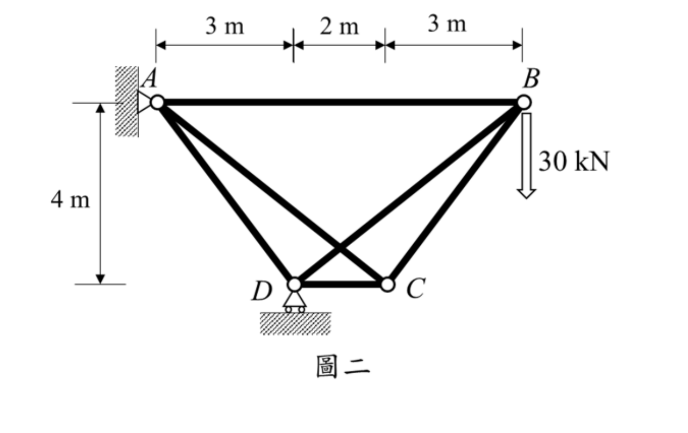

# 考題編號：SA-2023-2

**主分類：** `SA-U2-2` 靜不定結構諧合變位
**副分類：** `SA-U1-1` 靜不定度與穩定性之判斷
**分析法：** 諧合變位法 / 最小功法
**標籤：** `靜不定桁架` `諧合變位法` `多餘力` `節點法` `單位力法`

---

## 1. 原始題目重述 (Problem Restatement)

試分析一平面桁架如圖二所示，點 A 為鉸支承，點 D 為滾支承，假設所有桿件之彈性模數與斷面積乘積為 $EA=200,000 \text{ kN}$。若桁架中點 B 承受一垂直載重 $30 \text{ kN}$，試求桿件 BD 中之內力並標註受壓或受拉。（25 分）

*圖說：節點配置為 A 在左上，B 在右上，D 在左下，C 在右下。各段水平距離：A 至 D 為 3m，D 至 C 為 2m，C 至 B 為 3m。A 點為鉸支承，D 點為滾支承。垂直高度為 4m。B 點受一向下 30 kN 之垂直載重。*

## 2. 考題核心精神與出題者意圖 (Core Concepts & Examiner's Intent)

**核心精神：**
1. **靜不定桁架解析**：考驗考生對靜不定度判斷及多餘力的選擇能力。經判斷此為一階內部靜不定桁架。
2. **諧合變位法（或最小功法）應用**：需熟練地拆解結構為「原載重作用之靜定結構（$S$ 系統）」與「單位多餘力作用之靜定結構（$u$ 系統）」，並利用疊加原理求解。
3. **計算細心度**：本題幾何不完全對稱，各桿長度與角度皆不同，節點力平衡的計算工作量大，考驗考生的計算穩定度。

## 3. 解題戰略地圖與陷阱分析 (Strategic Roadmap & Trap Analysis)

**戰略步驟：**
1. **靜不定度判斷**：計算 $i = m + r - 2j = 6 + 3 - 8 = 1$，確認為一階靜不定。
2. **選擇多餘力**：題目直接詢問 BD 桿內力，故直接選定 BD 桿內力為多餘力 $X$（假設為拉力），將 BD 切斷形成靜定基本結構。
3. **計算 $S$ 系統**：在無 BD 桿的基本結構上施加 30 kN 載重，利用節點法求出各桿內力 $S$。
4. **計算 $u$ 系統**：在無 BD 桿的基本結構之 BD 兩節點，施加互相靠近的單位拉力 $1$，求出各桿內力 $u$。
5. **諧合方程式求解**：利用 $X = -\frac{\sum S \cdot u \cdot L / EA}{\sum u^2 \cdot L / EA}$ 求解。由於 $EA$ 均同，可直接消去不影響結果。

**陷阱分析：**
- **陷阱一：反力計算錯誤**。A 與 D 水平位置不同，A 點為鉸支承、D 為垂直滾支承，取力矩時力臂容易看錯。
- **陷阱二：$u$ 系統的外部反力**。單位多餘力為一對內部自平衡力，對整體不產生外部支承反力，若誤算反力將導致後續全錯。
- **陷阱三：多餘力目標選擇**。若不以 BD 為多餘力（例如以 AC 為多餘力），算完後還必須進行一次疊加（$F_{BD} = S'_{BD} + u'_{BD} \cdot X$）才能得出答案，多了一步且容易忘記。

## 3.5 變數層次分析 (Variable Hierarchy Analysis)

> 複習提示：第一次解題後，在每個卡住的知識點旁標記 `⚠`；第二次複習時只看有 `⚠` 的項目。

### 最終目標
`透過諧合變位法計算一階靜不定桁架之多餘桿件 BD 內力`

### 本題關鍵公式（依計算順序）

> $\boxed{\cdot}$ = 需由前步驟推導，非題目直接給定的變數

$$\text{Step 1: } i = m + r - 2j$$

$$\text{Step 2: } \Sigma F_x = 0, \Sigma F_y = 0 \Rightarrow \text{各桿 } S \text{ 與 } u$$

$$\text{Step 3: } \Delta_{10} = \sum \boxed{S} \cdot \boxed{u} \cdot L$$

$$\text{Step 4: } \delta_{11} = \sum \boxed{u}^2 \cdot L$$

$$\text{Step 5: } F_{BD} = - \frac{\boxed{\Delta_{10}}}{\boxed{\delta_{11}}}$$

### L1：題目直接給定

| 符號 | 數值 | 說明 |
|------|------|------|
| $L_{AB}, L_{CD}, \dots$ | $8, 2, 5, \dots$ | 各桿長度由幾何求得 |
| $P$ | $30 \text{ kN}$ | B 點外加向下集中載重 |
| $EA$ | $200,000 \text{ kN}$ | 軸向剛度（本題中可約掉） |

### L2：需知識點推導

**Step 1：靜定基本結構分析 (S 系統)**

| 符號 | 公式/來源 | 卡關? |
|------|----------|:-----:|
| $D_y, A_y, A_x$| 整體力矩與力平衡 | |
| $S_{ij}$ | 各節點 $\Sigma F_x=0, \Sigma F_y=0$ | |

**Step 2：單位多餘力分析 (u 系統)**

| 符號 | 公式/來源 | 卡關? |
|------|----------|:-----:|
| $u_{ij}$ | 切斷 BD 桿，施加單位內力，以節點法求解 | |

**Step 3：諧合方程式**

| 符號 | 公式/來源 | 卡關? |
|------|----------|:-----:|
| $F_{BD}$ | $X = -\Delta_{10} / \delta_{11}$ | |

### L3：深層知識（不懂就卡住）

| 知識點 | 說明 | 卡關? |
|--------|------|:-----:|
| 諧合變位法精神 | 將內部多餘力視為外力，強制切斷處之相對位移為零 | |
| 自平衡系統反力 | 一對作用於同一直線上、大小相等方向相反的內力，支承反力為 0 | |

## 4. 步驟化詳細計算過程 (Step-by-Step Detailed Calculation)

**Step 1：確認靜不定度與基本結構**
- 節點數 $j=4$
- 桿件數 $m=6$
- 反力數 $r=3$ (A 鉸:2, D 滾:1)
靜不定度 $i = 6 + 3 - 2(4) = 1$。
選擇欲求的 **BD 桿內力為多餘力 $X$**，將其切斷，形成靜定基本結構。

**Step 2：計算外力作用下的內力 ($S$ 系統)**
切斷 BD 桿，外力 30 kN 作用於 B 點向下。
1. **求支承反力**：
   $\Sigma M_A = 0 \Rightarrow D_y \times 3 - 30 \times 8 = 0 \Rightarrow D_y = 80 \text{ kN} (\uparrow)$
   $\Sigma F_y = 0 \Rightarrow A_y + 80 - 30 = 0 \Rightarrow A_y = -50 \text{ kN} (\downarrow)$
   $\Sigma F_x = 0 \Rightarrow A_x = 0$
2. **節點法求內力 $S$** (設拉力為正)：
   - **節點 B** (連接 AB, BC)：
     $\Sigma F_y = 0 \Rightarrow -S_{BC}(4/5) - 30 = 0 \Rightarrow S_{BC} = -37.5 \text{ kN}$
     $\Sigma F_x = 0 \Rightarrow -S_{AB} - S_{BC}(3/5) = 0 \Rightarrow S_{AB} = 22.5 \text{ kN}$
   - **節點 C** (連接 AC, BC, CD)：
     $\Sigma F_y = 0 \Rightarrow S_{AC}(4/\sqrt{41}) + S_{BC}(4/5) = 0 \Rightarrow S_{AC} = 7.5\sqrt{41} \text{ kN}$
     $\Sigma F_x = 0 \Rightarrow -S_{CD} - S_{AC}(5/\sqrt{41}) + S_{BC}(3/5) = 0 \Rightarrow -S_{CD} - 37.5 - 22.5 = 0 \Rightarrow S_{CD} = -60 \text{ kN}$
   - **節點 D** (連接 AD, CD，有反力 $D_y=80$)：
     $\Sigma F_y = 0 \Rightarrow S_{AD}(4/5) + 80 = 0 \Rightarrow S_{AD} = -100 \text{ kN}$
   - 桿件 BD 已切斷，故 $S_{BD} = 0$。

**Step 3：計算單位多餘力作用下的內力 ($u$ 系統)**
在切斷的 BD 桿兩端，施加互相靠近的單位拉力 $1$。由於為內部自平衡力，支承反力皆為 0。
以節點法求內力 $u$：
- **節點 B** (受沿 DB 方向，向內拉力 $1$，分力為 $x=-5/\sqrt{41}, y=-4/\sqrt{41}$)：
  $\Sigma F_y = 0 \Rightarrow -u_{BC}(4/5) - 4/\sqrt{41} = 0 \Rightarrow u_{BC} = -5/\sqrt{41}$
  $\Sigma F_x = 0 \Rightarrow -u_{AB} - u_{BC}(3/5) - 5/\sqrt{41} = 0 \Rightarrow u_{AB} = -2/\sqrt{41}$
- **節點 C**：
  $\Sigma F_y = 0 \Rightarrow u_{AC}(4/\sqrt{41}) + u_{BC}(4/5) = 0 \Rightarrow u_{AC} = 1$
  $\Sigma F_x = 0 \Rightarrow -u_{CD} - u_{AC}(5/\sqrt{41}) + u_{BC}(3/5) = 0 \Rightarrow u_{CD} = -8/\sqrt{41}$
- **節點 D**：
  $\Sigma F_y = 0 \Rightarrow u_{AD}(4/5) + 4/\sqrt{41} = 0 \Rightarrow u_{AD} = -5/\sqrt{41}$
- 桿件 BD 本身單位拉力：$u_{BD} = 1$。

**Step 4：運用諧合方程式求解**
計算 $\Delta_{10} = \sum S \cdot u \cdot L$ 及 $\delta_{11} = \sum u^2 \cdot L$ (消去常數 EA)：

| 桿件 | $L$ (m) | $S$ (kN) | $u$ | $S \cdot u \cdot L$ | $u^2 \cdot L$ |
|:---:|:---:|:---:|:---:|:---:|:---:|
| AB | 8 | 22.5 | $-2/\sqrt{41}$ | $-360/\sqrt{41}$ | $32/41$ |
| BC | 5 | -37.5 | $-5/\sqrt{41}$ | $937.5/\sqrt{41}$ | $125/41$ |
| AC | $\sqrt{41}$ | $7.5\sqrt{41}$| 1 | $307.5$ | $\sqrt{41}$ |
| CD | 2 | -60 | $-8/\sqrt{41}$ | $960/\sqrt{41}$ | $128/41$ |
| AD | 5 | -100 | $-5/\sqrt{41}$ | $2500/\sqrt{41}$ | $125/41$ |
| BD | $\sqrt{41}$ | 0 | 1 | 0 | $\sqrt{41}$ |

**總和加總：**
$$\Delta_{10} = \frac{4037.5}{\sqrt{41}} + 307.5 \approx 938.05$$
$$\delta_{11} = \frac{410}{41} + 2\sqrt{41} = 10 + 2\sqrt{41} \approx 22.806$$

**代入諧合方程式：**
$$X = F_{BD} = - \frac{\Delta_{10}}{\delta_{11}} = - \frac{\frac{4037.5}{\sqrt{41}} + 307.5}{10 + 2\sqrt{41}} = - \frac{4037.5 + 307.5\sqrt{41}}{82 + 10\sqrt{41}}$$
將上下同乘 $(82 - 10\sqrt{41})$ 進行化簡可得：
$$F_{BD} = - \frac{25625 - 1895\sqrt{41}}{328} \approx -41.131 \text{ kN}$$
因計算結果為負號，表示實際受力方向與假設（拉力）相反，故為壓力。

$$\boxed{F_{BD} = 41.13 \text{ kN} \text{ (壓力)}}$$

## 5. 關鍵爭議點與進階探討 (Critical Issues & Advanced Discussion)
- **多餘桿的選擇策略**：本題直接選擇題目要求的 BD 桿作為多餘力是最直觀的做法。若為了簡化計算，也可選擇 AC 桿作為多餘力。若切斷 AC 桿，則 BC 與 CD 在 $S$ 系統中將成為零力桿，可大幅減少計算量；解出 $F_{AC}$ 後，再透過疊加原理（$F_{BD} = S'_{BD} + u'_{BD} \cdot F_{AC}$）求得 BD 桿內力，兩者答案完全一致。
