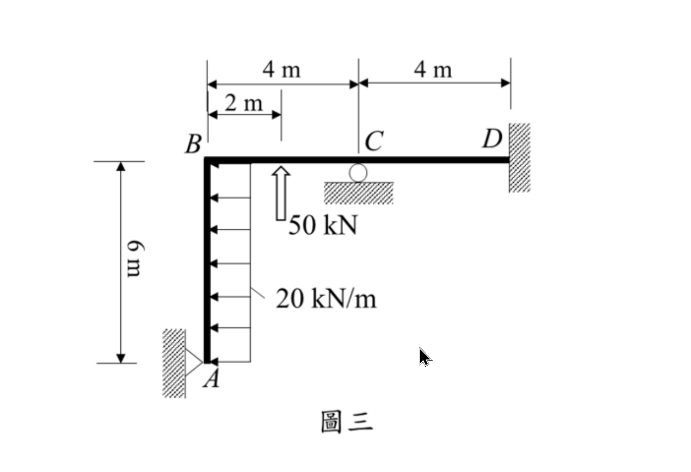

# 考題編號：SA-2023-3

**主分類：** `SA-U3` 傾角變位法
**副分類：** `SA-U3-1` 無側移剛架
**分析法：** 傾角變位法
**標籤：** `平面剛架` `無側移` `傾角變位法` `鉸端修正` `整體平衡`

---

## 1. 原始題目重述 (Problem Restatement)

圖三為一平面構架，點 D 為固定支承，點 A 為鉸支承，點 C 為滾支承，此構架點 A 至 B 間梁桿件承受一水平向均佈載重 20 kN/m，且點 B 至 C 間梁桿件中央承受一垂直集中載重 50 kN。設所有桿件 EI 為定值，且忽略桿件軸向變形，試用傾角變位法，求各桿件端點彎矩及各支承之反力。（25 分）

*圖說：垂直桿 AB 長 6m，水平桿 BC 長 4m，水平桿 CD 長 4m。A 點在左下角（鉸支承），B 在左上角（剛節點），C 在中段（滾支承），D 在右端（固定支承）。AB 桿受向左 20 kN/m 均佈力，BC 桿中央受**向上** 50 kN 集中力。*

## 2. 考題核心精神與出題者意圖 (Core Concepts & Examiner's Intent)

**核心精神：**
1. **側移判斷能力**：考生必須首要判斷此剛架是否具有側移（Sway）。由於 A 點為鉸支承限制水平與垂直位移，D 點為固定端，C 點為滾支承限制垂直位移，在「忽略軸向變形」前提下，各節點皆無發生相對側移之可能（$\Delta=0$）。
2. **傾角變位法基礎列式**：熟練計算固端彎矩（FEM）並注意符號（向上的外力容易因粗心而算反）。運用修正傾角變位方程式以簡化 A 端為鉸接的問題。
3. **自由體圖與反力求解**：求出端彎矩後，能否正確拆解各桿件，繪製自由體圖 (FBD) 並透過靜力平衡求出所有支承反力，是本題的另一大區別出高分群的重點。

## 3. 解題戰略地圖與陷阱分析 (Strategic Roadmap & Trap Analysis)

**戰略步驟：**
1. **判斷自由度**：無側移，未知轉角為 $\theta_B, \theta_C$。由於 A 點為鉸支承，利用修正傾角變位法可將 $\theta_A$ 提前消去。D 點固定，$\theta_D = 0$。
2. **計算固端彎矩 (FEM)**：採用順時針為正。特別注意 BC 桿上之 50 kN 是**向上**，FEM 方向需判斷正確。
3. **建立傾角變位方程式**：寫下 $M_{BA}$（修正後）、$M_{BC}$、$M_{CB}$、$M_{CD}$、$M_{DC}$ 的展開式。
4. **節點平衡求解**：利用 $\Sigma M_B = 0$ 及 $\Sigma M_C = 0$ 解出未知數 $EI\theta_B$ 與 $EI\theta_C$。
5. **代回求端彎矩**：將變位代回公式得到各桿端彎矩。
6. **拆解求反力**：將結構拆解為 AB、BC、CD 三段，加上節點 B、C 的平衡，逐一求得各支承（A, C, D）的 $x, y$ 方向反力與彎矩。

**陷阱分析：**
- **陷阱一：BC 桿外力方向誤讀**。50 kN 載重標示是**向上**的。若慣性思維誤看為向下，將導致 $FEM_{BC}$ 符號顛倒，後續全錯。
- **陷阱二：固端彎矩符號判定**。垂直的 AB 桿受向左均佈力推擠，為了在兩端維持原垂直角度，A 端的固端彎矩需為順時針（正），B 端為逆時針（負）。
- **陷阱三：水平反力遺漏**。水平桿 BCD 上方無外加水平力，容易誤以為 D 點水平反力 $D_x=0$。實際上 AB 桿頂端產生的水平剪力，會透過剛節點 B 轉化為軸力傳遞給水平桿，最後完全由 D 支承抵抗。
- **陷阱四：反力正負號解讀**。C 支承與 A 支承垂直反力算出來與常理直覺相反（A 與 C 需提供向下拉力來抵抗 50kN向上推力造成的翻轉），計算後需忠實呈現數學結果並標明向下。

## 3.5 變數層次分析 (Variable Hierarchy Analysis)

> 複習提示：第一次解題後，在每個卡住的知識點旁標記 `⚠`；第二次複習時只看有 `⚠` 的項目。

### 最終目標
`透過傾角變位法求算剛架各節點端彎矩與支承反力`

### 本題關鍵公式（依計算順序）

> $\boxed{\cdot}$ = 需由前步驟推導，非題目直接給定的變數

$$\text{Step 1: } FEM = f(w, P, L)$$

$$\text{Step 2: } M_{ij} = \frac{2EI}{L} (2\theta_i + \theta_j) + \boxed{FEM_{ij}}$$

$$\text{Step 3: } M_{BA}^{mod} = \frac{3EI}{L} \theta_B + (\boxed{FEM_{BA}} - \frac{1}{2}\boxed{FEM_{AB}})$$

$$\text{Step 4: } \sum M_{\text{node}} = 0 \Rightarrow \theta_B, \theta_C$$

$$\text{Step 5: } F_x, F_y, M \text{ 平衡方程式} \Rightarrow \text{支承反力}$$

### L1：題目直接給定

| 符號 | 數值 | 說明 |
|------|------|------|
| $L_{AB}, L_{BC}, L_{CD}$ | $6, 4, 4 \text{ m}$ | 各桿件長度 |
| $w_{AB}$ | $20 \text{ kN/m}$ | AB 桿向左均佈力 |
| $P_{BC}$ | $50 \text{ kN}$ | BC 桿中央向上集中力 |
| $EI$ | 常數 | 各桿撓曲剛度 |

### L2：需知識點推導

**Step 1：固端彎矩**

| 符號 | 公式/來源 | 卡關? |
|------|----------|:-----:|
| $FEM_{AB}, FEM_{BA}$ | $\pm wL^2/12$ | |
| $FEM_{BC}, FEM_{CB}$ | $\pm PL/8$ (注意方向) | |

**Step 2：傾角變位與節點平衡**

| 符號 | 公式/來源 | 卡關? |
|------|----------|:-----:|
| $\theta_B, \theta_C$ | 節點力矩平衡 $\Sigma M = 0$ 聯立方程 | |
| $M_{ij}$ | 代回傾角變位方程式 | |

**Step 3：整體力平衡與反力**

| 符號 | 公式/來源 | 卡關? |
|------|----------|:-----:|
| $A_x, A_y$| 拆桿件取 $\Sigma M=0, \Sigma F=0$ 求剪力與軸力傳遞 | |
| $C_y, D_x, D_y, M_D$| 同上拆解桿件與整體平衡 | |

### L3：深層知識（不懂就卡住）

| 知識點 | 說明 | 卡關? |
|--------|------|:-----:|
| 側移判斷 | 忽略軸向變形，依支承與幾何拘束判斷節點是否產生相對側向位移 | |
| 鉸端修正公式 | $M_{ij}^{mod} = \frac{3EI}{L}\theta_i + (FEM_{ij} - 0.5 FEM_{ji})$，可減少未知數 | |

## 4. 步驟化詳細計算過程 (Step-by-Step Detailed Calculation)

**Step 1：側移判斷與自由度設定**
因 A 支承（限制 x, y）、D 支承（限制 x, y）及 C 支承（限制 y），加上忽略軸向變形，構架無法側移，即 $\Delta = 0$。
系統自由度為 $\theta_B$ 與 $\theta_C$。$\theta_D = 0$。A 為鉸端，應用修正傾角變位法即可避免將 $\theta_A$ 設為未知數。

**Step 2：計算固端彎矩 (FEM)** (約定順時針為正)
- **AB 桿**：載重 $w = 20 \text{ kN/m}$ 向左。
  $FEM_{AB} = + \frac{w L^2}{12} = + \frac{20 \times 6^2}{12} = +60 \text{ kN-m}$
  $FEM_{BA} = - \frac{w L^2}{12} = -60 \text{ kN-m}$
- **BC 桿**：中央集中載重 $P = 50 \text{ kN}$ **向上**。
  $FEM_{BC} = + \frac{P L}{8} = + \frac{50 \times 4}{8} = +25 \text{ kN-m}$
  $FEM_{CB} = - \frac{P L}{8} = -25 \text{ kN-m}$
- **CD 桿**：無載重。
  $FEM_{CD} = 0$，$FEM_{DC} = 0$

**Step 3：建立傾角變位方程式**
- **AB 桿** (A 為鉸，使用修正公式)：
  $M_{AB} = 0$
  $M_{BA} = \frac{3EI}{6} \theta_B + \left( FEM_{BA} - \frac{1}{2} FEM_{AB} \right) = 0.5 EI \theta_B + \left( -60 - 30 \right) = 0.5 EI \theta_B - 90$
- **BC 桿**：
  $M_{BC} = \frac{2EI}{4} (2\theta_B + \theta_C) + FEM_{BC} = EI \theta_B + 0.5 EI \theta_C + 25$
  $M_{CB} = \frac{2EI}{4} (2\theta_C + \theta_B) + FEM_{CB} = 0.5 EI \theta_B + EI \theta_C - 25$
- **CD 桿** ($\theta_D = 0$)：
  $M_{CD} = \frac{2EI}{4} (2\theta_C) = EI \theta_C$
  $M_{DC} = \frac{2EI}{4} (\theta_C) = 0.5 EI \theta_C$

**Step 4：節點平衡方程式與求解**
- **節點 B** ($\Sigma M_B = 0$)：
  $M_{BA} + M_{BC} = 0 \Rightarrow (0.5 EI \theta_B - 90) + (EI \theta_B + 0.5 EI \theta_C + 25) = 0$
  $1.5 EI \theta_B + 0.5 EI \theta_C = 65 \quad \dots \text{(式1)}$
- **節點 C** ($\Sigma M_C = 0$)：
  $M_{CB} + M_{CD} = 0 \Rightarrow (0.5 EI \theta_B + EI \theta_C - 25) + EI \theta_C = 0$
  $0.5 EI \theta_B + 2 EI \theta_C = 25 \quad \dots \text{(式2)}$

解聯立方程式：
(式1)$\times 4 \Rightarrow 6 EI \theta_B + 2 EI \theta_C = 260$
與 (式2) 相減得 $5.5 EI \theta_B = 235 \Rightarrow EI \theta_B = \frac{470}{11} \approx 42.73$
代回 (式2) 得 $0.5(\frac{470}{11}) + 2 EI \theta_C = 25 \Rightarrow 2 EI \theta_C = \frac{275-235}{11} = \frac{40}{11} \Rightarrow EI \theta_C = \frac{20}{11} \approx 1.82$

**Step 5：計算各桿端彎矩**
將位移代回原方程式：
- $\mathbf{M_{AB} = 0}$
- $\mathbf{M_{BA} = 0.5 (\frac{470}{11}) - 90 = -\frac{755}{11} \text{ kN-m} \approx -68.64 \text{ kN-m}}$
- $\mathbf{M_{BC} = \frac{470}{11} + 0.5 (\frac{20}{11}) + 25 = \frac{755}{11} \text{ kN-m} \approx 68.64 \text{ kN-m}}$
- $\mathbf{M_{CB} = 0.5 (\frac{470}{11}) + \frac{20}{11} - 25 = -\frac{20}{11} \text{ kN-m} \approx -1.82 \text{ kN-m}}$
- $\mathbf{M_{CD} = \frac{20}{11} \text{ kN-m} \approx 1.82 \text{ kN-m}}$
- $\mathbf{M_{DC} = 0.5 (\frac{20}{11}) = \frac{10}{11} \text{ kN-m} \approx 0.91 \text{ kN-m}}$

**Step 6：拆解自由體圖求各支承反力**
1. **拆解 AB 桿**（長 6m，受 20 kN/m 向左，端彎矩 $M_{BA}$ 逆時針 $755/11$）：
   $\Sigma M_A = 0 \Rightarrow B_x(6) - 120(3) - 755/11 = 0 \Rightarrow B_x = \frac{4715}{66} \text{ kN} (\rightarrow)$
   $\Sigma F_x = 0 \Rightarrow A_x + B_x - 120 = 0 \Rightarrow \mathbf{A_x = \frac{3205}{66} \text{ kN} \approx 48.56 \text{ kN} (\rightarrow)}$
2. **拆解 CD 桿**（長 4m，端彎矩 $M_{CD}=20/11, M_{DC}=10/11$ 均為順時針）：
   $\Sigma M_C = 0 \Rightarrow -D_y(4) + 20/11 + 10/11 = 0 \Rightarrow \mathbf{D_y = \frac{30}{44} = \frac{15}{22} \text{ kN} \approx 0.68 \text{ kN} (\uparrow)}$
   $\Sigma F_y = 0 \Rightarrow C_{y, CD} = \frac{15}{22} \text{ kN} (\downarrow)$
3. **拆解 BC 桿**（長 4m，中央受 50 kN 向上，端彎矩 $M_{BC}=755/11, M_{CB}=-20/11$）：
   $\Sigma M_B = 0 \Rightarrow -C_{y, BC}(4) - 50(2) + 755/11 - 20/11 = 0 \Rightarrow C_{y, BC} = -\frac{365}{44} \text{ kN} (\downarrow)$
   $\Sigma F_y = 0 \Rightarrow B_y + 50 + (-365/44) = 0 \Rightarrow B_y = -\frac{1835}{44} \text{ kN} (\downarrow)$
4. **節點傳遞與支承總反力**：
   - **A 支承**：垂直反力由 AB 桿承擔 B 點之軸力 $B_y$ 傳遞，故 $\mathbf{A_y = \frac{1835}{44} \text{ kN} \approx 41.71 \text{ kN} (\downarrow)}$。
   - **C 支承**：滾支承提供垂直反力以平衡桿件傳來之剪力。$C_y = C_{y, BC} + C_{y, CD} = -365/44 - 30/44 = \mathbf{-\frac{395}{44} \text{ kN} \approx -8.98 \text{ kN} (\downarrow)}$。
   - **D 支承**：水平推力由 AB 桿上端 $B_x$ 沿水平桿剛性傳導至 D，故 $\mathbf{D_x = \frac{4715}{66} \text{ kN} \approx 71.44 \text{ kN} (\rightarrow)}$。固定端彎矩 $\mathbf{M_D = \frac{10}{11} \text{ kN-m} \text{ (順時針)}}$。

> 整體驗算：$\Sigma F_x = 3205/66 + 4715/66 - 120 = 0$；$\Sigma F_y = -1835/44 - 395/44 + 30/44 + 50 = 0$；$\Sigma M_A = -120(3) - 50(2) + C_y(4) + D_y(8) + D_x(6) + M_D = -360 - 100 + 395/11 + 4715/11 - 60/11 + 10/11 = 0$。力系完全平衡。
