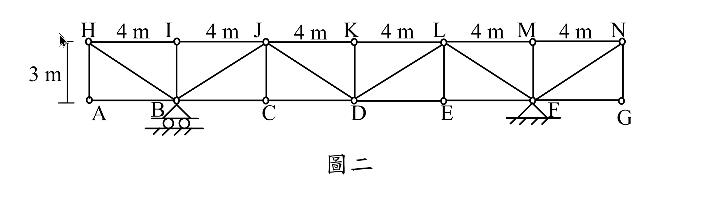

# 考題編號：SA-2024-2

**主分類：** `SA-U2` 結構變位分析
**副分類：** `SA-U1` 靜定結構分析
**分析法：** 單位力法 (虛功法)
**標籤：** `靜定桁架`, `製造誤差`, `溫度變化`, `支承沉陷`, `多餘資訊陷阱`

---

## 1. 原始題目重述 (Problem Restatement)
如圖二所示之桁架，已知支承 F 發生垂直向下沉陷 $v_F = 12\text{ mm}$，桿件 CD 有製造誤差 $\delta$，桿件 DE 有溫差 $\Delta T$。因以上三個原因，造成 C 點向下位移 4.8 mm，E 點向下位移 6.4 mm。試求上述製造誤差 $\delta = ?\text{ mm}$（註明過長或過短）及 $\Delta T = ?^\circ\text{C}$（註明升溫或降溫）；假設所有桁架桿件性質相同如下：熱膨脹係數 $\alpha = 1.5 \times 10^{-5} /^\circ\text{C}$，楊氏模數 $100\text{ GPa}$，斷面積 $A=150\text{ mm}^2$。（25 分）

*圖說：總跨度共 7 個節點 (A~G)，每節點間距 4m。支承位於 B (滾支承) 與 F (鉸支承)。上方節點 H~N 高度為 3m。斜桿呈現 Pratt 桁架配置 (V字型)。*

## 2. 考題核心精神與出題者意圖 (Core Concepts & Examiner's Intent)
本題是一道極具鑑別度的「靜定結構運動學」考題。出題者主要測驗考生兩個核心觀念：
1. **虛功法（單位力法）的多重成因疊加**：必須熟悉如何將支承沉陷、溫度變化、製造誤差同時納入虛功方程式中。
2. **靜定結構的物理本質（陷阱）**：靜定結構在承受溫度變化、製造誤差及支承沉陷時，**完全不會產生內部應力**，只會產生純幾何變形。因此，題目故意給定楊氏模數 $E$ 與斷面積 $A$，是為了誘導觀念不熟的考生去計算不存在的彈性變形（$\frac{PL}{EA}$），這是一個經典的「多餘資訊陷阱」。

## 3. 解題戰略地圖與陷阱分析 (Strategic Roadmap & Trap Analysis)
1. **支承反力與虛擬內力計算**：
   - 本桁架為靜定結構，支承位於 B 點 ($x=4$) 與 F 點 ($x=20$)，跨距為 16m。
   - 分別在 C 點與 E 點施加單位虛擬向下力，利用「切面法」求出對應的 CD 桿與 DE 桿虛擬內力 ($u_{CD}$ 與 $u_{DE}$)。
2. **建立虛功方程式**：
   - 總位移 = 支承沉陷引起的剛體位移 + 桿件變形引起的位移。
   - 虛功方程式：$1 \cdot \Delta = \sum u_i \delta_i + \sum R_{vi} \cdot (\text{支承位移})$
   - 透過 C 點與 E 點的已知位移，建立包含未知數 $\delta_{CD}$ 與 $\delta_{DE}$ 的二元一次聯立方程式。
3. **陷阱分析**：
   - **陷阱一（多餘參數）**：絕對不可將 $E$ 與 $A$ 代入計算，因為內力 $P=0$。
   - **陷阱二（虛擬功符號）**：支承 F 實際向下沉陷，若虛擬反力向上，則該項虛功為負值，移項至位移側時相當於正向貢獻，需特別注意符號一致性。
   - **陷阱三（斜桿方向判斷）**：若未仔細觀察圖面採用正確的切面力矩中心，將求錯 $u$ 值。Pratt 桁架在 C-D 區段斜桿為 J-D，故力矩中心為 J；在 D-E 區段斜桿為 L-D，故力矩中心為 L。

## 3.5 變數層次分析 (Variable Hierarchy Analysis)

### 最終目標
透過聯立虛功方程式，解出 CD 桿的製造誤差 $\delta$ 與 DE 桿的溫度變化 $\Delta T$。

### 本題關鍵公式（依計算順序）
$$
1 \cdot \Delta_{C} = u_{CD}^C \cdot \delta_{CD} + u_{DE}^C \cdot \delta_{DE} + R_{vF}^C \cdot v_F
$$
（C點虛功方程式）

$$
1 \cdot \Delta_{E} = u_{CD}^E \cdot \delta_{CD} + u_{DE}^E \cdot \delta_{DE} + R_{vF}^E \cdot v_F
$$
（E點虛功方程式）

$$
\delta_{DE} = \alpha \cdot \Delta T \cdot L_{DE}
$$
（溫度變形公式）

### L1：題目直接給定
| 符號 | 數值 | 說明 |
|---|---|---|
| $v_F$ | $12\text{ mm}(\downarrow)$ | 支承 F 下陷量 |
| $\Delta_C$ | $4.8\text{ mm}(\downarrow)$ | C 點實際向下位移 |
| $\Delta_E$ | $6.4\text{ mm}(\downarrow)$ | E 點實際向下位移 |
| $L_{CD}, L_{DE}$ | $4000\text{ mm}$ | 桿件長度 |
| $\alpha$ | $1.5 \times 10^{-5} /^\circ\text{C}$ | 熱膨脹係數 |

### L2：需知識點推導
| 符號 | 公式／來源 | 卡關? |
|---|---|---|
| $R_{vF}^C, R_{vF}^E$ | 取整體平衡求虛擬反力 | |
| $u_{CD}, u_{DE}$ | 切面法取上弦節點為力矩中心求虛擬內力 | |
| $\delta_{CD}$ | 解二元一次方程式得出 | |
| $\delta_{DE}$ | 解二元一次方程式得出 | |

### L3：深層知識（不懂就卡住）
| 知識點 | 說明 | 卡關? |
|---|---|---|
| 靜定無內力 | 靜定結構受溫度與製造誤差作用時，不產生內力，故 $E, A$ 為多餘資訊。 | |
| 剛體位移項 | 虛功方程式中，支承沉陷項目的作功與方向必須正確對應。 | |

## 4. 步驟化詳細計算過程 (Step-by-Step Detailed Calculation)

### Step 1: 分析幾何與支承配置
- 支承 B $(x=4)$，支承 F $(x=20)$，跨度 $L = 16\text{ m}$。
- 實際產生長度變化的桿件僅有 CD ($\delta_{CD}$) 與 DE ($\delta_{DE}$)。
- 定義拉力為正（伸長為正）。向下位移為正。

### Step 2: 建立 C 點虛功方程式
在 C 點 $(x=8)$ 施加單位向下虛擬載重 $1(\downarrow)$：
- **虛擬支承反力**：
  $\Sigma M_B = 0 \implies R_{vF}^C \times 16 - 1 \times 4 = 0 \implies R_{vF}^C = 0.25 (\uparrow)$
  $R_{vB}^C = 0.75 (\uparrow)$
- **求 $u_{CD}^C$**：切斷 J-K, J-D, C-D，取左半自由體。對 J 點 $(x=8, y=3)$ 取彎矩：
  $u_{CD}^C \times 3 - R_{vB}^C \times 4 = 0 \implies 3 u_{CD}^C = 0.75 \times 4 = 3 \implies u_{CD}^C = 1$ (拉力)
- **求 $u_{DE}^C$**：切斷 K-L, L-D, D-E，取右半自由體。對 L 點 $(x=16, y=3)$ 取彎矩：
  $u_{DE}^C \times 3 - R_{vF}^C \times 4 = 0 \implies 3 u_{DE}^C = 0.25 \times 4 = 1 \implies u_{DE}^C = \frac{1}{3}$ (拉力)
- **虛功方程式**：
  $1 \cdot \Delta_C + R_{vF}^C \cdot (-v_F) = u_{CD}^C \cdot \delta_{CD} + u_{DE}^C \cdot \delta_{DE}$
  $4.8 + 0.25 \times (-12) = 1 \cdot \delta_{CD} + \frac{1}{3} \cdot \delta_{DE}$
  $\boxed{\delta_{CD} + \frac{1}{3} \delta_{DE} = 1.8} \quad \text{--- (式 1)}$
  *(註：亦可視為剛體位移 $0.25 \times 12 = 3$ mm 加上彈性位移等於總位移 4.8 mm)*

### Step 3: 建立 E 點虛功方程式
在 E 點 $(x=16)$ 施加單位向下虛擬載重 $1(\downarrow)$：
- **虛擬支承反力**：
  $\Sigma M_B = 0 \implies R_{vF}^E \times 16 - 1 \times 12 = 0 \implies R_{vF}^E = 0.75 (\uparrow)$
  $R_{vB}^E = 0.25 (\uparrow)$
- **求 $u_{CD}^E$**：切斷 J-K, J-D, C-D，取左半自由體。對 J 點 $(x=8, y=3)$ 取彎矩：
  $u_{CD}^E \times 3 - R_{vB}^E \times 4 = 0 \implies 3 u_{CD}^E = 0.25 \times 4 = 1 \implies u_{CD}^E = \frac{1}{3}$ (拉力)
- **求 $u_{DE}^E$**：切斷 K-L, L-D, D-E，取右半自由體。對 L 點 $(x=16, y=3)$ 取彎矩：
  (注意：單位力 1 剛好通過 L 點，無力矩)
  $u_{DE}^E \times 3 - R_{vF}^E \times 4 = 0 \implies 3 u_{DE}^E = 0.75 \times 4 = 3 \implies u_{DE}^E = 1$ (拉力)
- **虛功方程式**：
  $1 \cdot \Delta_E + R_{vF}^E \cdot (-v_F) = u_{CD}^E \cdot \delta_{CD} + u_{DE}^E \cdot \delta_{DE}$
  $6.4 + 0.75 \times (-12) = \frac{1}{3} \cdot \delta_{CD} + 1 \cdot \delta_{DE}$
  $\boxed{\frac{1}{3} \delta_{CD} + \delta_{DE} = -2.6} \quad \text{--- (式 2)}$

### Step 4: 聯立求解並判斷結果
將 (式 1) 乘以 3：
$3 \delta_{CD} + \delta_{DE} = 5.4 \quad \text{--- (式 3)}$
(式 3) 減去 (式 2)：
$\left(3 - \frac{1}{3}\right) \delta_{CD} = 5.4 - (-2.6)$
$\frac{8}{3} \delta_{CD} = 8 \implies \delta_{CD} = 3\text{ mm}$
代回 (式 1)：
$3 + \frac{1}{3} \delta_{DE} = 1.8 \implies \frac{1}{3} \delta_{DE} = -1.2 \implies \delta_{DE} = -3.6\text{ mm}$

**判斷製造誤差：**
計算結果 $\delta_{CD} = +3\text{ mm}$。因虛功法中定義拉力（伸長）為正，正號代表桿件實際長度比設計長度多出 3 mm。
$$
\boxed{\text{製造誤差 } \delta = 3\text{ mm (過長)}}
$$

**判斷溫度變化：**
計算結果 $\delta_{DE} = -3.6\text{ mm}$。負號代表桿件縮短。
利用熱變形公式：
$$
\delta_{DE} = \alpha \cdot \Delta T \cdot L_{DE}
$$
$$
-3.6 = (1.5 \times 10^{-5}) \times \Delta T \times 4000
$$
$$
-3.6 = 0.06 \times \Delta T \implies \Delta T = -60^\circ\text{C}
$$
$$
\boxed{\text{溫差 } \Delta T = 60^\circ\text{C} \text{ (降溫)}}
$$

## 5. 關鍵爭議點與進階探討 (Critical Issues & Advanced Discussion)
- **靜定結構的免受力特性**：本題最大的陷阱在於提供了 $E$ 與 $A$。若考生未能一眼識破本桁架為靜定結構，可能會試圖將 $\delta = \frac{PL}{EA}$ 納入方程式中，這不僅浪費時間，更顯示對結構行為的誤解。考場上遇到這類給定大量似乎用不到的參數的題目，應先冷靜檢驗靜不定度。
- **支承沉陷的剛體位移直觀驗證**：在虛功法外，其實可以直觀檢驗沉陷影響。B點不動，F點下沉12mm。C點距離B為總跨距的 1/4，剛體下沉 $12 \times \frac{1}{4} = 3$ mm。E點距離B為 3/4，剛體下沉 $12 \times \frac{3}{4} = 9$ mm。扣除剛體位移後，純因桿件變形造成的位移為 $\Delta_{C}' = 4.8 - 3 = 1.8$ mm，$\Delta_{E}' = 6.4 - 9 = -2.6$ mm，與我們方程式左側的數值完全一致。這種交叉驗證能在考場上提供極大的信心。
