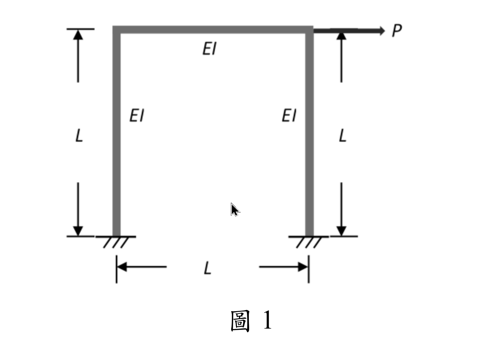

# 考題編號：SA-2025-1

**主分類：** `SA-U2-4` 靜不定結構之矩陣分析法  
**副分類：** （無）  
**分析法：** 矩陣位移法（Direct Stiffness Method）  
**標籤：** `矩陣勁度法` `側向勁度` `門型剛構架` `固定端` `靜態凝縮` `忽略軸向變形`  


---

## §1 題目重述

如圖1所示之一層樓單跨度剛構架（Rigid-jointed frame），梁及柱皆為垂直剛接，兩柱底為固定支承。梁柱之撓曲剛度均為 $EI$，長度均為 $L$。若忽略所有桿件之軸向變形，請推導對應側向作用力 $P$ 之**側向勁度**（提示：請先寫出結構之勁度矩陣）。（25 分）



*圖說：門型剛構架。左柱底 A、右柱底 D 固定；頂部節點 B（左）、C（右）剛接連接水平梁 BC。所有桿件撓曲剛度 $EI$、長度 $L$。側向力 $P$ 作用於梁端（水平向右）。*

---

## §2 核心精神與出題者意圖

**核心觀念：** 以矩陣位移法系統化建立結構勁度矩陣，再透過**靜態凝縮（Static Condensation）**消去旋轉自由度，直接得到側向勁度 $k_{lateral} = P/\Delta$。

**出題者意圖：**

- 測試能否在忽略軸向變形後，正確辨識有效自由度（三個：$\theta_B,\,\theta_C,\,\Delta$）
- 測試勁度矩陣從構件局部矩陣到整體矩陣的系統化組裝能力
- 題目提示「先寫出勁度矩陣」，不可僅用傾角變位法消去轉角後直接回答
- 靜態凝縮是矩陣分析核心技術，考察是否掌握 Schur complement 公式

---

## §3 解題戰略地圖

```
忽略軸向變形
    ↓
辨識 DOF：θB、θC、Δ（3個）
    ↓
各構件局部勁度矩陣（2×2 自由端子矩陣）
    ↓
組裝 3×3 整體勁度矩陣 [K]
    ↓
建立方程組 [K]{d} = {F}（其中 F = {0, 0, P}）
    ↓
由對稱性知 θB = θC，解出 θ = 3Δ/(5L)
    ↓
代入第三行，求出 k = P/Δ = 84EI/(5L³)
```

**陷阱分析：**

| 陷阱 | 說明 | 應對 |
|------|------|------|
| 梁的弦轉角 $\psi_{BC}$ | 梁 BC 水平，B、C 無垂直位移差（柱不縮短），故 $\psi_{BC}=0$ | 只有兩根柱有 $\psi=\Delta/L$ |
| 勁度矩陣 $K_{33}$ 符號 | 柱頂側移產生的柱頂剪力與 $\Delta$ 方向相反（阻抗），$K_{33}$ 應為正 | $K_{33}=+24EI/L^3$ |
| 靜態凝縮 vs. 直接代入 | 兩種方式等效，本題用「代入轉角結果至第三方程」即可；大型結構需用凝縮公式 | 本題代入法較簡潔 |
| DOF 順序對勁度矩陣的影響 | 組裝時必須統一 DOF 對應關係，不可混用 | 統一用 $\{\theta_B,\,\theta_C,\,\Delta\}$ |

---

## §3.5 變數層次分析（Variable Hierarchy Analysis）

> 複習提示：第一次解題後在卡住處標記 `⚠`；複習時只看 `⚠` 項目。

### 最終目標

$$k_{lateral} = \frac{P}{\Delta} = \frac{84EI}{5L^3}$$

**推導路徑：** 矩陣位移法建立 $[K]_{3\times3}$ → 建立 $[K]\{d\}=\{F\}$ → 對稱性推出 $\theta_B=\theta_C$ → 代入求 $\Delta$ → 得 $k$

---

### L1：題目直接給定

| 符號 | 數值 | 說明 |
|------|------|------|
| $EI$ | $EI$（符號） | 所有桿件撓曲剛度均相同 |
| $L$ | $L$（符號） | 所有桿件長度均相同 |
| 支承條件 | 兩柱底固定支承 | A、D：$\theta=0,\;\delta_H=0,\;\delta_V=0$ |
| 節點條件 | 梁柱剛接 | B、C：梁柱連續，轉角相同 |
| 外力 | 側向力 $P$ | 水平作用於節點（B 或 C） |
| 約束 | 忽略軸向變形 | 柱不縮短、梁不伸縮 |

---

### L2：需知識點推導

**Step 1：自由度辨識**

| 符號 | 推導依據 | 卡關? |
|------|---------|:-----:|
| $\theta_B$ | B 節點旋轉自由 | |
| $\theta_C$ | C 節點旋轉自由 | |
| $\Delta$ | B、C 水平位移相同（梁不伸縮）；垂直位移 = 0（柱不縮短） | |
| 柱底 A、D | 全固定 → 不貢獻自由度 | |

**Step 2：柱元素局部勁度（自由端子矩陣，DOF：$\theta_{top},\,\delta_{top}$）**

基底固定端消去後，自由端 2×2 子矩陣：

$$[\bar{k}]_{col} = \begin{bmatrix} \dfrac{4EI}{L} & -\dfrac{6EI}{L^2} \\[4pt] -\dfrac{6EI}{L^2} & \dfrac{12EI}{L^3} \end{bmatrix}$$

| 項目 | 公式 | 物理意義 | 卡關? |
|------|------|---------|:-----:|
| $k_{\theta\theta}$ | $4EI/L$ | 施加單位旋轉所需彎矩 | |
| $k_{\theta\delta}=k_{\delta\theta}$ | $-6EI/L^2$ | 旋轉-側移耦合（負號：側移抑制旋轉） | |
| $k_{\delta\delta}$ | $12EI/L^3$ | 施加單位側移所需剪力 | |

**Step 3：梁元素局部勁度（DOF：$\theta_B,\,\theta_C$，無側移）**

$$[\bar{k}]_{beam} = \frac{EI}{L}\begin{bmatrix} 4 & 2 \\ 2 & 4 \end{bmatrix}$$

| 項目 | 公式 | 物理意義 | 卡關? |
|------|------|---------|:-----:|
| 近端剛度 | $4EI/L$ | 遠端固定時施加單位旋轉所需彎矩 | |
| 遠端傳遞 | $2EI/L$ | 近端旋轉在遠端產生的彎矩（傳遞率 1/2） | |

**Step 4：整體勁度矩陣組裝（DOF 順序：$\theta_B,\,\theta_C,\,\Delta$）**

| 位置 | 貢獻構件 | 數值 | 卡關? |
|------|---------|------|:-----:|
| $K_{11}$ | 左柱 $4EI/L$ + 梁 $4EI/L$ | $8EI/L$ | |
| $K_{12}=K_{21}$ | 梁 $2EI/L$ | $2EI/L$ | |
| $K_{13}=K_{31}$ | 左柱 $-6EI/L^2$ | $-6EI/L^2$ | |
| $K_{22}$ | 右柱 $4EI/L$ + 梁 $4EI/L$ | $8EI/L$ | |
| $K_{23}=K_{32}$ | 右柱 $-6EI/L^2$ | $-6EI/L^2$ | |
| $K_{33}$ | 左柱 $12EI/L^3$ + 右柱 $12EI/L^3$ | $24EI/L^3$ | |

**Step 5：對稱推論 $\theta_B = \theta_C$**

| 推論 | 依據 | 卡關? |
|------|------|:-----:|
| 結構幾何對稱 + 荷載反對稱（側移） | 兩個旋轉方程對稱，故 $\theta_B=\theta_C=\theta$ | |
| $\theta=3\Delta/(5L)$ | 解方程 $10EI\theta/L = 6EI\Delta/L^2$ | |

---

### L3：深層知識（不懂就卡住）

| 知識點 | 說明 | 卡關? |
|--------|------|:-----:|
| 「忽略軸向變形」對 DOF 的精確影響 | 消去梁的相對側移差（B、C 同一 $\Delta$）；消去柱軸縮（B、C 無垂直位移） | |
| 梁的弦轉角 $\psi_{BC}=0$ | 僅柱有 $\psi=\Delta/L$，梁端無相對垂直位移 | |
| 4×4 梁元素矩陣的縮減方式 | 固定端（位移=0）直接消去對應行列，剩餘子矩陣即為局部勁度 | |
| 整體矩陣組裝（direct stiffness assembly） | 局部 DOF 對應到整體 DOF 後，逐項疊加 | |
| 靜態凝縮公式（Schur complement） | $k_{eff}=K_{33}-\{K_{31},K_{32}\}[K_{\theta\theta}]^{-1}\{K_{13};K_{23}\}$，與代入消元等效 | |

---

## §4 詳細計算過程

### 4.1 自由度辨識

忽略所有桿件軸向變形：

- **柱 AB、DC** 不縮短 → B、C 垂直位移 = 0
- **梁 BC** 不伸縮 → B、C 水平位移相同，設為 $\Delta$

**有效自由度（DOF）：**

$$\{d\} = \{\theta_B,\;\theta_C,\;\Delta\}^T$$

邊界條件：柱底 A、D 為固定端，三個自由度均為零（不貢獻 DOF）。

---

### 4.2 各構件局部勁度矩陣

**構件① 左柱 AB**（A 固定，B 自由，垂直桿件，側向 = 水平方向）

基底固定端消去後，自由端子矩陣（DOF 順序：$\theta_B,\,\Delta$）：

$$[\bar{k}]_{AB} = \begin{bmatrix} \dfrac{4EI}{L} & -\dfrac{6EI}{L^2} \\[6pt] -\dfrac{6EI}{L^2} & \dfrac{12EI}{L^3} \end{bmatrix}$$

**構件② 右柱 DC**（D 固定，C 自由，垂直桿件，側向 = 水平方向）

$$[\bar{k}]_{DC} = \begin{bmatrix} \dfrac{4EI}{L} & -\dfrac{6EI}{L^2} \\[6pt] -\dfrac{6EI}{L^2} & \dfrac{12EI}{L^3} \end{bmatrix} \quad \text{（DOF 順序：}\theta_C,\,\Delta\text{）}$$

**構件③ 梁 BC**（兩端無側移：$\psi_{BC}=0$，水平桿件，橫向 = 垂直方向）

B、C 之垂直位移均為零（柱不縮短），梁無橫向端位移，故：

$$[\bar{k}]_{BC} = \frac{EI}{L}\begin{bmatrix} 4 & 2 \\ 2 & 4 \end{bmatrix} \quad \text{（DOF 順序：}\theta_B,\,\theta_C\text{）}$$

---

### 4.3 整體勁度矩陣組裝

DOF 全域編號：1 = $\theta_B$，2 = $\theta_C$，3 = $\Delta$

$$\boxed{[K] = \begin{bmatrix} \dfrac{8EI}{L} & \dfrac{2EI}{L} & -\dfrac{6EI}{L^2} \\[8pt] \dfrac{2EI}{L} & \dfrac{8EI}{L} & -\dfrac{6EI}{L^2} \\[8pt] -\dfrac{6EI}{L^2} & -\dfrac{6EI}{L^2} & \dfrac{24EI}{L^3} \end{bmatrix}}$$

| 位置 | 貢獻 |
|------|------|
| $K_{11}$ | $4EI/L_{\text{（左柱）}} + 4EI/L_{\text{（梁）}} = 8EI/L$ |
| $K_{12}=K_{21}$ | $2EI/L_{\text{（梁）}}$ |
| $K_{13}=K_{31}$ | $-6EI/L^2_{\text{（左柱）}}$ |
| $K_{22}$ | $4EI/L_{\text{（右柱）}} + 4EI/L_{\text{（梁）}} = 8EI/L$ |
| $K_{23}=K_{32}$ | $-6EI/L^2_{\text{（右柱）}}$ |
| $K_{33}$ | $12EI/L^3_{\text{（左柱）}} + 12EI/L^3_{\text{（右柱）}} = 24EI/L^3$ |

---

### 4.4 建立方程組

外力向量：$\{F\} = \{0,\;0,\;P\}^T$（B、C 節點無外部彎矩；$\Delta$ 方向施加 $P$）

$$[K]\{d\} = \{F\}$$

展開：

$$\frac{8EI}{L}\,\theta_B + \frac{2EI}{L}\,\theta_C - \frac{6EI}{L^2}\,\Delta = 0 \qquad \cdots(1)$$

$$\frac{2EI}{L}\,\theta_B + \frac{8EI}{L}\,\theta_C - \frac{6EI}{L^2}\,\Delta = 0 \qquad \cdots(2)$$

$$-\frac{6EI}{L^2}\,\theta_B - \frac{6EI}{L^2}\,\theta_C + \frac{24EI}{L^3}\,\Delta = P \qquad \cdots(3)$$

---

### 4.5 求解旋轉自由度

方程 (1) 與 (2) 結構對稱，令 $\theta_B = \theta_C = \theta$，代入 (1)：

$$\frac{8EI}{L}\,\theta + \frac{2EI}{L}\,\theta - \frac{6EI}{L^2}\,\Delta = 0$$

$$\frac{10EI}{L}\,\theta = \frac{6EI}{L^2}\,\Delta$$

$$\therefore\;\theta_B = \theta_C = \frac{3\Delta}{5L} \qquad \cdots(4)$$

---

### 4.6 求側向勁度

將 (4) 代入方程 (3)：

$$-\frac{6EI}{L^2}\cdot\frac{3\Delta}{5L} - \frac{6EI}{L^2}\cdot\frac{3\Delta}{5L} + \frac{24EI}{L^3}\,\Delta = P$$

$$-\frac{18EI}{5L^3}\,\Delta - \frac{18EI}{5L^3}\,\Delta + \frac{24EI}{L^3}\,\Delta = P$$

$$\frac{EI\,\Delta}{L^3}\!\left(-\frac{18}{5} - \frac{18}{5} + 24\right) = P$$

$$\frac{EI\,\Delta}{L^3}\!\left(-\frac{36}{5} + \frac{120}{5}\right) = P$$

$$\frac{84\,EI}{5L^3}\,\Delta = P$$

$$\therefore\;\boxed{k_{lateral} = \frac{P}{\Delta} = \frac{84EI}{5L^3}}$$

---

### 4.7 驗算：靜態凝縮公式（Schur Complement）

$$k_{eff} = K_{33} - \begin{bmatrix} K_{31} & K_{32} \end{bmatrix} [K_{\theta\theta}]^{-1} \begin{bmatrix} K_{13} \\ K_{23} \end{bmatrix}$$

其中：

$$[K_{\theta\theta}] = \frac{EI}{L}\begin{bmatrix} 8 & 2 \\ 2 & 8 \end{bmatrix},\qquad \det = \frac{(EI)^2}{L^2}(64-4) = \frac{60(EI)^2}{L^2}$$

$$[K_{\theta\theta}]^{-1} = \frac{L}{60EI}\begin{bmatrix} 8 & -2 \\ -2 & 8 \end{bmatrix}$$

$$[K_{\theta\theta}]^{-1}\!\begin{bmatrix} K_{13} \\ K_{23} \end{bmatrix} = \frac{L}{60EI}\begin{bmatrix} 8 & -2 \\ -2 & 8 \end{bmatrix}\!\begin{bmatrix} -6EI/L^2 \\ -6EI/L^2 \end{bmatrix} = \frac{L}{60EI}\!\begin{bmatrix} -36EI/L^2 \\ -36EI/L^2 \end{bmatrix} = \begin{bmatrix} -3/(5L) \\ -3/(5L) \end{bmatrix}$$

$$\begin{bmatrix} K_{31} & K_{32} \end{bmatrix}\!\begin{bmatrix} -3/(5L) \\ -3/(5L) \end{bmatrix} = \left(-\frac{6EI}{L^2}\right)\!\left(-\frac{3}{5L}\right)\times 2 = \frac{36EI}{5L^3}$$

$$k_{eff} = \frac{24EI}{L^3} - \frac{36EI}{5L^3} = \frac{120EI}{5L^3} - \frac{36EI}{5L^3} = \frac{84EI}{5L^3}\quad \checkmark$$

---

## §5 進階探討

### 5.1 端點彎矩計算（以 $P$ 表示）

由 $\Delta = \dfrac{5PL^3}{84EI}$，$\theta_B=\theta_C=\dfrac{3\Delta}{5L}=\dfrac{PL^2}{28EI}$，

以傾角變位公式驗算各端彎矩（$\psi_{col}=\Delta/L$）：

| 位置 | 彎矩（傾角變位法） | 數值 |
|------|-----------------|------|
| 左柱基底 A（$M_{AB}$） | $\dfrac{2EI}{L}(\theta_B - 3\psi) = \dfrac{2EI}{L}\!\left(\dfrac{PL^2}{28EI}-\dfrac{3\Delta}{L}\right)$ | $-\dfrac{2PL}{7}$ |
| 左柱頂 B（$M_{BA}$） | $\dfrac{2EI}{L}(2\theta_B - 3\psi)$ | $-\dfrac{3PL}{14}$ |
| 梁左端 B（$M_{BC}$） | $\dfrac{2EI}{L}(2\theta_B+\theta_C)$ | $+\dfrac{3PL}{14}$ |
| 梁右端 C（$M_{CB}$） | $\dfrac{2EI}{L}(2\theta_C+\theta_B)$ | $+\dfrac{3PL}{14}$ |
| 右柱頂 C（$M_{CD}$） | $\dfrac{2EI}{L}(2\theta_C - 3\psi)$ | $-\dfrac{3PL}{14}$ |
| 右柱基底 D（$M_{DC}$） | $\dfrac{2EI}{L}(\theta_C - 3\psi)$ | $-\dfrac{2PL}{7}$ |

節點彎矩平衡驗算：
- B 節點：$M_{BA}+M_{BC} = -\dfrac{3PL}{14}+\dfrac{3PL}{14} = 0\;\checkmark$
- C 節點：$M_{CD}+M_{CB} = -\dfrac{3PL}{14}+\dfrac{3PL}{14} = 0\;\checkmark$

樓層剪力驗算（V = 柱兩端彎矩之和除以柱長）：

$$V_{left} + V_{right} = \frac{|M_{AB}|+|M_{BA}|}{L}\times 2 = \frac{\frac{2PL}{7}+\frac{3PL}{14}}{L}\times 2 = \frac{\frac{7PL}{14}}{L}\times 2 = P\;\checkmark$$

### 5.2 參數影響探討

若梁柱 EI 不同（梁：$EI_b$，柱：$EI_c$），柱長 $L_c$，梁長 $L_b$，則：

$$K_{11} = \frac{4EI_c}{L_c} + \frac{4EI_b}{L_b},\quad K_{33} = \frac{24EI_c}{L_c^3}$$

側向勁度隨梁剛度增大而增大（梁越剛，對節點旋轉的束縛越大，側向剛度越高）。梁無限剛（$EI_b \to \infty$）時，$\theta_B=\theta_C=0$，$k_{lateral} = 24EI_c/L_c^3$（雙固定柱的純剪切剛度）。

本題梁柱剛度相同，凝縮效果使得：

$$k_{lateral} = \frac{84EI}{5L^3} \approx 0.70\times\frac{12EI}{L^3}\times 2 = 0.70\times k_{cantilever}$$

（相當於兩根懸臂柱側移剛度總和的 70%，其餘 30% 由節點旋轉造成剛度折減。）

### 5.3 與傾角變位法的等效性

本題亦可直接以傾角變位法建立：
- 轉角平衡方程（對應勁度矩陣第 1、2 行）
- 水平剪力平衡方程（對應第 3 行）

兩法本質相同：傾角變位法是直接列方程，矩陣位移法是系統化組裝後整體求解。矩陣法的優點在於對複雜結構（多層多跨）可程式化實作。

---

## §6 本題知識點索引

| 知識點 | 概念 ID |
|--------|---------|
| 勁度矩陣（梁元素） | [[STIFFNESS-MATRIX]] |
| 矩陣位移法 | [[MATRIX-DISPLACEMENT-METHOD]] |
| 傾角變位公式 | [[SLOPE-DEFLECTION-EQUATION]] |
| 弦轉角（Chord rotation）| [[CHORD-ROTATION]] |
| 靜態凝縮（Schur complement）| [[STIFFNESS-MATRIX]] |

---

*解析日期：2026-07-02*
