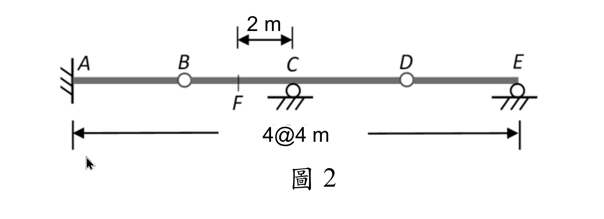

# 考題編號：SA-2025-2

**主分類：** `SA-U1-3` 靜定及靜不定結構影響線  
**副分類：** （無）  
**分析法：** 靜力平衡法 + Müller-Breslau 原理（概念驗核）  
**標籤：** `影響線` `靜定梁` `內鉸接` `固定端` `懸臂段` `滾支承`  


---

## §1 題目重述

如圖1所示之連續梁，請畫出 $R_A$、$R_C$、$R_E$、$M_A$ 及 $V_F$ 之**影響線圖**（Influence Line Diagrams）。

支承條件：
- A：固定端支承（固定端，提供 $R_A$、$H_A$、$M_A$ 三個反力）
- C：滾支承（提供 $R_C$ 垂直反力）
- E：滾支承（提供 $R_E$ 垂直反力）
- B、D：內鉸接（Gerber 鉸，可自由旋轉，彎矩為零）

幾何（由左至右）：$AB = 2\text{ m}$，$BC = CD = DE = EF = 4\text{ m}$，共 18 m。



*圖說：(待補充說明)*

*座標定義：以 A 為原點，x 軸正向朝右。各點座標：A(0)、B(2)、C(6)、D(10)、E(14)、F(18)。*

---

## §2 核心精神與出題者意圖

**核心觀念：** 含內鉸接（Gerber 鉸）的靜定梁，藉由鉸接條件（內鉸處彎矩為零）額外提供靜力方程，使結構為靜定。影響線以「移動單位載重 P=1」在不同位置所對應的反力/內力值繪製。

**靜定性驗證：**

$$\text{未知反力數：} R_A,\, H_A,\, M_A,\, R_C,\, R_E = 5 \text{ 個}$$
$$\text{靜力平衡方程：} 3$$
$$\text{鉸接條件（B 及 D）：} 2$$
$$\text{超靜定度} = 5 - 3 - 2 = 0 \quad \checkmark \text{（靜定）}$$

**出題者意圖：**
- 測試 Gerber 梁的鉸接條件應用（右側自由體彎矩為零）
- 測試影響線逐段分析（不同載重位置對應不同方程組）
- VF 在自由端之值（理解自由端剪力恆為零）
- 關鍵座標值（峰值、零點、負值區）

---

## §3 解題戰略地圖

```
對每個載重位置 x（0≤x≤18），寫出：
  (1) 全域垂直平衡：RA + RC + RE = 1
  (2) 全域對 A 取矩：MA + 6RC + 14RE = x
  (3) 鉸D右側自由體對D取矩（x_load vs x_D=10）
  (4) 鉸B右側自由體對B取矩（x_load vs x_B=2）

→ 解出 RE（由(3)），再解 RC（由(4)），再解 RA、MA（由(1)(2)）
→ 逐段整理成 IL 公式 → 連接線型
```

**陷阱分析：**

| 陷阱 | 說明 | 應對 |
|------|------|------|
| 鉸接條件方向 | 必須對每個鉸選定「右側自由體」並用「右側力對該鉸取矩=0」| 勿用左側自由體（受固定端力影響，計算較繁瑣） |
| 載重位置分段 | 載重在鉸的左側或右側時，右側自由體的載重項不同 | 嚴格按 x vs 鉸位置分三段：x<2、2≤x≤10、x>10 |
| RC 在 D 右側的 IL 出現峰值 2 | 超過支承的 IL 值可大於 1 | 此為槓桿效應，屬正常 |
| VF 在自由端 | 自由端剪力恆為零（無反力） | IL 為水平零線 |
| MA 符號 | 固定端逆時針彎矩為正 | MA 在 B 處達正峰值 +2，在 D 處達負峰值 −2 |

---

## §3.5 變數層次分析（Variable Hierarchy Analysis）

> 複習提示：第一次解題後在卡住處標記 `⚠`；複習時只看 `⚠` 項目。

### 最終目標

繪製 5 條影響線，各自以 x（載重位置）為橫軸，繪出縱距值的折線圖（每段為線性）。

---

### L1：題目直接給定

| 符號 | 數值 | 說明 |
|------|------|------|
| 座標 | A=0, B=2, C=6, D=10, E=14, F=18（m） | 幾何給定 |
| 支承 | A（固定端）、C（滾）、E（滾） | 反力來源 |
| 鉸接 | B（x=2）、D（x=10） | 提供附加靜力條件 |
| 移動載重 | P=1（向下），位置 x | 影響線定義 |

---

### L2：需知識點推導

**Step 1：鉸D條件（D右側自由體，對D取矩）**

| 範圍 | 右側自由體含有哪些力 | 條件方程 | 卡關? |
|------|---------------------|---------|:-----:|
| x < 10（載重在D左） | RE（在x=14）、無載重 | $4R_E = 0$ → $R_E = 0$ | |
| x ≥ 10（載重在D右） | RE（在x=14）、載重P在x | $4R_E - 1\cdot(x-10) = 0$ → $R_E = \dfrac{x-10}{4}$ | |

**Step 2：鉸B條件（B右側自由體，對B取矩）**

| 範圍 | 方程 | RC 求解 | 卡關? |
|------|------|---------|:-----:|
| x < 2 | $4R_C + 12R_E = 0$ | $R_C = 0$（RE=0） | |
| 2 ≤ x ≤ 10 | $4R_C + 12R_E - (x-2) = 0$，RE=0 | $R_C = \dfrac{x-2}{4}$ | |
| x > 10 | $4R_C + 12\cdot\dfrac{x-10}{4} - (x-2) = 0$ | $R_C = \dfrac{14-x}{2}$ | |

**Step 3：全域平衡求 RA 與 MA**

| 符號 | 公式 | 卡關? |
|------|------|:-----:|
| $R_A$ | $R_A = 1 - R_C - R_E$ | |
| $M_A$ | $M_A = x - 6R_C - 14R_E$ | |

---

### L3：深層知識（不懂就卡住）

| 知識點 | 說明 | 卡關? |
|--------|------|:-----:|
| 內鉸接的靜力條件 | 「鉸處彎矩為零」→ 取右側自由體對鉸取矩，去掉左側（固定端）未知力的影響 | |
| 鉸右側自由體的載重包含條件 | 只有當 $x > x_{hinge}$（載重在鉸右側）時，載重才出現在右側自由體中 | |
| 影響線分段線性特性 | 靜定結構的影響線為分段線性（直線段），折點在支承和鉸位置 | |
| 自由端剪力 = 0 | 自由端不存在右側的結構力，VF=0 恆成立 | |
| IL 可超過 1 | 槓桿效應下（如D點以右的RC、RE），IL 縱距可大於 1 | |

---

## §4 詳細計算過程

### 4.1 利用鉸D條件求 RE（分兩段）

**D右側自由體** = 從 D(x=10) 到 F(x=18) 之段落

對 D 取矩（逆時針正）：

$$\sum M_D^{right} = 0:\quad R_E \cdot (14-10) - P \cdot \max(x-10,\,0) = 0$$

$$\therefore\; R_E = \begin{cases} 0 & x < 10 \\ \dfrac{x-10}{4} & x \geq 10 \end{cases}$$

---

### 4.2 利用鉸B條件求 RC（分三段）

**B右側自由體** = 從 B(x=2) 到 F(x=18) 之段落

對 B 取矩：

$$\sum M_B^{right} = 0:\quad R_C \cdot (6-2) + R_E \cdot (14-2) - P \cdot \max(x-2,\,0) = 0$$

$$4R_C + 12R_E = \max(x-2,\,0)$$

**（a）x < 2（載重在 AB 段）：**
$$4R_C + 12\cdot 0 = 0 \implies R_C = 0$$

**（b）2 ≤ x ≤ 10（載重在 BD 段）：** $R_E = 0$
$$4R_C = x-2 \implies R_C = \frac{x-2}{4}$$

**（c）x > 10（載重在 DF 段）：** $R_E = (x-10)/4$
$$4R_C + 12\cdot\frac{x-10}{4} = x-2$$
$$4R_C + 3(x-10) = x-2$$
$$4R_C = -2x + 28 \implies R_C = \frac{14-x}{2}$$

---

### 4.3 全域平衡求 RA 與 MA

**ΣFy = 0：**

$$R_A = 1 - R_C - R_E$$

**ΣMA = 0（對A取矩，逆時針正）：**

$$M_A + 6R_C + 14R_E - 1\cdot x = 0 \implies M_A = x - 6R_C - 14R_E$$

---

### 4.4 影響線縱距公式彙整

**分三段代入計算：**

#### 段 I：$0 \leq x < 2$（AB 段）

$R_E = 0,\; R_C = 0$

| 量 | 公式 | 值域 |
|----|------|------|
| $R_A$ | $1$ | 常數 1 |
| $R_C$ | $0$ | 0 |
| $R_E$ | $0$ | 0 |
| $M_A$ | $x$ | 0 至 2 |
| $V_F$ | $0$ | 0 |

#### 段 II：$2 \leq x \leq 10$（BD 段）

$R_E = 0,\; R_C = (x-2)/4$

| 量 | 公式 | 端值 |
|----|------|------|
| $R_A$ | $1 - \dfrac{x-2}{4} = \dfrac{6-x}{4}$ | $R_A(2)=1,\; R_A(6)=0,\; R_A(10)=-1$ |
| $R_C$ | $\dfrac{x-2}{4}$ | $R_C(2)=0,\; R_C(6)=1,\; R_C(10)=2$ |
| $R_E$ | $0$ | 0 整段 |
| $M_A$ | $x - 6\cdot\dfrac{x-2}{4} = \dfrac{6-x}{2}$ | $M_A(2)=2,\; M_A(6)=0,\; M_A(10)=-2$ |
| $V_F$ | $0$ | 0 |

> 驗算 $M_A$ 在 x=2（段 I/II 交界）：段 I 給 $M_A=2$，段 II 給 $M_A=(6-2)/2=2$ ✓（連續）

#### 段 III：$10 \leq x \leq 18$（DF 段）

$R_E = (x-10)/4,\; R_C = (14-x)/2$

| 量 | 公式 | 端值 |
|----|------|------|
| $R_A$ | $1 - \dfrac{14-x}{2} - \dfrac{x-10}{4} = \dfrac{x-14}{4}$ | $R_A(10)=-1,\; R_A(14)=0,\; R_A(18)=1$ |
| $R_C$ | $\dfrac{14-x}{2}$ | $R_C(10)=2,\; R_C(14)=0,\; R_C(18)=-2$ |
| $R_E$ | $\dfrac{x-10}{4}$ | $R_E(10)=0,\; R_E(14)=1,\; R_E(18)=2$ |
| $M_A$ | $x - 6\cdot\dfrac{14-x}{2} - 14\cdot\dfrac{x-10}{4} = \dfrac{x-14}{2}$ | $M_A(10)=-2,\; M_A(14)=0,\; M_A(18)=2$ |
| $V_F$ | $0$ | 0（自由端恆為零） |

> $M_A$ 在 x=10：段 II 給 $(6-10)/2=-2$，段 III 給 $(10-14)/2=-2$ ✓（連續）

---

### 4.5 影響線縱距表彙整

| 位置 $x$（m） | A(0) | B(2) | C(6) | D(10) | E(14) | F(18) |
|:-------------|:----:|:----:|:----:|:-----:|:-----:|:-----:|
| **IL$_{R_A}$** | 1 | 1 | 0 | −1 | 0 | 1 |
| **IL$_{R_C}$** | 0 | 0 | 1 | 2 | 0 | −2 |
| **IL$_{R_E}$** | 0 | 0 | 0 | 0 | 1 | 2 |
| **IL$_{M_A}$**（kN·m/kN）| 0 | 2 | 0 | −2 | 0 | 2 |
| **IL$_{V_F}$** | 0 | 0 | 0 | 0 | 0 | 0 |

> 所有 IL 在各段均為**線性（直線段）**，折點位於 A、B、C、D、E、F 各處。

---

### 4.6 影響線形狀描述

**IL$_{R_A}$：**
- [A,B]：水平線 $y=1$
- [B,D]：從 1 線性降至 −1（通過 C 時為 0）
- [D,F]：從 −1 線性升至 1（通過 E 時為 0）

**IL$_{R_C}$：**
- [A,B]：水平線 $y=0$
- [B,D]：從 0 線性升至 2（通過 C 時為 1）
- [D,F]：從 2 線性降至 −2（通過 E 時為 0）

**IL$_{R_E}$：**
- [A,D]：水平線 $y=0$
- [D,F]：從 0 線性升至 2（通過 E 時為 1）

**IL$_{M_A}$（單位：m）：**
- [A,B]：從 0 線性升至 2（斜率 = 1 m/m）
- [B,D]：從 2 線性降至 −2（通過 C 時為 0）
- [D,F]：從 −2 線性升至 2（通過 E 時為 0）

**IL$_{V_F}$：**
- 全段 $y=0$（水平零線，自由端剪力恆為零）

---

### 4.7 驗算（三個特殊載重位置）

**載重在 D（x=10）：**

$$R_E = 0,\quad R_C = \frac{10-2}{4} = 2,\quad R_A = 1-2-0 = -1,\quad M_A = 10-12-0 = -2$$

$\Sigma F_y: -1+2+0=1\;\checkmark \quad \Sigma M_A: -2+12+0-10=0\;\checkmark$

鉸B右側：$2\cdot4+0-1\cdot8=0\;\checkmark$，鉸D右側：$0\cdot4-1\cdot0=0\;\checkmark$

**載重在 E（x=14）：**

$$R_E = 1,\quad R_C = 0,\quad R_A = 0,\quad M_A = 0$$

（單位載重完全由 E 支撐，其他反力為零）$\;\checkmark$

**載重在 F（x=18，懸臂端）：**

$$R_E = 2,\quad R_C = -2,\quad R_A = 1,\quad M_A = 2$$

$\Sigma F_y: 1+(-2)+2=1\;\checkmark \quad \Sigma M_A: 2-12+28-18=0\;\checkmark$

鉸B右側：$(-2)\cdot4+2\cdot12-1\cdot16 = -8+24-16=0\;\checkmark$

---

## §5 進階探討

### 5.1 物理意義與 Müller-Breslau 驗核

| 影響線 | Müller-Breslau 解讀 |
|--------|-------------------|
| $R_A$ | 移除A的垂直約束，施加單位向上位移：AB段（固定端旋轉）、BC段（鉸B折彎）等的撓曲形狀 |
| $R_C$ | 移除C的滾支承，施加單位向上位移於C：結構形成兩個三角形撓曲段 |
| $R_E$ | 同理，移除E滾支承，D右側無支承 → DF段為線性（懸臂狀） |
| $M_A$ | 移除A的旋轉約束，施加單位轉角：AB段旋轉，折點在B → 三角形形狀 |
| $V_F$ | 在F處引入鉸（插入剪力釋放）並施加單位剪力位移：自由端無約束 → 零位移線 |

### 5.2 RC 峰值 = 2 的物理解釋

當載重在 D（x=10）時，$R_C = 2$ > 1。這是**槓桿效應**：
- D 是內鉸，D 右側的 DE 段如同從 C 支點延伸的懸臂
- 鉸 D 在 C 右方 4m，施加在 D 的載重對 C 產生槓桿放大
- $R_C = 2$（向上），$R_A = -1$（向下），滿足力矩平衡

### 5.3 VF 的特殊意義

自由端 F 的剪力恆為零。若 F 改為一個截面（非端點），則 VF 的影響線將在 F 的右側出現階梯（= 1 的常數段）。本題 F 為自由端故 $IL_{V_F} \equiv 0$。

---

## §6 本題知識點索引

| 知識點 | 概念 ID |
|--------|---------|
| 影響線 | [[INFLUENCE-LINE]] |
| Müller-Breslau 原理 | [[MULLER-BRESLAU-PRINCIPLE]] |
| 靜不定度判斷 | [[DEGREE-OF-INDETERMINACY]] |
| 固定端反力 | [[SLOPE-DEFLECTION-EQUATION]] |

---

*解析日期：2026-07-02*
