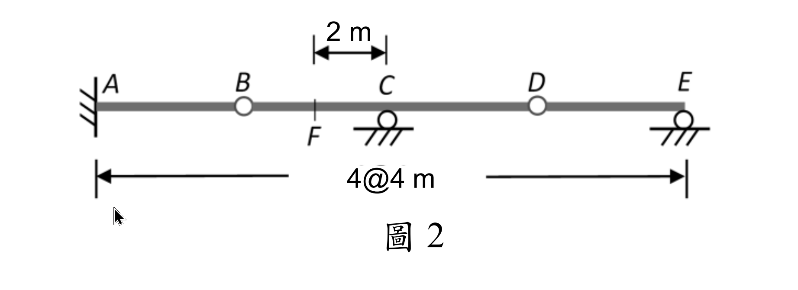
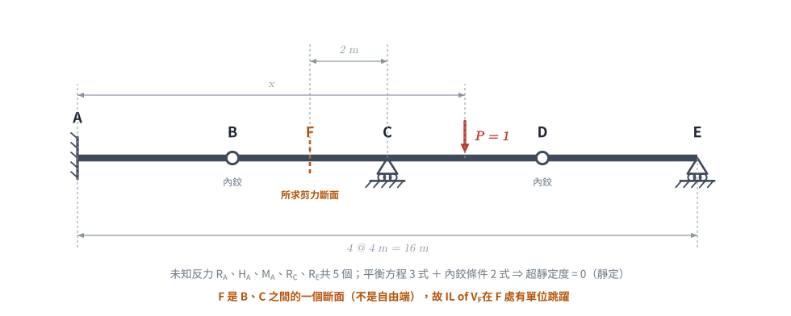
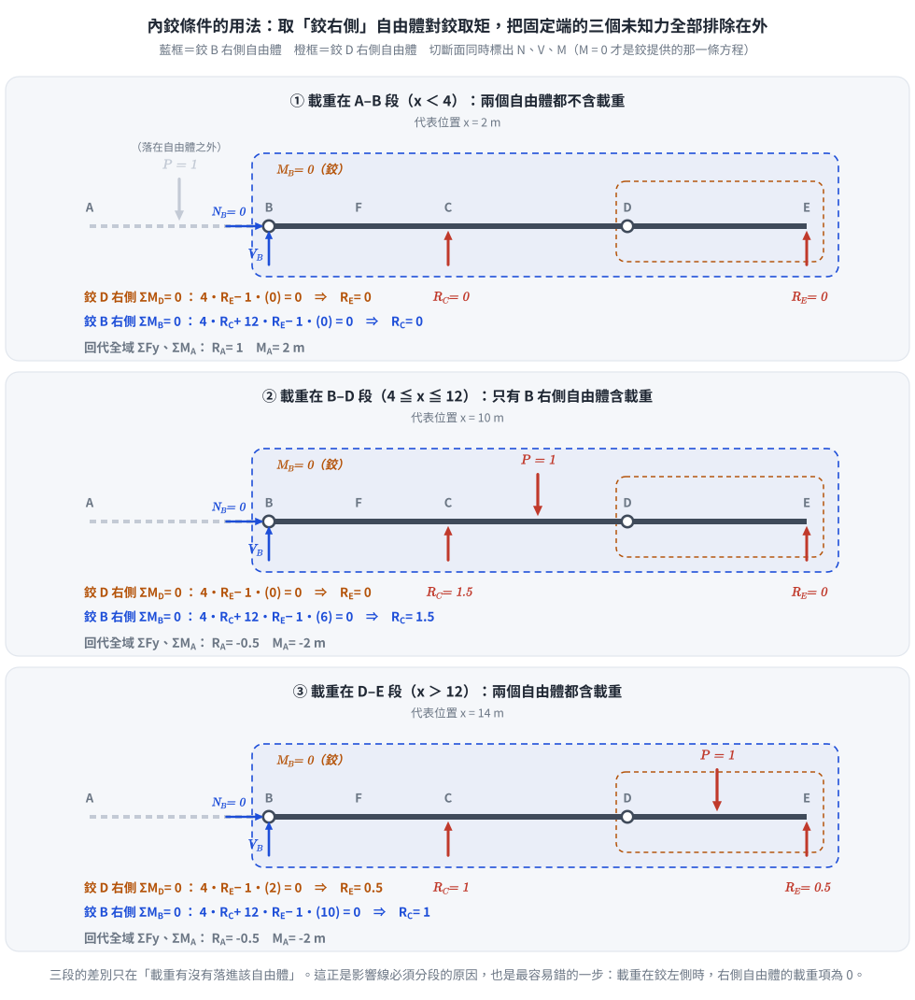
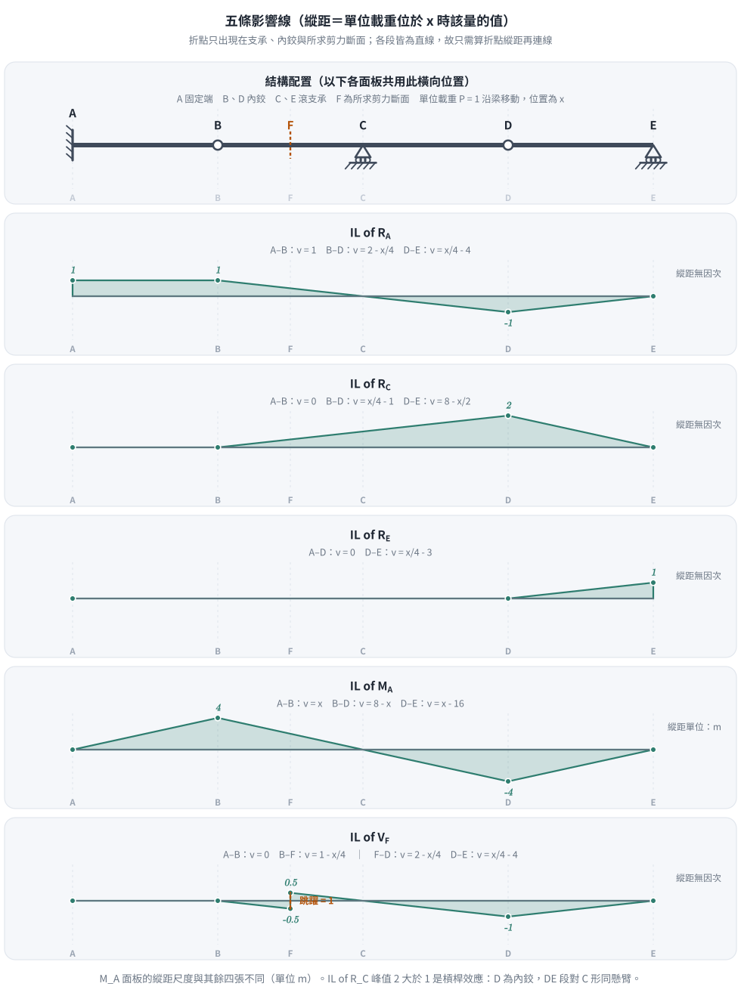
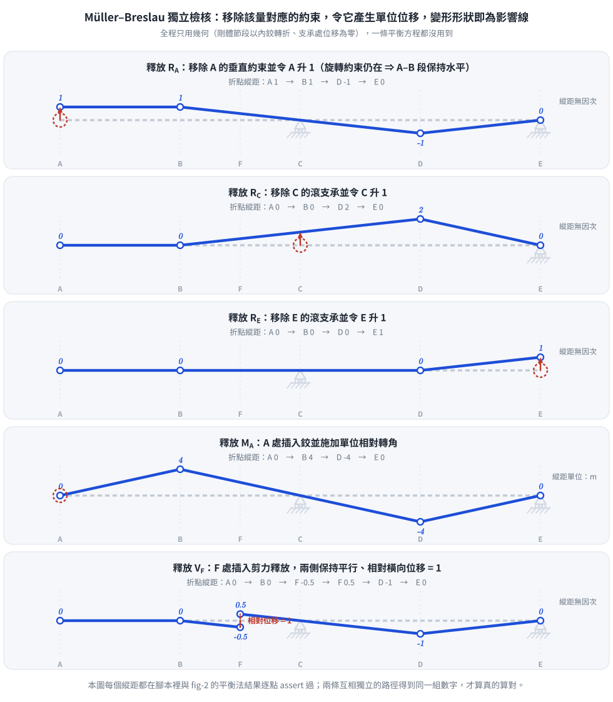

# 考題編號：SA-2025-2

**主分類：** `SA-U1-3` 靜定及靜不定結構影響線
**副分類：** （無）
**分析法：** 靜力平衡法 ＋ Müller-Breslau 原理（獨立驗核）
**標籤：** `影響線` `靜定梁` `Gerber 鉸` `固定端` `剪力斷面` `滾支承`

---

## §1 題目重述

如圖 2 所示之連續梁，請畫出 $R_A$、$R_C$、$R_E$、$M_A$ 及 $V_F$ 之**影響線圖**（Influence Line Diagrams）。

**支承與接續條件：**

- **A**：固定端（提供 $R_A$、$H_A$、$M_A$ 三個反力）
- **B、D**：內鉸接（Gerber 鉸，彎矩為零）
- **C、E**：滾支承（各提供一個垂直反力）
- **F**：**B、C 之間的一個斷面**（不是支承，也不是自由端），位於 C 左方 2 m

**幾何（附圖標示 `4@4 m`）：** $A(0)$、$B(4)$、$F(6)$、$C(8)$、$D(12)$、$E(16)$，全長 16 m。



*圖說：考卷圖 2。底部尺寸線標的是 `4@4 m`（A 到 E 共 16 m，四等跨）；**頂部那道 2 m 尺寸線量的是 F 到 C**，用來定出剪力斷面 F 的位置。*



*圖 1　題目重繪（向量版）。這張圖攔的就是本題最致命的誤讀：把 F 當成自由端、或把跨距記成 $AB=2$ —— 只要錯一項，五條影響線的縱距全部作廢。*

> **⚠ 讀圖提醒（本題最容易失分處）**
> F **不是自由端**。若誤讀為自由端，會得到 $IL_{V_F} \equiv 0$ 的「水平零線」——
> 而 $V_F$ 在 F 處的**單位跳躍**（$-0.5 \to +0.5$）正是本題要考的東西，等於整題白做。
> （本檔 2026-07-02 初版即因此誤讀，2026-08-16 勘誤、2026-08-26 全文改寫，詳見文末 CHANGELOG。）

---

## §2 核心精神與出題者意圖

**核心觀念：** 含 Gerber 鉸的**靜定**梁。內鉸提供額外的靜力條件（鉸處彎矩為零），使反力數與方程數相等。

**靜定性驗證：**

$$\text{未知反力：} R_A,\ H_A,\ M_A,\ R_C,\ R_E = 5 \text{ 個}$$
$$\text{靜力平衡：} 3 \text{ 式}\qquad \text{鉸接條件（B、D）：} 2 \text{ 式}$$
$$\text{超靜定度} = 5 - 3 - 2 = 0 \quad\checkmark\ \text{（靜定）}$$

**出題者意圖：**

1. **Gerber 鉸的用法** —— 取「鉸右側自由體對該鉸取矩」，一次排除固定端的三個未知力。
2. **由外而內的解題順序** —— 先用最右邊的鉸 D 解 $R_E$，再用鉸 B 解 $R_C$，最後才回到整體平衡解 $R_A$、$M_A$。
3. **剪力斷面的單位跳躍** —— F 不在支承上，$IL_{V_F}$ 必在 F 處跳躍 1。
4. **IL 縱距可以大於 1** —— $IL_{R_C}$ 在 D 達到 2（槓桿效應）。

---

## §3 解題戰略地圖

```
對每個載重位置 x（0 ≤ x ≤ 16）：
  (1) 鉸 D 右側自由體對 D 取矩  → R_E
  (2) 鉸 B 右側自由體對 B 取矩  → R_C（需先代入 R_E）
  (3) 全域 ΣFy = 1              → R_A
  (4) 全域 ΣM_A = 0             → M_A
  (5) A–F 左側自由體            → V_F
→ 折點只在 A、B、C、D、E 與斷面 F；各段線性，算折點縱距後連線即可
```

**陷阱分析：**

| 陷阱 | 說明 | 應對 |
|---|---|---|
| **把 F 當自由端** | 誤讀附圖的 2 m 尺寸線 | 2 m 量的是 F→C；F 是 B、C 之間的斷面，$IL_{V_F}$ 有單位跳躍 |
| **把跨距記成 4@4 以外** | 底部尺寸線是 `4@4 m` | $A(0)\,B(4)\,C(8)\,D(12)\,E(16)$，四等跨 |
| 鉸條件用錯側 | 取左側自由體會被固定端三個未知力糾纏 | 一律取**鉸右側**自由體對鉸取矩 |
| 載重位置分段 | 鉸右側自由體是否含載重，取決於 $x$ 與鉸位置 | 嚴格分段：$x<4$、$4\le x\le12$、$x>12$ |
| 看到 $IL_{R_C} = 2$ 就懷疑算錯 | IL 縱距本來就可以大於 1 | 槓桿效應：D 為內鉸，DE 段對 C 形同懸臂 |
| $M_A$ 的正負 | 固定端彎矩的符號慣例 | 本文取「使梁上側受拉為正」，$M_A$ 在 B 達 $+4$、在 D 達 $-4$ |

---

## §3.5 變數層次分析（Variable Hierarchy Analysis）

> 複習提示：第一次解題後在卡住處標記 `⚠`；複習時只看 `⚠` 項目。

### 最終目標

繪製 5 條影響線，橫軸為載重位置 $x$，各段為直線。

### 本題關鍵公式（依計算順序）

$$R_E = \frac{(x-12)^+}{4}, \qquad
R_C = \frac{(x-4)^+ - 12\,\boxed{R_E}}{4}, \qquad
R_A = 1 - \boxed{R_C} - \boxed{R_E}$$

$$M_A = x - 8\,\boxed{R_C} - 16\,\boxed{R_E}, \qquad
V_F = \boxed{R_A} - \begin{cases}1 & x < 6\\ 0 & x > 6\end{cases}$$

（$(\cdot)^+$ 表示取正部，即 $\max(\cdot,0)$。）

### L1：題目直接給定

| 符號 | 數值 | 說明 |
|---|---|---|
| 座標 | A=0、B=4、F=6、C=8、D=12、E=16（m） | 附圖 `4@4 m` ＋ 頂部 2 m |
| 支承 | A 固定端、C 滾、E 滾 | 反力來源 |
| 內鉸 | B（x=4）、D（x=12） | 提供附加靜力條件 |
| 移動載重 | $P = 1$（向下），位置 $x$ | 影響線定義 |

### L2：需知識點推導

**Step 1：鉸 D 條件（D 右側自由體，對 D 取矩）**

| 範圍 | 右側自由體含哪些力 | 條件方程 | 卡關? |
|---|---|---|:--:|
| $x < 12$ | 只有 $R_E$（在 $x=16$） | $4R_E = 0 \Rightarrow R_E = 0$ | |
| $x \ge 12$ | $R_E$ ＋ 載重 $P$ 在 $x$ | $4R_E = x-12 \Rightarrow R_E = \dfrac{x-12}{4}$ | |

**Step 2：鉸 B 條件（B 右側自由體，對 B 取矩）**

| 範圍 | 方程 | $R_C$ | 卡關? |
|---|---|---|:--:|
| $x < 4$ | $4R_C + 12R_E = 0$ | $R_C = 0$ | |
| $4 \le x \le 12$ | $4R_C = x - 4$（$R_E=0$） | $R_C = \dfrac{x-4}{4}$ | |
| $x > 12$ | $4R_C + 3(x-12) = x-4$ | $R_C = 8 - \dfrac{x}{2}$ | |

**Step 3：全域平衡**

| 符號 | 公式 | 卡關? |
|---|---|:--:|
| $R_A$ | $1 - R_C - R_E$ | |
| $M_A$ | $x - 8R_C - 16R_E$ | |

**Step 4：剪力斷面**

| 符號 | 公式 | 卡關? |
|---|---|:--:|
| $V_F$ | A–F 左側自由體：$R_A$ 減去落在 F 左方的載重 | |

### L3：深層知識（不懂就卡住）

| 知識點 | 說明 | 卡關? |
|---|---|:--:|
| 內鉸的靜力條件 | 「鉸處彎矩為零」→ 取**右側**自由體對鉸取矩，把固定端三個未知力排除在外 | |
| 由外而內的解題順序 | 最右邊的鉸只牽涉最少的未知數，先解它 | |
| 靜定結構 IL 為分段直線 | 折點在支承、內鉸、以及所求內力的斷面 | |
| 剪力斷面的單位跳躍 | 單位載重跨過斷面時，$V$ 的值必變化 1 | |
| IL 可超過 1 | 槓桿效應（懸臂放大） | |

---

## §4 詳細計算過程



*圖 3　內鉸條件的用法：取「鉸右側」自由體對鉸取矩，把固定端的三個未知力全部排除在外。切斷面同時標出 $N$、$V$、$M$（$M=0$ 才是鉸提供的那條方程）。這張圖攔的是最容易錯的一步 —— 載重落在鉸左側時，右側自由體的載重項為 0。*

### 4.1 鉸 D 條件求 $R_E$

**D 右側自由體** ＝ 從 $D(12)$ 到 $E(16)$。對 D 取矩：

$$\sum M_D^{\text{right}} = 0:\quad R_E\,(16-12) - P\cdot\max(x-12,\,0) = 0$$

$$\therefore\ R_E = \begin{cases}0 & x < 12\\[4pt] \dfrac{x-12}{4} & x \ge 12\end{cases}$$

### 4.2 鉸 B 條件求 $R_C$

**B 右側自由體** ＝ 從 $B(4)$ 到 $E(16)$。對 B 取矩：

$$\sum M_B^{\text{right}} = 0:\quad R_C\,(8-4) + R_E\,(16-4) - P\cdot\max(x-4,\,0) = 0$$

$$4R_C + 12R_E = \max(x-4,\,0)$$

**（a）$x < 4$：** $4R_C = 0 \Rightarrow R_C = 0$
**（b）$4 \le x \le 12$（$R_E = 0$）：** $R_C = \dfrac{x-4}{4}$
**（c）$x > 12$：** $4R_C + 12\cdot\dfrac{x-12}{4} = x-4 \Rightarrow 4R_C = 32 - 2x \Rightarrow R_C = 8 - \dfrac{x}{2}$

### 4.3 全域平衡求 $R_A$、$M_A$

$$\sum F_y = 0:\quad R_A = 1 - R_C - R_E$$
$$\sum M_A = 0:\quad M_A + 8R_C + 16R_E - x = 0 \;\Rightarrow\; M_A = x - 8R_C - 16R_E$$

### 4.4 剪力斷面 F（$x_F = 6$，位於 B–C 之間）

取 A–F 左側自由體（A 到 F 之間只有固定端反力，以及可能落在該區的載重）：

$$V_F = R_A - \begin{cases}1 & \text{載重在 F 左方}\\ 0 & \text{載重在 F 右方}\end{cases}$$

---

### 4.5 分段直線式

| | A–B（$0\le x\le4$） | B–D（$4\le x\le12$） | D–E（$12\le x\le16$） |
|---|---|---|---|
| $IL_{R_A}$ | $1$ | $2 - x/4$ | $x/4 - 4$ |
| $IL_{R_C}$ | $0$ | $x/4 - 1$ | $8 - x/2$ |
| $IL_{R_E}$ | $0$（至 D 皆為 0） | $0$ | $x/4 - 3$ |
| $IL_{M_A}$（m） | $x$ | $8 - x$ | $x - 16$ |
| $IL_{V_F}$ | $0$（A–B）；$1 - x/4$（B–F） | $2 - x/4$（F–D） | $x/4 - 4$ |

### 4.6 影響線縱距總表

| 位置 $x$（m） | A(0) | B(4) | **F(6)** | C(8) | D(12) | E(16) |
|:---|:---:|:---:|:---:|:---:|:---:|:---:|
| $IL_{R_A}$ | $1$ | $1$ | $0.5$ | $0$ | $-1$ | $0$ |
| $IL_{R_C}$ | $0$ | $0$ | $0.5$ | $1$ | $\mathbf{2}$ | $0$ |
| $IL_{R_E}$ | $0$ | $0$ | $0$ | $0$ | $0$ | $1$ |
| $IL_{M_A}$（m） | $0$ | $\mathbf{4}$ | $2$ | $0$ | $\mathbf{-4}$ | $0$ |
| $IL_{V_F}$ | $0$ | $0$ | $\mathbf{-0.5\ /\ +0.5}$ | $0$ | $-1$ | $0$ |

> 所有 IL 在各段均為**線性**；折點只出現在 A、B、C、D、E 與剪力斷面 F。



*圖 2　五條影響線，縱距與分段式全部由 §4.1–4.4 的方程算出。這張圖攔三件事：把影響線當彎矩圖畫、折點沒落在支承／內鉸／剪力斷面上、以及漏掉 $IL_{R_C}$ 的峰值 2。*

### 4.7 驗算（三個特殊載重位置）

**載重在 D（$x=12$）：**

$$R_E = 0,\quad R_C = \frac{12-4}{4} = 2,\quad R_A = 1-2-0 = -1,\quad M_A = 12 - 16 = -4$$

$\Sigma F_y:\ -1+2+0 = 1\ \checkmark$　　$\Sigma M_A:\ -4 + 8(2) + 0 - 12 = 0\ \checkmark$
鉸 B 右側：$4(2) + 0 - 1\cdot8 = 0\ \checkmark$　　鉸 D 右側：$4(0) - 0 = 0\ \checkmark$

**載重在 E（$x=16$）：**

$$R_E = 1,\quad R_C = \frac{12 - 12}{4} = 0,\quad R_A = 0,\quad M_A = 16 - 0 - 16 = 0$$

（單位載重完全由 E 支撐）$\checkmark$

**載重在 F 兩側（$x = 6^\mp$）：**

$$R_A(6) = 2 - \tfrac64 = 0.5 \quad\Rightarrow\quad V_F(6^-) = 0.5 - 1 = -0.5,\qquad V_F(6^+) = 0.5$$

跳躍 $= 0.5 - (-0.5) = 1\ \checkmark$

---

## §5 進階探討

### 5.1 Müller-Breslau 的獨立驗核

靜定結構的影響線可以**完全不用平衡方程**求得：把對應的束制解除，令它產生單位位移／轉角，剛體機構的形狀就是影響線。

| 影響線 | 釋放什麼 | 機構形狀 |
|---|---|---|
| $R_A$ | 移除 A 的垂直約束（旋轉約束仍在）| A 升 1，A–B 段保持水平；B、D 為轉折點，通過 C、E 兩個零點 |
| $R_C$ | 移除 C 的滾支承 | C 升 1；A–B 段仍水平（固定端）；D 為轉折點 |
| $R_E$ | 移除 E 的滾支承 | E 升 1；A–D 段不動（D 左側被 A、C 鎖死） |
| $M_A$ | A 處插入鉸並施加單位轉角 | A–B 段斜率 = 1 |
| $V_F$ | F 處插入剪力釋放（兩側保持平行）| 相對橫向位移 = 1，兩側斜率相同 |



*圖 4　Müller–Breslau 的獨立檢核：全程只用幾何，一條平衡方程都沒用到。兩條互相獨立的路徑（平衡法／機構法）得到同一組縱距，才算真的算對（產圖腳本已逐點 assert）。這張圖攔的是影響線形狀畫錯。*

### 5.2 $IL_{R_C}$ 峰值 = 2 的物理解釋

載重在 D（$x=12$）時 $R_C = 2 > 1$，這是**槓桿效應**：

- D 是內鉸，D 右側的 DE 段對 C 而言形同一根伸出去的懸臂；
- 鉸 D 在 C 右方 4 m、支承 E 在 C 右方 8 m，$1$ 的載重放在 D 上，C 必須出 2 才平衡；
- 代價是 $R_A = -1$（**A 被向下壓**）。

這也告訴我們：$R_C$ 的設計最大值不會發生在 C 正上方，而是在 D。

### 5.3 $V_F$ 的意義：為什麼「F 是不是自由端」是整題的分水嶺

- **若 F 是自由端**：自由端右側沒有結構，$V_F \equiv 0$，$IL_{V_F}$ 是一條水平零線 —— 這條影響線變得毫無資訊。
- **F 是 B–C 間的斷面**（本題實況）：$IL_{V_F}$ 在 F 處有**單位跳躍**（$-0.5 \to +0.5$），且在 D 達到 $-1$。

$V_F$ 的最大負值 $-1$ 出現在載重放在 D 時（因為此時 $R_A = -1$，而載重在 F 右方）。這是設計 BC 段抗剪時的控制情況 —— 而它完全來自右側懸臂的槓桿效應，跟「F 附近的載重」無關。**這正是影響線的價值：它會指出最不利載重位置在你想不到的地方。**

---

## §6 本題知識點索引

| 知識點 | 概念 ID |
|---|---|
| 影響線 | [[INFLUENCE-LINE]] |
| Müller-Breslau 原理 | [[MULLER-BRESLAU-PRINCIPLE]] |
| 靜不定度判斷 | [[DEGREE-OF-INDETERMINACY]] |
| Gerber 梁（內鉸） | [[GERBER-BEAM]] |

---

## CHANGELOG

| 日期 | 變更 | 原因 |
|---|---|---|
| 2026-07-02 | 初版解析 | — |
| 2026-08-16 | 加註 §1.5 勘誤區塊（保留原文），指出附圖幾何應為 4@4 m、F 為 C 左 2 m 的斷面 | 原文誤讀附圖，把 F 當自由端、跨距記成 $AB=2$／全長 18 m |
| 2026-08-26 | **全文改寫**：§1～§5 一律改用正確幾何，勘誤區塊併入 §1 的讀圖提醒並降為本表一列 | 舊版正文與 §1.5 互相矛盾（§4 全部是錯幾何、§5.3 還在說「F 為自由端故 $IL_{V_F}\equiv0$」），複習時極易讀到錯的那一半 |

---

*解析日期：2026-07-02　｜　勘誤：2026-08-16　｜　全文改寫＋圖解：2026-08-26（向量圖，腳本 `gen_SA-2025-2.py`，可重跑；改 `XA…XF` 任一座標重跑，五條影響線與機構圖會一起變）*
