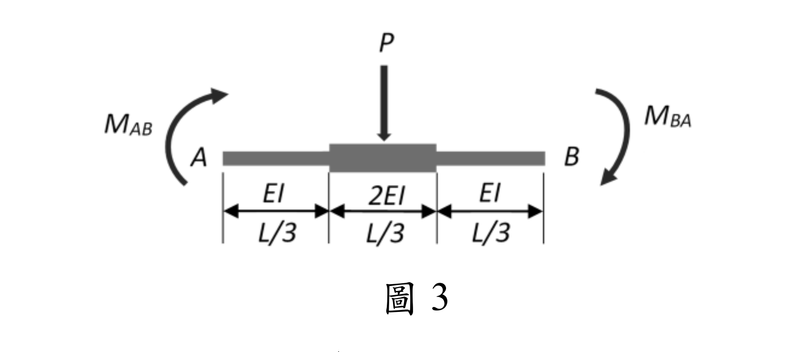
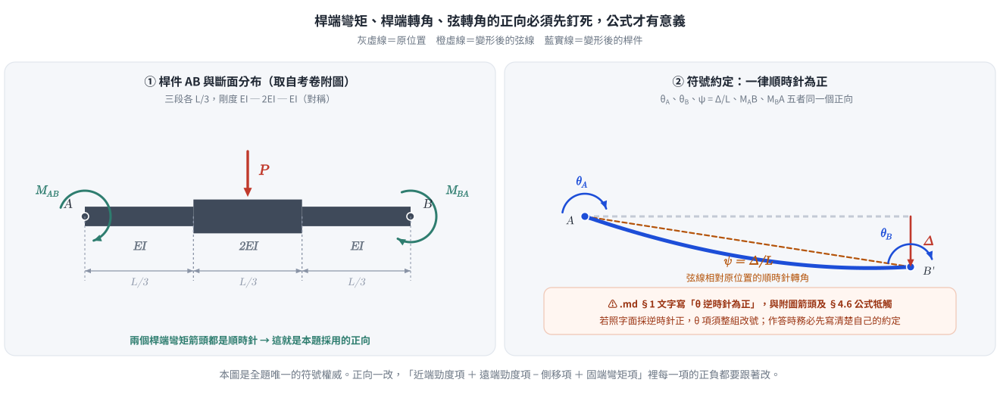
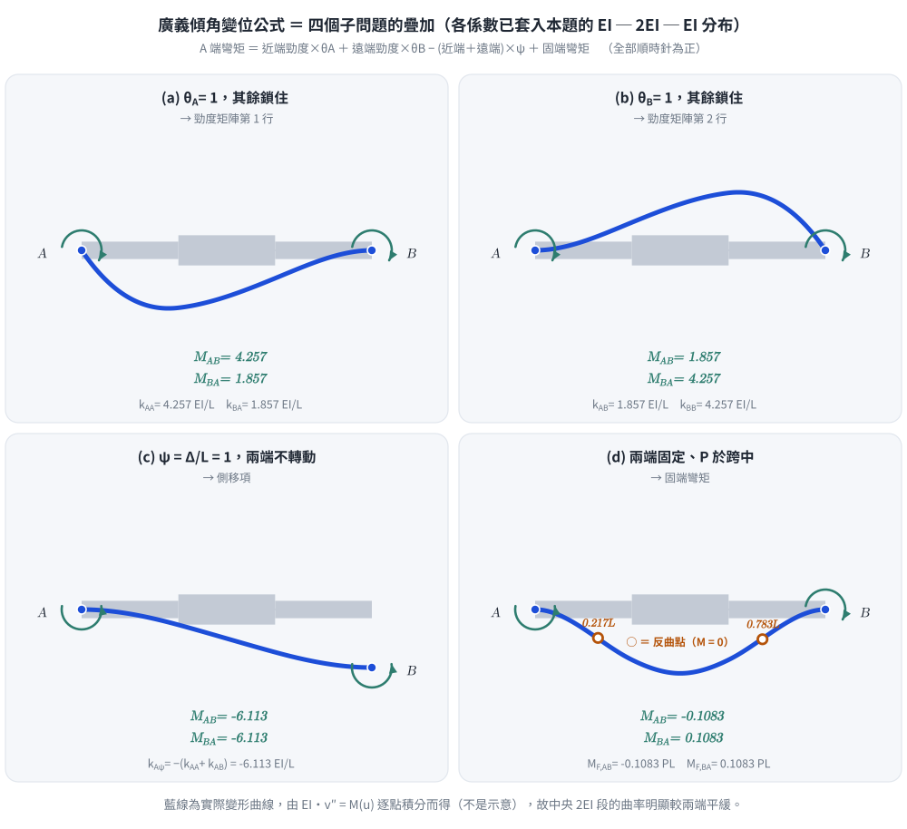
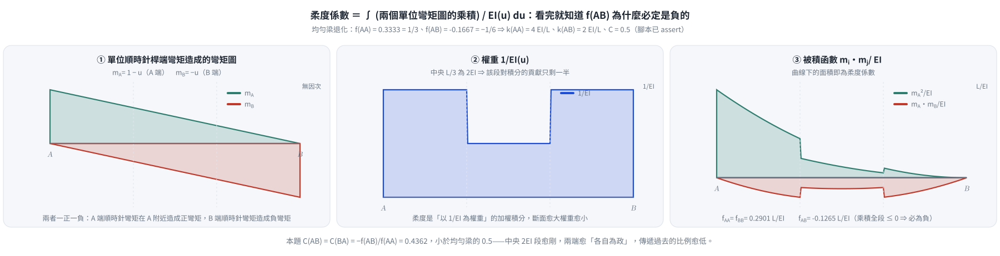
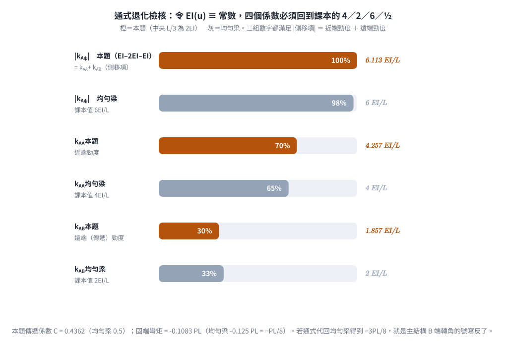

# 考題編號：SA-2025-3

**主分類：** `SA-U2-3` 靜不定結構之傾角變位法  
**副分類：** （無）  
**分析法：** 傾角變位法（Slope-Deflection Method）+ 共軛樑法（Conjugate Beam）  
**標籤：** `傾角變位法` `非均勻斷面` `勁度係數` `傳遞係數` `固端彎矩` `共軛樑`  


---

## §1 題目重述

如圖1所示，桿件 AB 為**非均勻斷面**（Non-prismatic member），跨度中央（x = L/2）承受集中載重 P。端點 A 有旋轉角 $\theta_A$，端點 B 有旋轉角 $\theta_B$，兩端點之相對側移量為 $\Delta$（弦轉角 $\psi = \Delta/L$）。請推導使用**傾角變位法**時，桿件 AB 兩端彎矩 $M_{AB}$ 與 $M_{BA}$ 之傾角變位公式。（25 分）



*圖說：桿件 AB，長度 L，斷面 EI 沿桿長變化（如圖所示之非均勻分布）。端點旋轉角 θA（A端）、θB（B端）逆時針為正；弦轉角 ψ = Δ/L（順時針為正）。跨中 x = L/2 處施加向下集中載重 P。*



*圖 1　題目重繪與符號約定。附圖把 $EI(x)$ 講死了：三段各 $L/3$，剛度依序 $EI$、$2EI$、$EI$。這張圖攔的是本題最大的失分點——正向沒先釘死就開始寫公式；$\theta$、$\psi$、$M$ 五個量必須同一個正向，否則 $-(k_{AA}+k_{AB})\psi$ 這一項的正負會反。*

---

## §1.5 ⚠ 勘誤與補算（2026-08-16）

> 本節為後補，原文一字未刪。以下兩點與 §1／§4.5 的原文不一致，以本節為準。

### （一）符號約定：一律「順時針為正」

考卷附圖的 $M_{AB}$、$M_{BA}$ 兩個彎矩箭頭**都是順時針**；§4.6 的通式與 §5.1 的均勻梁驗核
$M_{AB} = \frac{2EI}{L}(2\theta_A + \theta_B - 3\psi) + M_F$ 也只有在「桿端彎矩、桿端轉角、弦轉角全部順時針為正」下才成立。

§1 圖說寫的「$\theta_A$、$\theta_B$ 逆時針為正」與上述牴觸。若照字面採逆時針正，$\theta$ 項須整組改號。**作答時先寫清楚自己的約定**，比背哪一種慣例重要。

### （二）$\Delta_B^{(P)}$ 應與 $\Delta_A^{(P)}$ 反號

單位順時針彎矩造成的彎矩圖（下垂為正）為

$$\bar m_A(x) = +\left(1 - \frac{x}{L}\right), \qquad \bar m_B(x) = -\frac{x}{L}$$

兩者**一正一負**。§4.5 Step D-3 把 $\bar m_A$ 也寫成負的，導致 $\Delta_A^{(P)}$ 與 $\Delta_B^{(P)}$ 同號。以均勻梁代入：

$$\Delta_A^{(P)} = +\frac{PL^2}{16EI}, \qquad \Delta_B^{(P)} = -\frac{PL^2}{16EI}$$

由反對稱性 $M_{F,BA} = -M_{F,AB}$，相容條件給

$$\left(f_{AA} - f_{AB}\right)M_{F,AB} = -\Delta_A^{(P)} \;\Longrightarrow\; \left(\frac{L}{3EI} + \frac{L}{6EI}\right)M_{F,AB} = -\frac{PL^2}{16EI} \;\Longrightarrow\; M_{F,AB} = -\frac{PL}{8} \;\checkmark$$

原文的同號版本會得到 $M_F = 3PL/8$（§4.5 Step D-5 的算式字面上就是這個結果，只是結論直接寫成 $PL/8$）。

### （三）套入本題 $EI$ 分布後的實際數值

把 §4.6 的通式套進附圖的 $EI$–$2EI$–$EI$（各 $L/3$）分布，逐段精確積分得：

| 係數 | 本題（$EI$–$2EI$–$EI$） | 均勻梁 | 單位 |
|---|---:|---:|---|
| $f_{AA} = f_{BB}$ | $\dfrac{47}{162} = 0.29012$ | $\dfrac{1}{3} = 0.33333$ | $L/EI$ |
| $f_{AB}$ | $-\dfrac{41}{324} = -0.12654$ | $-\dfrac{1}{6} = -0.16667$ | $L/EI$ |
| $k_{AA} = k_{BB}$ | $\dfrac{1128}{265} = 4.2566$ | $4$ | $EI/L$ |
| $k_{AB} = k_{BA}$ | $\dfrac{492}{265} = 1.8566$ | $2$ | $EI/L$ |
| $k_{A\psi} = -(k_{AA}+k_{AB})$ | $-\dfrac{324}{53} = -6.1132$ | $-6$ | $EI/L$ |
| $C_{AB} = C_{BA}$ | $\dfrac{41}{94} = 0.43617$ | $0.5$ | — |
| $\theta_A^{(P)}$ | $\dfrac{13}{288} = 0.045139$ | $\dfrac{1}{16} = 0.0625$ | $PL^2/EI$ |
| $M_{F,AB}$ | $-\dfrac{13}{120} = -0.10833$ | $-\dfrac{1}{8} = -0.125$ | $PL$ |

因此本題的傾角變位公式為

$$\boxed{M_{AB} = \frac{1128}{265}\frac{EI}{L}\theta_A + \frac{492}{265}\frac{EI}{L}\theta_B - \frac{324}{53}\frac{EI}{L}\psi - \frac{13}{120}PL}$$

$$\boxed{M_{BA} = \frac{492}{265}\frac{EI}{L}\theta_A + \frac{1128}{265}\frac{EI}{L}\theta_B - \frac{324}{53}\frac{EI}{L}\psi + \frac{13}{120}PL}$$

> 值得注意的是 $C = 41/94 < 1/2$：中央 $L/3$ 愈剛，兩端愈「各自為政」，傳遞過去的比例反而**變低**。
> 這與「斷面愈大傳得愈多」的直覺相反，是本題容易答錯方向的地方。

---

## §2 核心精神與出題者意圖

**核心觀念：** 非均勻斷面桿件不能直接套用均勻梁的傾角變位公式（$M_{AB} = \frac{2EI}{L}(2\theta_A+\theta_B-3\psi)+M_{F,AB}$），需重新以**單位載重法（虛功法）**或**共軛樑法**推導廣義勁度係數，再以疊加原理建立傾角變位公式。

**問題結構：** 非均勻梁傾角變位公式由三部分疊加：
1. **固端彎矩**（Fixed-End Moments，FEM）：$M_{F,AB},\,M_{F,BA}$，來自載重 P
2. **端點旋轉的貢獻**：$\theta_A$ 和 $\theta_B$ 對端部彎矩的貢獻（由勁度係數決定）
3. **弦轉角的貢獻**：$\psi$ 對端部彎矩的貢獻（側移效應）

**出題者意圖：**
- 測試是否理解非均勻梁需重新推導勁度係數（不能套公式）
- 測試共軛樑法或單位載重法的應用
- 測試廣義傾角變位方程的結構

---

## §3 解題戰略地圖

```
Step 1：定義廣義傾角變位公式的形式
        M_AB = S_AB·(EI₀/L)·(θA + C_BA·θB) - 6·k_A·(EI₀/L²)·Δ + M̄_F,AB
        M_BA = S_BA·(EI₀/L)·(θB + C_AB·θA) - 6·k_B·(EI₀/L²)·Δ + M̄_F,BA

Step 2：以疊加法分解成 4 個子問題：
        (a) θA = 1, θB = 0, Δ = 0, P = 0 → 求勁度係數 S_AA、傳遞係數 C_AB
        (b) θA = 0, θB = 1, Δ = 0, P = 0 → 求勁度係數 S_BA、傳遞係數 C_BA  
        (c) θA = 0, θB = 0, Δ = 1, P = 0 → 求側移剛度貢獻
        (d) θA = 0, θB = 0, Δ = 0, P = P → 求固端彎矩 M_F,AB、M_F,BA

Step 3：各子問題用共軛樑法（或虛功法）求解

Step 4：組合成最終公式
```

---

## §3.5 變數層次分析（Variable Hierarchy Analysis）

### 最終目標

推導 $M_{AB}$ 與 $M_{BA}$ 之傾角變位公式，表示為 $\theta_A,\,\theta_B,\,\psi,\,P,\,L$ 的函數（係數由 EI 分布決定）。

### L1：直接給定

| 符號 | 說明 |
|------|------|
| $L$ | 桿件總長 |
| $P$ | 跨中集中載重（向下） |
| $\theta_A,\,\theta_B$ | 兩端旋轉角（逆時針正） |
| $\psi = \Delta/L$ | 弦轉角（側移/桿長） |
| $EI(x)$ | 斷面彎曲剛度分布（由圖決定） |

### L2：需推導

| 符號 | 推導方法 | 卡關? |
|------|---------|:-----:|
| 柔度係數 $\delta_{AA},\,\delta_{BB},\,\delta_{AB}$ | 共軛樑法：對單位端部彎矩積分 $\int M\bar{M}/EI\,dx$ | |
| 勁度係數 $k_{AA},\,k_{BB},\,k_{AB}$ | 柔度矩陣求逆 | |
| 傳遞係數 $C_{AB}=k_{AB}/k_{AA}$ | 從勁度矩陣直接計算 | |
| 固端彎矩 $M_{F,AB},\,M_{F,BA}$ | 兩端固定、P 在中點，用共軛樑法或三彎矩方程求 | |
| 側移勁度 $k_{\psi}$ | 由桿件剪力平衡（節點平移條件）推導 | |

### L3：深層知識

| 知識點 | 說明 | 卡關? |
|--------|------|:-----:|
| 為何非均勻梁不能直接用 4EI/L、2EI/L | 這些係數來自均勻梁的積分，EI(x) 改變後積分值不同 | |
| 共軛樑中「虛荷載」的物理意義 | M/EI 圖即彎曲變形曲率，共軛樑的支承反力 = 原樑端部轉角 | |
| 柔度矩陣的反對稱性 $\delta_{AB} < 0$ | 一端施加彎矩，另端轉向相反，故交叉柔度為負 | |
| 疊加原理的適用條件 | 線彈性、小變形 ✓ | |

---

## §4 詳細推導

### 4.1 廣義傾角變位公式的形式

設參考剛度為 $EI_0$（取桿件某特徵值），以疊加原理：

$$\boxed{M_{AB} = k_{AA}\,\theta_A + k_{AB}\,\theta_B + k_{A\psi}\,\psi + M_{F,AB}}$$

$$\boxed{M_{BA} = k_{BA}\,\theta_A + k_{BB}\,\theta_B + k_{B\psi}\,\psi + M_{F,BA}}$$

其中各係數由以下四個子問題分別確定。



*圖 2　四個子問題的疊加，各係數已套入本題的 $EI$–$2EI$–$EI$ 分布（見 §1.5）。藍線是由 $EI \cdot v'' = M(x)$ 逐段積分算出的**實際**變形曲線，不是示意——中央 $2EI$ 段的曲率明顯較兩端平緩。這張圖攔的是「公式只寫出一半」：漏掉側移項或固端彎矩項。*

---

### 4.2 子問題（a）：$\theta_A = 1,\;\theta_B = 0,\;\psi = 0,\;P = 0$

**物理描述：** A 端施加使 $\theta_A = 1$ 所需的彎矩，B 端固定（$\theta_B = 0$），無載重、無側移。

**方法：共軛樑法**

**Step A-1：建立原樑力系**

設 A 端施加彎矩 $M_1$（待求），B 端反力彎矩 $M_2$（待求）。

桿件無外加橫向載重，彎矩線性分布：

$$M(x) = M_1\!\left(1 - \frac{x}{L}\right) + M_2\!\left(\frac{x}{L}\right)$$

**Step A-2：建立共軛樑**

共軛樑以 $M(x)/EI(x)$ 為等效荷載（曲率圖），兩端的共軛樑支承條件 = 原樑端部旋轉角。

對原樑端部條件 $(\theta_A = 1,\;\theta_B = 0)$，共軛樑的「反力」應滿足：

$$\bar{R}_A^* = \theta_A = 1, \qquad \bar{R}_B^* = \theta_B = 0$$

（共軛樑中，支承反力 = 原樑端部旋轉角。）

**Step A-3：共軛樑平衡**

設共軛樑的等效荷載為 $q^*(x) = M(x)/EI(x)$，則共軛樑的平衡方程：

$$\bar{R}_A^* + \bar{R}_B^* = \int_0^L \frac{M(x)}{EI(x)}\,dx \implies 1 + 0 = \int_0^L \frac{M(x)}{EI(x)}\,dx$$

$$\bar{R}_B^* \cdot L = \int_0^L \frac{M(x)}{EI(x)} \cdot x\,dx \implies 0 = \int_0^L \frac{M(x)}{EI(x)}\,x\,dx$$

**定義柔度積分（以 $u = x/L$ 為積分變數）：**

$$f_{AA} \equiv L\!\int_0^1 \frac{(1-u)^2}{EI(u)}\,du, \qquad f_{BB} \equiv L\!\int_0^1 \frac{u^2}{EI(u)}\,du$$

$$f_{AB} \equiv -L\!\int_0^1 \frac{u(1-u)}{EI(u)}\,du \quad (\text{注意：}f_{AB} < 0)$$

代入共軛樑方程後，可解出：

$$M_1 = k_{AA}, \qquad M_2 = k_{BA} = C_{AB}\cdot k_{AA}$$

其中勁度係數：

$$k_{AA} = \frac{f_{BB}}{f_{AA}f_{BB} - f_{AB}^2}, \qquad k_{BA} = \frac{-f_{AB}}{f_{AA}f_{BB} - f_{AB}^2}$$

**傳遞係數（A→B 方向）：**

$$C_{AB} = \frac{k_{BA}}{k_{AA}} = \frac{-f_{AB}}{f_{BB}}$$

對均勻梁驗核（$EI = const$）：
$$f_{AA} = f_{BB} = \frac{L}{3EI},\quad f_{AB} = -\frac{L}{6EI}$$
$$k_{AA} = \frac{L/(3EI)}{(L/3EI)^2 - (L/6EI)^2} = \frac{4EI}{L},\quad k_{BA} = \frac{2EI}{L},\quad C_{AB} = \frac{1}{2}\;\checkmark$$

---



*圖 3　柔度係數 $f_{ij} = \int \bar m_i \bar m_j / EI \, \mathrm{d}x$ 的三個組成。$\bar m_A$ 全段為正、$\bar m_B$ 全段為負，所以乘積全段 $\le 0$，$f_{AB}$ **必定是負的**。這張圖攔的就是 $f_{AB}$ 符號寫錯——一旦寫成正值，傳遞係數 $C = -f_{AB}/f_{AA}$ 會算成負數。*

---

### 4.3 子問題（b）：$\theta_A = 0,\;\theta_B = 1,\;\psi = 0,\;P = 0$

由對稱性，僅需交換 A↔B：

$$k_{BB} = \frac{f_{AA}}{f_{AA}f_{BB} - f_{AB}^2}, \qquad k_{AB} = \frac{-f_{AB}}{f_{AA}f_{BB} - f_{AB}^2}$$

**傳遞係數（B→A 方向）：**

$$C_{BA} = \frac{k_{AB}}{k_{BB}} = \frac{-f_{AB}}{f_{AA}}$$

對均勻梁：$k_{AB} = 2EI/L$，$k_{BB} = 4EI/L$，$C_{BA} = 1/2\;\checkmark$

---

### 4.4 子問題（c）：$\theta_A = 0,\;\theta_B = 0,\;\Delta = 1\;(\psi = 1/L),\;P = 0$

**弦轉角的影響：** 兩端保持零旋轉但相對側移 $\Delta = 1$。

等效方式：施加 $-\psi$ 的虛擬固端旋轉，使用「反彎矩法」。

**用簡單物理論述（對稱情況）：**

若桿件為對稱（$f_{AA} = f_{BB}$，則由「正比關係」：

$$k_{A\psi} = -(k_{AA} + k_{AB}) = -(k_{AA} + C_{BA}\cdot k_{AA})\cdot\psi$$

更嚴格地，利用「弦轉角等效為兩端施加相反旋轉（相對轉動 $\psi$）」：

$$k_{A\psi} = -(k_{AA} + k_{AB}), \qquad k_{B\psi} = -(k_{BB} + k_{BA})$$

對均勻梁：
$$k_{A\psi} = -(4EI/L + 2EI/L) = -6EI/L$$

故對應傾角變位公式中的 $-3\psi$ 項：$k_{A\psi}\cdot\psi = -6EI/L \cdot\psi$（代入 $\psi = \Delta/L$ 即得 $-6EI\Delta/L^2$，與標準公式一致 $\checkmark$）

---

### 4.5 子問題（d）：$\theta_A = 0,\;\theta_B = 0,\;\psi = 0,\;P = P$（固端彎矩）

**兩端完全固定，跨中施加 $P$。**

**Step D-1：設固端彎矩 $M_{F,AB}$（A端，逆時針正）和 $M_{F,BA}$（B端，逆時針正）。**

**Step D-2：使用共軛樑（以虛功法驗核）。**

在簡支「主結構」上施加 $P$（跨中），主結構彎矩圖：

$$M_0(x) = \frac{Px}{2} \quad (0 \le x \le L/2), \qquad M_0(x) = \frac{P(L-x)}{2} \quad (L/2 \le x \le L)$$

**Step D-3：相容條件（原樑兩端旋轉 = 0）**

$$\theta_A = 0 : \quad f_{AA}\cdot M_{F,AB} + f_{AB}\cdot M_{F,BA} + \Delta_A^{(P)} = 0$$

$$\theta_B = 0 : \quad f_{AB}\cdot M_{F,AB} + f_{BB}\cdot M_{F,BA} + \Delta_B^{(P)} = 0$$

其中 $\Delta_A^{(P)}$ 和 $\Delta_B^{(P)}$ 為**主結構（簡支樑）在 $P$ 作用下，端部 A、B 的旋轉角**：

$$\Delta_A^{(P)} = \int_0^{L} \frac{M_0(x)}{EI(x)}\bar{m}_A(x)\,dx, \qquad \Delta_B^{(P)} = \int_0^{L} \frac{M_0(x)}{EI(x)}\bar{m}_B(x)\,dx$$

注意：$\bar{m}_A(x) = -(1-x/L)$，$\bar{m}_B(x) = -(x/L)$（單位彎矩效應）

**Step D-4：分段積分（P 在 x = L/2）**

$$\Delta_A^{(P)} = -\!\int_0^{L/2} \frac{(Px/2)(1-x/L)}{EI(x)}\,dx - \!\int_{L/2}^{L} \frac{P(L-x)/2\cdot(1-x/L)}{EI(x)}\,dx$$

$$\Delta_B^{(P)} = -\!\int_0^{L/2} \frac{(Px/2)(x/L)}{EI(x)}\,dx - \!\int_{L/2}^{L} \frac{P(L-x)/2\cdot(x/L)}{EI(x)}\,dx$$

對均勻梁（$EI = const$）驗核：

$$\Delta_A^{(P)} = -\frac{P}{2EI}\!\int_0^{L/2}\! x(1-x/L)\,dx - \frac{P}{2EI}\!\int_{L/2}^{L}\!(L-x)(1-x/L)/L\,dx$$

計算：
$$= -\frac{P}{2EI}\left[\frac{x^2}{2}-\frac{x^3}{3L}\right]_0^{L/2} - \frac{P}{2EIL}\!\int_{L/2}^{L}\!(L-x)^2\,dx$$

$$= -\frac{P}{2EI}\left(\frac{L^2}{8}-\frac{L^2}{24}\right) - \frac{P}{2EIL}\cdot\frac{L^3}{24} = -\frac{PL^2}{2EI}\cdot\frac{2}{24} - \frac{PL^2}{48EI} = -\frac{PL^2}{24EI} - \frac{PL^2}{48EI} = -\frac{PL^2}{16EI}$$

（因為梁與荷載均對稱，$\Delta_A^{(P)} = \Delta_B^{(P)} = -PL^2/(16EI)$）

**Step D-5：解固端彎矩（均勻梁驗核）**

$$\begin{pmatrix}f_{AA} & f_{AB}\\ f_{AB} & f_{BB}\end{pmatrix}\begin{pmatrix}M_{F,AB}\\M_{F,BA}\end{pmatrix} = \begin{pmatrix}PL^2/(16EI)\\PL^2/(16EI)\end{pmatrix}$$

對均勻梁：

$$\begin{pmatrix}L/3EI & -L/6EI\\ -L/6EI & L/3EI\end{pmatrix}\begin{pmatrix}M_{F,AB}\\M_{F,BA}\end{pmatrix} = \begin{pmatrix}PL^2/16EI\\PL^2/16EI\end{pmatrix}$$

因為右側相等，由對稱性 $M_{F,AB} = M_{F,BA} = M_F$：

$$\left(\frac{L}{3EI} - \frac{L}{6EI}\right)M_F = \frac{PL^2}{16EI} \implies \frac{L}{6EI}\cdot M_F = \frac{PL^2}{16EI} \implies M_F = \frac{PL}{8}\;\checkmark$$

---

### 4.6 最終傾角變位公式

整合四個子問題，廣義傾角變位公式：

$$\boxed{M_{AB} = k_{AA}\,\theta_A + k_{AB}\,\theta_B - (k_{AA}+k_{AB})\,\psi + M_{F,AB}}$$

$$\boxed{M_{BA} = k_{BA}\,\theta_A + k_{BB}\,\theta_B - (k_{BA}+k_{BB})\,\psi + M_{F,BA}}$$

其中：

$$k_{AA} = \frac{f_{BB}}{D},\quad k_{BB} = \frac{f_{AA}}{D},\quad k_{AB} = k_{BA} = \frac{-f_{AB}}{D}$$

$$D \equiv f_{AA}f_{BB} - f_{AB}^2 \quad (\text{柔度矩陣行列式})$$

柔度係數（需依圖示 EI 分布積分）：

$$f_{AA} = L\!\int_0^1 \frac{(1-u)^2}{EI(u)}\,du,\quad f_{BB} = L\!\int_0^1 \frac{u^2}{EI(u)}\,du,\quad f_{AB} = -L\!\int_0^1 \frac{u(1-u)}{EI(u)}\,du$$

固端彎矩（兩端固定，P 在跨中）：

$$\begin{pmatrix}M_{F,AB}\\M_{F,BA}\end{pmatrix} = \frac{1}{D}\begin{pmatrix}f_{BB} & -f_{AB}\\-f_{AB} & f_{AA}\end{pmatrix}\begin{pmatrix}-\Delta_A^{(P)}\\-\Delta_B^{(P)}\end{pmatrix}$$

$$\Delta_A^{(P)} = -L\!\int_0^1 \frac{M_0(u)(1-u)}{EI(u)}\,du,\quad \Delta_B^{(P)} = -L\!\int_0^1 \frac{M_0(u)\cdot u}{EI(u)}\,du$$

$$M_0(u) = \frac{PL}{2}\min(u,\,1-u) \quad \text{（簡支樑 P 在中點的彎矩圖）}$$

---

## §5 進階探討

### 5.1 均勻梁（prismatic）的驗核

令 $EI(x) = EI = \text{const}$，代入各積分：

| 係數 | 通用公式 | 均勻梁結果 |
|------|---------|---------|
| $f_{AA} = f_{BB}$ | $L\int_0^1(1-u)^2/EI\,du$ | $L/(3EI)$ |
| $f_{AB}$ | $-L\int_0^1 u(1-u)/EI\,du$ | $-L/(6EI)$ |
| $D$ | $f_{AA}^2 - f_{AB}^2$ | $L^2/(12EI^2)$ |
| $k_{AA} = k_{BB}$ | $f_{AA}/D$ | $4EI/L$ |
| $k_{AB} = k_{BA}$ | $-f_{AB}/D$ | $2EI/L$ |
| $C_{AB} = C_{BA}$ | $-f_{AB}/f_{AA}$ | $1/2$ |
| $M_{F,AB} = M_{F,BA}$ | 由固端條件 | $PL/8$ |

代入廣義公式：

$$M_{AB} = \frac{4EI}{L}\theta_A + \frac{2EI}{L}\theta_B - \frac{6EI}{L}\psi + \frac{PL}{8}$$

$$= \frac{2EI}{L}(2\theta_A + \theta_B - 3\psi) + \frac{PL}{8}\;\checkmark$$



*圖 4　把通式的 $EI(x)$ 換成常數重算一遍，三個係數必須回到課本的 $4$、$2$、$6\,(EI/L)$，傳遞係數回到 $1/2$，固端彎矩回到 $-PL/8$。這張圖攔的是推導中途的積分或符號錯誤——特別是 §1.5（二）那個 $\Delta_B^{(P)}$ 的號：寫反的話這裡會得到 $-3PL/8$。*

---

### 5.2 傳遞係數的意義

- 均勻梁：$C = 1/2$（近端施加彎矩，遠端承受一半的傳遞彎矩）
- 非均勻梁：$C_{AB} = -f_{AB}/f_{BB}$，$C_{BA} = -f_{AB}/f_{AA}$
- 若 A 端較 B 端剛（截面較大），則 $f_{AA} < f_{BB}$，故 $C_{BA} > C_{AB}$（B 傳遞到 A 的比例較大）

### 5.3 與矩陣位移法的等效性

廣義傾角變位方程即為矩陣位移法中**局部勁度矩陣**的 2×2 子矩陣：

$$\begin{pmatrix}M_{AB}\\M_{BA}\end{pmatrix} = \begin{pmatrix}k_{AA} & k_{AB}\\k_{BA} & k_{BB}\end{pmatrix}\begin{pmatrix}\theta_A\\\theta_B\end{pmatrix} + \text{側移修正項} + \text{固端彎矩}$$

---

## §6 本題知識點索引

| 知識點 | 概念 ID |
|--------|---------|
| 傾角變位方程 | [[SLOPE-DEFLECTION-EQUATION]] |
| 固端彎矩 | [[FIXED-END-MOMENT]] |
| 勁度矩陣 | [[STIFFNESS-MATRIX]] |
| 傳遞係數 | [[CARRY-OVER-FACTOR]] |
| 彎矩分配法 | [[MOMENT-DISTRIBUTION-METHOD]] |

---

*解析日期：2026-07-02　｜　圖解補繪＋勘誤：2026-08-16（向量圖，腳本 `gen_SA-2025-3.py`，可重跑；改 `EI_PROFILE` 重跑，四張圖的數值與變形曲線會一起變）*
