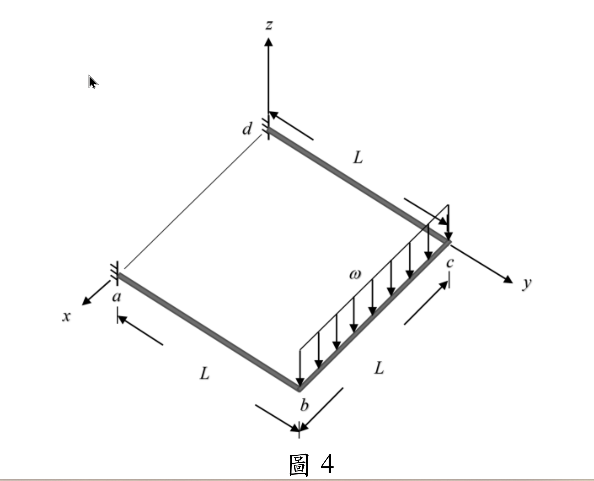

### 考題編號：SA-2025-4

**主分類：** `SA-U2-4` 靜不定結構之矩陣分析法
**副分類：**
**分析法：** 矩陣法
**標籤：** `矩陣位移法` `整體勁度矩陣` `自由度` `格床結構` `實心圓桿` `對稱性利用`

---

## 1. 原始題目重述 (Problem Restatement)
圖 4 所示 $abcd$ 為一位於 $xy$ 平面上的構架，$a$ 及 $d$ 為固定端，$ab$ 及 $bc$ 桿垂直剛接於 $b$ 點，$bc$ 及 $cd$ 桿垂直剛接於 $c$ 點。$ab$、$bc$ 及 $cd$ 三根桿件皆為長度 $L$ 的實心圓桿，其彈性模數為 $E$，剪力模數為 $G$，慣性矩為 $I$。已知 $bc$ 桿件受到負 $z$ 軸方向的均布載重 $\omega$。若不考慮桿件的軸向變形，請以勁度法求所有自由度之變位（含位移及轉角），及 $a$、$d$ 兩支承之反力。（25 分）

*圖說：本題為立體平面構架（Grid），載重在負 $z$ 向。節點 $a, d$ 均為固定端。各桿件長度皆為 $L$。*

## 2. 考題核心精神與出題者意圖 (Core Concepts & Examiner's Intent)
本題測驗考生對於**立體平面構架（Grid Frame / 格床結構）**的矩陣位移法分析能力。
出題者的核心意圖包含：
1. **實心圓桿的極慣性矩特性**：考驗是否知道實心圓形斷面的極慣性矩 $J = I_x + I_y = 2I$，若直接寫 $J$ 而未轉換，將無法得到最終最簡答案。
2. **對稱性的應用**：完整的 Grid 結構有 2 個活動節點（$b, c$），每節點 3 個自由度（$w, \theta_x, \theta_y$），若直接組裝將形成 $6 \times 6$ 矩陣，在考場上手算極易出錯。利用結構幾何與載重的對稱性，可以將問題簡化至 $3 \times 3$ 甚至解耦，這是拿分的絕對關鍵。

## 3. 解題戰略地圖與陷阱分析 (Strategic Roadmap & Trap Analysis)
- **Step 1: 定義坐標與自由度**：設 $a$ 為 $(L,0,0)$、$b$ 為 $(0,0,0)$、$c$ 為 $(0,L,0)$、$d$ 為 $(L,L,0)$。由於載重 $\omega$ 均勻作用在 $bc$ 上，結構變形呈完全對稱。$w_b = w_c$、$\theta_{xb} = -\theta_{xc}$、$\theta_{yb} = \theta_{yc}$。
- **Step 2: 建立節點等效載重**：均布載重 $\omega$ 作用於 $bc$，產生固端剪力與固端彎矩。將其反向即為節點等效載重。
- **Step 3: 組裝勁度矩陣並求解**：針對節點 $b$ 建立平衡方程式。由於對稱性，$\theta_{yb} = \theta_{yc}$ 使得 $bc$ 桿無扭轉，而 $ab$ 桿提供彎曲與扭轉勁度。
- **陷阱 1**：**方向符號約定**。彎矩與轉角的正負號必須依循嚴格的右手定則。
- **陷阱 2**：**$J = 2I$**。忘記將 $J$ 換成 $2I$ 會導致扭轉剛度項無法與彎曲剛度項合併。

## 3.5 變數層次分析 (Variable Hierarchy Analysis)

> 複習提示：第一次解題後，在每個卡住的知識點旁標記 `⚠`；第二次複習時只看有 `⚠` 的項目。

### 最終目標
`求出節點 b, c 的變位 (w, θx, θy)，並回代求 a, d 支承反力`

### 本題關鍵公式（依計算順序）

> $\boxed{\cdot}$ = 需由前步驟推導，非題目直接給定的變數

$$\text{Step 1: } P_{zb} = \frac{\omega L}{2}, \quad P_{mxb} = \frac{\omega L^2}{12}$$

$$\text{Step 2: } \Sigma F_{zb} = K_{11} w_b + K_{13} \theta_{yb} = \boxed{P_{zb}}$$

$$\text{Step 3: } \Sigma M_{yb} = K_{31} w_b + K_{33} \theta_{yb} = 0 \implies \theta_{yb} = f(\boxed{w_b})$$

$$\text{Step 4: } \Sigma M_{xb} = K_{22} \theta_{xb} = \boxed{P_{mxb}} \implies \theta_{xb}$$

### L1：題目直接給定
_看到題目就能讀出的數字，不需要任何公式。_

| 符號 | 數值 | 說明 |
|------|------|------|
| $L$ | $L$ | 各桿長度 |
| $\omega$ | $\omega$ | 負 $z$ 向均布載重 |
| $E, G, I$ | $E, G, I$ | 材料及斷面性質 |

### L2：需知識點推導
_需要知道公式名稱與適用條件，套入 L1 即可算出。_

**Step 1：固端載重與等效節點載重**

| 符號 | 公式/來源 | 卡關? |
|------|----------|:-----:|
| $P_{zb}$ | $bc$ 桿之一半總重：$\omega L / 2$ | |
| $P_{mxb}$ | $bc$ 桿均布載重之固端彎矩：$\omega L^2 / 12$ | |

**Step 2：局部勁度項**

| 符號 | 公式/來源 | 卡關? |
|------|----------|:-----:|
| $K_{w,w}$ | 懸臂梁端點受力：$12EI/L^3$ | |
| $K_{\theta,\theta}$ | 懸臂梁端點彎曲：$4EI/L$ | |
| $K_{\text{torsion}}$ | 扭轉剛度：$GJ/L = 2GI/L$ | |

### L3：深層知識（不懂就卡住）

| 知識點 | 說明 | 卡關? |
|--------|------|:-----:|
| 實心圓桿極慣性矩 | $J = I_x + I_y = 2I$ | |
| 幾何對稱性分析 | U 型構架受對稱載重，兩側撓度相同 $w_b=w_c$，對稱軸彎矩反向 $\theta_{xb}=-\theta_{xc}$ | |
| 扭轉相容條件 | 因 $\theta_{yb} = \theta_{yc}$，$bc$ 桿沿自身軸線無相對扭轉變形 | |

## 4. 步驟化詳細計算過程 (Step-by-Step Detailed Calculation)
> 📊 互動圖：`SA-2025-4-matrix-viz.html`

**Step 1: 坐標系統與對稱性**
建立坐標系：設 $b$ 點為 $(0,0,0)$，$c$ 點為 $(0,L,0)$，$a$ 點為 $(L,0,0)$。
則 $ab$ 桿沿 $x$ 軸，$bc$ 桿沿 $y$ 軸。
由於結構與載重皆對稱於 $y = L/2$ 平面，可知節點位移具備以下對稱性：
- $z$ 向位移：$w_b = w_c$ (向下為正)
- 繞 $x$ 軸轉角：$\theta_{xb} = -\theta_{xc}$
- 繞 $y$ 軸轉角：$\theta_{yb} = \theta_{yc}$

**Step 2: 節點等效載重**
作用於 $bc$ 桿的均布載重 $\omega$ (方向向下)，在節點 $b$ 產生的等效節點載重為：
- $P_{zb} = \frac{\omega L}{2}$ (方向向下)
- $P_{mxb} = \frac{\omega L^2}{12}$ (依右手定則，繞 $x$ 軸之轉矩)

**Step 3: 節點 $b$ 之勁度平衡方程式**
探討節點 $b$ 處的三個自由度 $w_b, \theta_{xb}, \theta_{yb}$：

1. **對於繞 $x$ 軸的彎矩平衡 ($\Sigma M_{xb}$)**：
$ab$ 桿提供扭轉勁度：$T_{ab} = \frac{GJ}{L} \theta_{xb} = \frac{2GI}{L} \theta_{xb}$
$bc$ 桿因 $\theta_{xb} = -\theta_{xc}$，提供彎曲勁度：$M_{xb}^{(bc)} = \frac{4EI}{L}\theta_{xb} + \frac{2EI}{L}(-\theta_{xb}) = \frac{2EI}{L}\theta_{xb}$
$\Sigma M_{xb} = \left( \frac{2GI}{L} + \frac{2EI}{L} \right) \theta_{xb} = P_{mxb} = \frac{\omega L^2}{12}$
解得：
$$ \boxed{ \theta_{xb} = \frac{\omega L^3}{24I(E+G)} } \quad (\text{且 } \theta_{xc} = -\frac{\omega L^3}{24I(E+G)}) $$

2. **對於繞 $y$ 軸的彎矩平衡 ($\Sigma M_{yb}$)**：
$ab$ 桿提供彎曲勁度：$M_{yb}^{(ab)} = \frac{4EI}{L} \theta_{yb} - \frac{6EI}{L^2} w_b$
$bc$ 桿因 $\theta_{yb} = \theta_{yc}$，無相對扭角，提供之扭矩為 $0$。
外部無 $y$ 向力矩載重：
$\frac{4EI}{L} \theta_{yb} - \frac{6EI}{L^2} w_b = 0 \implies \theta_{yb} = \frac{3}{2L} w_b$

3. **對於 $z$ 向的力平衡 ($\Sigma F_{zb}$)**：
$ab$ 桿提供剪力勁度：$V_{zb}^{(ab)} = \frac{12EI}{L^3} w_b - \frac{6EI}{L^2} \theta_{yb}$
$bc$ 桿之剪力貢獻因對稱性互相抵銷（外部載重已化為等效載重）。
$\frac{12EI}{L^3} w_b - \frac{6EI}{L^2} \left( \frac{3}{2L} w_b \right) = P_{zb} = \frac{\omega L}{2}$
$\left( \frac{12EI}{L^3} - \frac{9EI}{L^3} \right) w_b = \frac{\omega L}{2}$
$\frac{3EI}{L^3} w_b = \frac{\omega L}{2}$
解得：
$$ \boxed{ w_b = \frac{\omega L^4}{6EI} } \quad (\text{且 } w_c = \frac{\omega L^4}{6EI}) $$
將 $w_b$ 代回求 $\theta_{yb}$：
$$ \boxed{ \theta_{yb} = \frac{3}{2L} \left( \frac{\omega L^4}{6EI} \right) = \frac{\omega L^3}{4EI} } \quad (\text{且 } \theta_{yc} = \frac{\omega L^3}{4EI}) $$

**Step 4: 計算支承反力**
求 $a$ 點之支承反力（固定端，對應 $ab$ 桿端點力）：
- **垂直反力 $R_{za}$**：
  $R_{za} = V_{ab} = \frac{\omega L}{2}$ (向上)
- **繞 $x$ 軸反彎矩 $M_{xa}$**（扭矩）：
  $M_{xa} = \frac{GJ}{L}\theta_{xb} = \frac{2GI}{L} \frac{\omega L^3}{24I(E+G)} = \frac{\omega L^2 G}{12(E+G)}$
- **繞 $y$ 軸反彎矩 $M_{ya}$**（彎矩）：
  固端彎矩為 $M_{ya} = \frac{6EI}{L^2} w_b - \frac{2EI}{L} \theta_{yb} = \frac{6EI}{L^2} (\frac{\omega L^4}{6EI}) - \frac{2EI}{L} (\frac{\omega L^3}{4EI}) = \omega L^2 - \frac{\omega L^2}{2} = \frac{\omega L^2}{2}$

由對稱性，$d$ 點支承反力量值與 $a$ 點相同（方向依坐標系對稱對應）。

## 5. 關鍵爭議點與進階探討 (Critical Issues & Advanced Discussion)
- 若考場上未察覺 $w$ 與 $\theta_y$ 可解耦，可直接寫出完整的 $3 \times 3$ 勁度矩陣，聯立求解亦會得到完全相同的結果。
- $bc$ 桿無扭轉變形的結論非常優雅，這意味著就彎曲而言，$ab$ 桿形同自由端承受集中載重 $\omega L / 2$ 之懸臂梁，其位移 $PL^3/3EI$ 與旋轉 $PL^2/2EI$ 完全吻合。考場上若能以靜力概念快速驗算，便能保證答案無誤。
