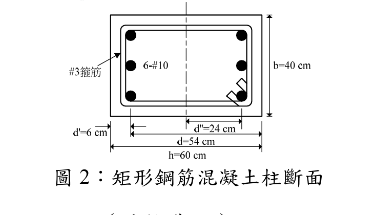

# RC-2011-3 — 矩形柱三排配筋P-M互制與柱曲率延展比

**來源：** 結構工程技師高考 · 鋼筋混凝土設計與預力 · 第3題
**考年：** 2011（民國100年）
**主分類：** [[RC-U1-2]] RC 柱強度分析與設計
**設計法：** USD強度設計法
**標籤：** `矩形柱` `P-M互制` `三排配筋` `中排鋼筋在形心` `過渡區φ值` `斷面韌性容量` `柱曲率延展比` `彈性中性軸` `載重係數γ`
**驗證狀態：** ✅ verified

---

## 題幹摘要

矩形 RC 柱 $b=40$ cm，$h=60$ cm，6-#10 鋼筋分三排（壓力排 $d'=6$ cm、中排 $d_m=30$ cm=形心、拉力排 $d=54$ cm），$f'_c=350$ kgf/cm²，$f_y=4200$ kgf/cm²。(一) 已知 $P_u=0.9P_b$，求設計彎矩強度 $\phi M_n$（15分）；(二) 求斷面韌性容量 $\mu_\phi=\phi_u/\phi_y$（假設載重係數 $\gamma=1.3$）（10分）。

## 核心考點

- 三排配筋時中排鋼筋位於塑性形心（$d_m=h/2=30$ cm），對彎矩的力臂為零，不貢獻彎矩
- $P_u=0.9P_b < P_b$ → $\varepsilon_t=0.002473$（過渡區），$\phi=0.685$，$\phi M_n=56.75$ tf·m
- 柱韌性計算：載重係數 $\gamma=1.3$ 用於換算服務載重 $N=P_u/\gamma$
- 彈性 NA（$k_yd=24.96$ cm）與 Whitney NA（$c_u^*=24.92$ cm）極為接近，$\mu_\phi=1.70$

## 解題關鍵步驟

1. 計算材料常數：$\beta_1=0.80$，$\varepsilon_y=0.002059$，$E_c=280{,}624$ kgf/cm²
2. 求平衡點：$c_b=32.02$ cm，$a_b=25.62$ cm；各力合計 $P_b=306.3$ tf
3. 建立力平衡方程求 $c_u$（$P_n=0.9P_b=275.7$ tf）：解二次方程得 $c_u=29.60$ cm
4. 計算 $\varepsilon_t=0.002473$（過渡區），插值 $\phi=0.685$
5. 對形心取矩：中排力臂=0，$M_n=82.84$ tf·m，$\phi M_n=\mathbf{56.75}$ tf·m
6. 韌性計算：$N=275.7/1.3=212.1$ tf；解彈性 NA 方程得 $k_yd=24.96$ cm，$\phi_y=7.09\times10^{-5}$ rad/cm
7. 解 Whitney NA 方程得 $c_u^*=24.92$ cm，$\phi_u=1.204\times10^{-4}$ rad/cm
8. $\mu_\phi=\phi_u/\phi_y=\mathbf{1.70}$

## 用到的公式

- 平衡中性軸：$c_b = \dfrac{6120}{6120+f_y}\cdot d$
- 中排鋼筋壓縮力（在 Whitney 塊外）：$S_m = A_m \cdot E_s \cdot \varepsilon_{cu}(c-d_m)/c$
- 過渡區 $\phi$：$\phi = 0.65 + 0.25\cdot\dfrac{\varepsilon_t - \varepsilon_y}{0.005 - \varepsilon_y}$
- 服務載重：$N = P_u/\gamma$（$\gamma=1.3$ 為題目給定載重係數）
- 曲率韌性：$\mu_\phi = \phi_u/\phi_y = (\varepsilon_{cu}/c_u^*)/(\varepsilon_y/(d-k_yd))$

## 涉及陷阱

- 中排鋼筋在形心處力臂為零，不貢獻彎矩，但仍參與軸力平衡（$c<30$ 時為拉力，$c>30$ 時為壓力）
- $\gamma$ 係數僅用於換算服務載重求 $\phi_u$，不可乘在 $\phi M_n$ 結果上
- 壓力鋼筋在 Whitney 應力塊內時，$C_1=A_1(f_y-0.85f'_c)$，須扣除混凝土占位

## 圖形

互動圖：[RC-2011-3-pm-viz.html](../../raw/solutions/RC-2011-3/RC-2011-3-pm-viz.html)

## 手寫補充

無

## 相關題目

- [[RC-2011-1]] — P-M 互制圖完整求算步驟（概念題）
- [[RC-2015-1]] — 方形柱 P-M 互制，平衡點最大彎矩
- [[RC-2019-2]] — 矩形柱壓力控制斷面，給定 Pu 求最大 Mu
- [[RC-2008-2]] — RC 柱強度分析與設計
- [[RC-2021-2]] — RC 柱強度分析與設計
- [[RC-2024-3]] — RC 柱強度分析與設計
- [[RC-2010-1]] — RC 柱強度分析與設計
