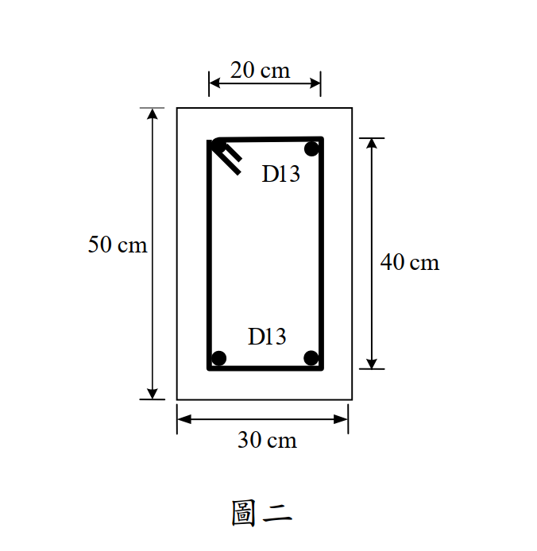

# RC-2013-3 — 扭矩強度設計：閉合箍筋間距與縱向扭力筋 Al 檢核

**來源：** 結構工程技師高考 · 鋼筋混凝土設計與預力 · 第3題
**考年：** 2013（民國102年）
**主分類：** [[RC-U2-2]] RC 扭力強度設計
**設計法：** USD強度設計法
**標籤：** `扭矩強度` `閉合箍筋` `空間桁架類比` `Ao計算` `ph最大間距` `縱向扭力筋Al` `斷面壓碎驗算` `D10箍筋`
**驗證狀態：** ✅ verified

---

## 題幹摘要

RC 矩形斷面 $b=30$ cm，$h=50$ cm，$T_u=1.5$ tf·m；閉合箍筋中心距 $x_o=20$ cm，$y_o=40$ cm；D10 箍筋，D13 縱向扭力筋；$f'_c=280$ kgf/cm²，$f_y=2{,}800$ kgf/cm²。求閉合箍筋間距 $s$，並檢核圖示 4 根 D13 縱向鋼筋配置是否恰當。

## 核心考點

- 扭力空間桁架：$A_t/s=T_u/(\phi\times2A_o\times f_{yv})=0.04635$ cm²/cm，$s=15.3$ cm
- 最大間距限制：$s\leq p_h/8=120/8=15$ cm（控制）→ 採 $s=15$ cm
- 縱向扭力筋：$A_l=(A_t/s)\times p_h=0.04635\times120=5.56$ cm²
- 圖示 4D13 $=5.08$ cm² $<5.56$ ❌（面積不足）；長邊間距 40 cm $>30$ cm ❌
- 需增設：每長邊加 1 根 D13 → 共 6D13=7.62 cm² ≥ 5.56 ✓；長邊間距 20 cm ✓

## 解題關鍵步驟

1. 幾何：$A_{oh}=20\times40=800$ cm²，$A_o=0.85\times800=680$ cm²，$p_h=120$ cm
2. 壓碎驗算：$T_up_h/1.7A_{oh}^2=16.54$ kgf/cm² $\leq\phi\times2.12\sqrt{f'_c}=30.15$ ✓
3. 箍筋：$A_t/s=150{,}000/(0.85\times2\times680\times2{,}800)=0.04635$ cm²/cm；$s_{calc}=0.71/0.04635=15.3$ cm
4. 間距上限：$\min(p_h/8,30)=\min(15,30)=15$ cm → 採 $s=15$ cm（計算值超限）
5. 縱向扭力筋需求：$A_l=0.04635\times120\times1.0=5.56$ cm²
6. 圖示 4D13=5.08 cm² < 5.56 ❌（面積不足 0.48 cm²）
7. 長邊間距：$y_o=40$ cm > 30 cm ❌（需在中點加筋）
8. 增設：每長邊加 1 根 D13 → 6D13=7.62 cm² ✓；長邊間距 20 cm ✓

## 用到的公式

- 箍筋需求：$A_t/s = T_u/(\phi\cdot2A_o\cdot f_{yv})$，$\theta=45°$
- 實際剪力流面積：$A_o = 0.85 A_{oh}$
- 扭力箍筋最大間距：$s\leq\min(p_h/8,\;30\text{ cm})$
- 縱向扭力筋：$A_l = (A_t/s)\cdot p_h\cdot(f_{yv}/f_{yl})\cdot\cot^2\theta$

## 涉及陷阱

- 扭力箍筋最大間距是 $p_h/8$（非剪力箍筋的 $d/2$）
- $A_t$ 為閉合箍筋**一腳**截面積（D10 一腳 = 0.71 cm²）
- $A_o=0.85A_{oh}$（非 $A_{oh}$ 本身）
- 縱向扭力筋需同時滿足面積（$\geq A_l$）與間距（$\leq 30$ cm）兩條件，且每角一根

## 圖形

## 手寫補充

無

## 相關題目

- [[RC-2011-4]] — 矩形梁扭矩剪力組合，斷面適當性檢核
- [[RC-2018-1]] — 矩形梁扭矩剪力組合，poh/8 間距控制
- [[RC-2013-4]] — 先拉法預力梁開裂彎矩
- [[RC-2008-3]] — RC 扭力強度設計
- [[RC-2025-3]] — RC 扭力強度設計
