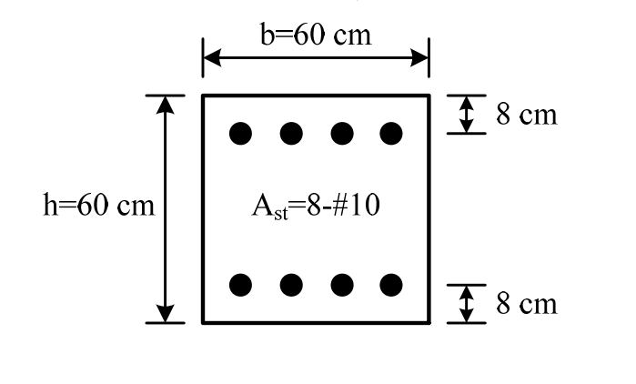

# RC-2015-1 — 對稱雙排鋼筋方形柱 P-M 互制最大彎矩：平衡點 φMn = 89.0 tf·m

**來源：** 結構工程技師高考 · 鋼筋混凝土設計與預力 · 第1題
**考年：** 2015（民國104年）
**主分類：** [[RC-U1-2]] RC 柱強度分析與設計
**設計法：** USD強度設計法
**標籤：** `方形柱` `P-M互制` `平衡點` `最大彎矩` `對稱配筋` `雙排鋼筋` `壓力控制過渡區` `β₁折減`
**驗證狀態：** ✅ verified

---

## 題幹摘要

RC 方形柱 $b=h=60$ cm，$d'=8$ cm，$d=52$ cm；縱筋 8-\#10（頂 4 + 底 4，$A_s=A'_s=32.572$ cm²，$A_{st}=65.144$ cm²）；$f'_c=350$ kgf/cm²，$f_y=4{,}200$ kgf/cm²。在適當調整軸壓後，求此柱斷面可承受之最大極限彎矩載重。

## 核心考點

- P-M 互制圖最大彎矩點在**平衡點**（$c=c_b$），非純彎矩（$P=0$）點
- $\beta_1=0.80$（$f'_c=350>280$）；$c_b=6120/(6120+4200)\times52=30.84$ cm；$a_b=24.67$ cm
- 壓力鋼筋應變：$\varepsilon'_s=0.00222>\varepsilon_y=0.00206$ → 兩排鋼筋均降伏
- $C_c=440.36$ tf，$C'_s=127.13$ tf，$T_s=136.80$ tf；$P_{n,b}=430.7$ tf
- $M_{n,\max}=135.85$ tf·m；$\varphi=0.655$（過渡區）→ $\varphi M_{n,\max}=89.0$ tf·m；$\varphi P_{n,b}=282.1$ tf

## 解題關鍵步驟

1. $\beta_1=0.85-0.05\times(350-280)/70=0.80$；$\varepsilon_y=4200/2{,}040{,}000=0.00206$
2. 平衡中性軸：$c_b=6120/10{,}320\times52=30.84$ cm；$a_b=0.80\times30.84=24.67$ cm
3. 壓力鋼筋應變：$\varepsilon'_s=0.003\times22.84/30.84=0.00222>\varepsilon_y$ → $f'_s=4{,}200$ kgf/cm²（降伏）
4. 三力：$C_c=0.85\times350\times24.67\times60=440{,}362$ kgf；$C'_s=32.572\times(4200-297.5)=127{,}126$ kgf；$T_s=32.572\times4200=136{,}802$ kgf
5. $P_{n,b}=440{,}362+127{,}126-136{,}802=430{,}686$ kgf $=430.7$ tf
6. 力矩（對斷面形心 30 cm）：$M_{n,\max}=440{,}362\times17.665+127{,}126\times22+136{,}802\times22=13{,}585{,}411$ kgf·cm $=135.85$ tf·m
7. $\varphi=0.65+(0.00206-0.002)/0.003\times0.25=0.655$；$\varphi M_{n,\max}=0.655\times135.85=\mathbf{89.0}$ tf·m

## 用到的公式

- 平衡中性軸：$c_b=\dfrac{6120}{6120+f_y}\cdot d$
- 壓力鋼筋淨力：$C'_s=A'_s(f'_s-0.85f'_c)$（扣混凝土占位）
- 力矩平衡（對形心）：$M_{n,\max}=C_c(h/2-a_b/2)+C'_s(h/2-d')+T_s(d-h/2)$
- 過渡區 $\varphi$：$0.65+(e_t-0.002)/0.003\times0.25$

## 涉及陷阱

- 最大彎矩在**平衡點**，不在純彎矩（$P=0$）點——對稱配筋柱的常見誤解
- $\beta_1=0.80$（$f'_c=350>280$），不可用 0.85
- 壓力鋼筋力需扣除混凝土占位：$C'_s=A'_s(f'_s-0.85f'_c)$
- 平衡點 $\varepsilon_t=\varepsilon_y\approx0.00206>0.002$ → 已入過渡區，$\varphi=0.655\neq0.65$

## 圖形

互動圖：[RC-2015-1-pm-viz.html](../../raw/solutions/RC-2015-1/RC-2015-1-pm-viz.html)

## 手寫補充

無

## 相關題目

- [[RC-2013-2]] — 特殊矩形框架柱塑鉸區圍束設計
- [[RC-2019-2]] — 矩形柱壓力控制斷面 P-M 分析
- [[RC-2012-3]] — 特殊矩形框架柱箍筋設計
- [[RC-2017-1]] — 加大柱雙折線應力應變
- [[RC-2014-1]] — 過筋梁應變相容（β₁折減同類考點）
