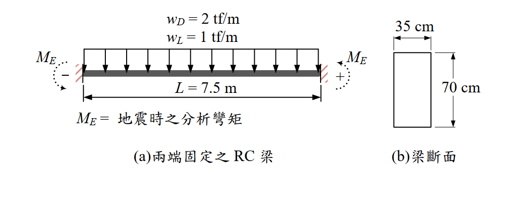

# RC-2016-1 — 兩端固定梁地震載重組合設計：固端 Mu=32.44 tf·m，頂筋 4-D22，底筋 2-D22

**來源：** 結構工程技師高考 · 鋼筋混凝土設計與預力 · 第1題
**考年：** 2016（民國105年）
**主分類：** [[RC-U1-1]] RC 梁彎矩強度分析與設計
**副分類：** [[RC-U3-3]] 韌性要求與耐震設計
**設計法：** USD強度設計法
**標籤：** `兩端固定梁` `地震彎矩組合` `雙曲度彎矩` `固端彎矩` `頂底筋設計` `單筋矩形梁` `ACI載重組合` `三種載重組合比較`
**驗證狀態：** ✅ verified

---

## 題幹摘要

兩端固定矩形 RC 梁，$b=35$ cm，$h=70$ cm，$d=63$ cm，$L=7.5$ m；$w_D=2$ tf/m，$w_L=1$ tf/m，$M_E=16.5$ tf·m（兩端雙曲度）；$f'_c=280$ kgf/cm²，$f_y=4{,}200$ kgf/cm²。設計整跨頂部與底部配置相同之鋼筋量。

## 核心考點

- 三種載重組合：①重力 $1.2D+1.6L$；②地震 $1.2D+1.0E+1.0L$；③地震 $0.9D+1.0E$
- 固端設計彎矩：組合②控制，$M_u=1.2\times9.375+1.0\times16.5+1.0\times4.688=32.44$ tf·m
- 跨中設計彎矩：組合①控制，$M_u=9.375$ tf·m（受 $A_{s,\min}=7.35$ cm² 控制）
- 頂筋（整跨均一）：$A_{s,\text{top}}=14.46$ cm²（固端控制）→ 選配 4-D22=15.48 cm²
- 底筋（整跨均一）：$A_{s,\bot}=7.35$ cm²（$A_{s,\min}$ 控制）→ 選配 2-D22=7.74 cm²

## 解題關鍵步驟

1. 固端彎矩：$M_{D,\text{end}}=2\times56.25/12=9.375$ tf·m；$M_{L,\text{end}}=4.688$ tf·m；$M_{D,\text{mid}}=4.688$ tf·m；$M_{L,\text{mid}}=2.344$ tf·m
2. 組合①固端：$1.2\times9.375+1.6\times4.688=18.75$ tf·m；跨中：$9.375$ tf·m
3. 組合②固端：$1.2\times9.375+16.5+4.688=32.44$ tf·m（**控制**）
4. 設計頂筋：$953.0A_s^2-238{,}140A_s+3{,}244{,}000=0$ → $A_s=14.46$ cm²；$\varepsilon_t=0.01903\gg0.005$ ✓，$\varphi=0.9$
5. 設計底筋：計算值 4.00 cm² $<A_{s,\min}=7.35$ cm²，取 7.35 cm²
6. 選配：頂筋 4-D22（15.48 cm²）；底筋 2-D22（7.74 cm²）；底筋 7.74 $\geq$ 頂筋/2=7.23 ✓

## 用到的公式

- 兩端固定梁：固端 $M=wL^2/12$；跨中 $M=wL^2/24$
- 地震載重組合：$U=1.2D+1.0E+1.0L$ 或 $U=0.9D+1.0E$
- 單筋梁：$0.9A_sf_y(d-a/2)=M_u$（二次方程）；$a=A_sf_y/(0.85f'_cb)$

## 涉及陷阱

- 雙曲度：地震彎矩 $M_E$ 與重力固端彎矩**同向疊加**（均使頂部受拉），不是相互抵消
- 三種組合需全算，本題地震組合②（非①）控制固端設計
- 跨中由最小鋼筋量 $A_{s,\min}=7.35$ cm² 控制，計算值 4.00 cm² 不適用

## 圖形

## 手寫補充

無

## 相關題目

- [[RC-2016-2]] — 同梁塑性鉸區箍筋耐震設計
- [[RC-2012-3]] — 特殊矩形框架柱塑鉸區箍筋
- [[RC-2012-2]] — 特殊矩形框架梁可能彎矩強度
- [[RC-2013-2]] — 特殊矩形框架柱 Ash 設計
- [[RC-2015-2]] — 雙筋梁最大彎矩設計
