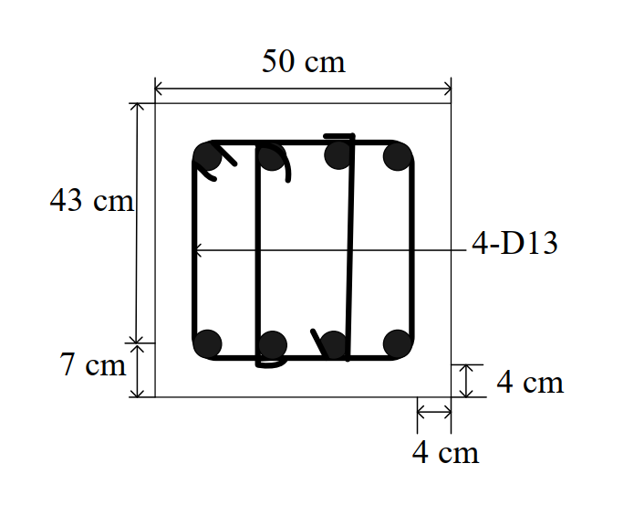

# RC-2018-1 — 矩形梁扭矩剪力組合：Aoh=1373.8 cm²，At/s+Av/s 合設，s=18 cm（d/2 控制）

**來源：** 結構工程技師高考 · 鋼筋混凝土設計與預力 · 第1題
**考年：** 2018（民國107年）
**主分類：** [[RC-U2-2]] RC 扭力強度設計
**副分類：** [[RC-U2-1]] RC 剪力強度分析與設計
**設計法：** USD強度設計法
**標籤：** `矩形梁` `扭矩剪力組合` `空間桁架類比` `塑性理念` `閉合箍筋` `poh/8最大間距` `Aoh計算` `縱向扭力筋` `θ=45°`
**驗證狀態：** ✅ verified

---

## 題幹摘要

矩形梁 $b=50$ cm，$h=43$ cm，$d=36$ cm；$T_u=4$ tf·m，$V_u=20$ tf；D13 封閉箍筋（$A_b=1.27$ cm²），淨保護層 $c_c=4$ cm；$f'_c=280$ kgf/cm²（28 MPa），$f_{yt}=2{,}800$ kgf/cm²（280 MPa），$\theta=45°$。試以塑性理念設計箍筋間距。

## 核心考點

- $A_{oh}=x_1\times y_1=40.73\times33.73=1{,}373.8$ cm²（箍筋中心線圍合面積，非總面積 $A_{cp}$）
- $p_{oh}=2(40.73+33.73)=148.9$ cm；$T_u=40\text{ kN·m}\gg\phi T_{th}=4.42\text{ kN·m}$ → 需設計扭力筋
- 截面上限（solid section check）：LHS $=2.163\text{ MPa}<\text{RHS}=3.308\text{ MPa}$ ✓
- 扭力箍筋：$(A_t/s)=0.693\text{ mm}^2/\text{mm}$，$s_T=183.3\text{ mm}$
- 剪力箍筋：$V_s=107{,}907\text{ N}$，$(A_v/s)=1.071\text{ mm}^2/\text{mm}$，$s_V=237.2\text{ mm}$
- 最大間距：$p_{oh}/8=186.1\text{ mm}$；$d/2=180\text{ mm}$（控制）→ 設計 $s=180\text{ mm}=\mathbf{18\text{ cm}}$

## 解題關鍵步驟

1. 斷面幾何：$x_1=50-2\times4-1.27=40.73$ cm；$y_1=43-2\times4-1.27=33.73$ cm；$A_{oh}=1{,}373.8$ cm²；$p_{oh}=148.9$ cm
2. 扭力門檻：$\phi T_{th}=0.75\times\frac{1}{12}\sqrt{28}\times215{,}000^2/1{,}860=4.42\times10^6\text{ N·mm}=4.42\text{ kN·m}$；$T_u=40\text{ kN·m}\gg4.42$ → 需設計
3. Solid section check：LHS $=\sqrt{1.111^2+1.856^2}=2.163\text{ MPa}<\text{RHS}=3.308\text{ MPa}$ ✓
4. 扭力箍筋：$(A_t/s)=40\times10^6/(0.75\times2\times137{,}380\times280\times1)=0.693\text{ mm}^2/\text{mm}$；$s_T=127/0.693=183.3\text{ mm}$
5. 剪力箍筋：$V_c=(1/6)\sqrt{28}\times500\times360=158{,}760\text{ N}$；$V_s=266{,}667-158{,}760=107{,}907\text{ N}$；$(A_v/s)=107{,}907/(280\times360)=1.071\text{ mm}^2/\text{mm}$；$s_V=254/1.071=237.2\text{ mm}$
6. 最大間距：$p_{oh}/8=186.1\text{ mm}$；$d/2=180\text{ mm}$（$V_s<(1/3)\sqrt{f'c}b_wd=317{,}520\text{ N}$，故用 $d/2$）
7. 設計間距：$s=\min(183.3,237.2,186.1,180)=\mathbf{180\text{ mm}=18\text{ cm}}$（$d/2$ 控制）
8. 補充縱向扭力筋：$A_l=(A_t/s)\times p_{oh}\times\cot^2\theta=0.693\times1{,}489=1{,}032\text{ mm}^2$；現有 4-D13（508 mm²）不足，需補充

## 用到的公式

- 扭力門檻：$\phi T_{th}=\phi\cdot\frac{1}{12}\sqrt{f'_c}\cdot A_{cp}^2/p_{cp}$
- Solid section check：$\sqrt{(V_u/b_wd)^2+(T_up_{oh}/1.7A_{oh}^2)^2}\leq\phi[V_c/b_wd+(2/3)\sqrt{f'_c}]$
- 扭力箍筋：$(A_t/s)=T_u/(\phi\cdot2A_{oh}\cdot f_{yt}\cdot\cot\theta)$，$\theta=45°$
- 剪力箍筋：$(A_v/s)=V_s/(f_{yt}\cdot d)$
- 最大間距：$s\leq\min(p_{oh}/8,\;d/2)$（$V_s\leq\frac{1}{3}\sqrt{f'_c}b_wd$ 時）
- 縱向扭力筋：$A_l=(A_t/s)\cdot p_{oh}\cdot\cot^2\theta$

## 涉及陷阱

- $A_{oh}$ 是箍筋**中心線**圍合面積（需扣保護層 + 箍筋半徑），非總截面積 $A_{cp}$
- 扭力最大間距 $p_{oh}/8$ 常被忽略——本題中僅次於控制條件 $d/2$
- $A_t$ 取**單腿**面積（空間桁架類比）；$A_v$ 取**雙腿**面積（剪力）
- $\phi=0.75$（剪力/扭力），非 $0.9$（彎矩）
- 需同時設計縱向扭力鋼筋 $A_l$（本題圖角落 4-D13 不足，需補充）

## 圖形

## 手寫補充

無

## 相關題目

- [[RC-2013-3]] — 矩形梁扭力設計（At/s、Al 完整計算）
- [[RC-2016-2]] — 特殊矩形框架梁塑性鉸區箍筋（剪力設計）
- [[RC-2014-3]] — 等效彎矩 Mm 法 Vc 計算
- [[RC-2012-2]] — 特殊矩形框架梁梁端設計
- [[RC-2019-1]] — 剪力強度綜合設計
