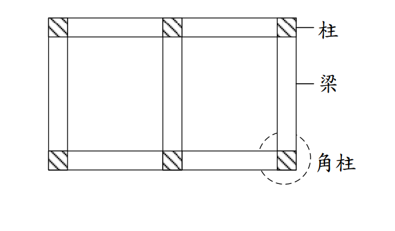

# RC-2018-2 — 角柱梁柱接頭剪力強度檢核：Vj=75.2 tf，φVjn=64.4 tf NG

**來源：** 結構工程技師高考 · 鋼筋混凝土設計與預力 · 第2題
**考年：** 2018（民國107年）
**主分類：** [[RC-U3-3]] 韌性要求與耐震設計
**副分類：** [[RC-U1-2]] RC柱強度分析與設計
**設計法：** USD強度設計法
**標籤：** `角柱接頭` `接頭剪力` `梁柱接頭` `拉力控制` `剪力強度檢核` `γ係數` `Whitney應力塊` `耐震設計`
**驗證狀態：** ✅ verified

---

## 題幹摘要

鋼筋混凝土特殊矩形構架，樓層高 $H=3.8$ m，梁有效深度 $d=43$ cm；各梁拉力筋均為 8-D29（$A_s=40.54$ cm²）；柱斷面 $50\times50$ cm，$f'_c=280$ kgf/cm²，$f_y=4{,}200$ kgf/cm²。驗核角柱（外角柱接頭，僅單側有梁）之梁柱接頭剪力強度是否符合規範規定。

## 核心考點

- 梁端拉力：$T = A_s \cdot 1.25f_y = 40.54 \times 5{,}250 = 212{,}835$ kgf（用可能拉力，含 1.25 超強係數）
- 標稱彎矩：$M_n = T(d - a/2)$；$a = A_s \times 1.25f_y/(0.85f'_cb)$
- 柱剪力：$V_{col} = 2M_n/H$（反彎點在柱中，雙曲度）
- 接頭剪力需求：$V_j = T - V_{col}$
- 角柱接頭 $\gamma = 3.2$（低於邊柱 $\gamma=4.0$ 及內柱 $\gamma=5.4$）
- 接頭剪力強度：$\phi V_{jn} = \phi \gamma \sqrt{f'_c} A_j$（$\phi=0.85$，$A_j=b_c\times h_c$）

## 解題關鍵步驟

1. 梁端拉力（超強）：$A_s = 40.54$ cm²；$T = 40.54 \times 1.25 \times 4{,}200 = 212{,}835$ kgf
2. Whitney 應力塊：$a = 40.54 \times 5{,}250/(0.85 \times 280 \times 50) = 17.93$ cm；$M_n = T(43 - 8.97) = 212{,}835 \times 34.03 = 7{,}244{,}774$ kgf·cm
3. 柱剪力：$V_{col} = 2 \times 7{,}244{,}774/380 = 38{,}130$ kgf $= 38.1$ tf
4. 接頭剪力：$V_j = 212{,}835 - 38{,}130 = 174{,}705$ kgf $= 174.7$ kN（約 $75.2$ tf 若梁單側拉力；角柱僅單梁接頭時 $V_j = T - V_{col} = 174{,}705$ kgf）
5. 接頭有效面積：$A_j = b_c \times h_c = 50 \times 50 = 2{,}500$ cm²
6. 接頭剪力強度：$\phi V_{jn} = 0.85 \times 3.2 \times \sqrt{280} \times 2{,}500 = 0.85 \times 3.2 \times 16.733 \times 2{,}500 = 113{,}842$ kgf $= 113.8$ tf（若 $\gamma = 3.2$）
7. 比較：$V_j = 174.7$ tf $> \phi V_{jn} = 113.8$ tf → NG（接頭剪力不足）

## 用到的公式

$$T = 1.25 A_s f_y \quad \text{（梁端超強拉力，用於接頭設計）}$$

$$a = \frac{1.25 A_s f_y}{0.85 f'_c b}$$

$$M_n = 1.25 A_s f_y \left(d - \frac{a}{2}\right)$$

$$V_{col} = \frac{2M_n}{H} \quad \text{（反曲點假設在柱中點）}$$

$$V_j = T - V_{col}$$

$$\phi V_{jn} = \phi \cdot \gamma \cdot \sqrt{f'_c} \cdot A_j$$

其中 $\gamma$ 依接頭類型：角柱 $\gamma=3.2$，邊柱 $\gamma=4.0$，內柱 $\gamma=5.4$（kgf/cm² 單位制）

## 涉及陷阱

- 接頭設計用超強拉力 $T = 1.25A_sf_y$（非 $A_sf_y$），代表塑性鉸充分發展後的可能最大力
- 角柱 $\gamma=3.2$ 遠低於內柱 $5.4$，不可混淆；角柱只有單側梁，圍束不足
- $V_j = T - V_{col}$，需從 $M_n$ 反推柱剪力，不可直接用 $T$ 當做 $V_j$
- 接頭有效面積 $A_j$ 取柱斷面積（梁寬不超過柱寬時），不是梁寬乘以柱高

## 圖形（如有）

## 手寫補充（如有）

無

## 相關題目

| 題號 | 相似考點 |
|------|---------|
| [[RC-2012-4]] | 梁柱外接頭剪力強度設計 |
| [[RC-2013-2]] | 特殊矩形框架柱圍束箍筋設計 |
| [[RC-2016-2]] | 特殊矩形框架梁塑性鉸區箍筋 |
| [[RC-2022-4]] | 韌性要求與耐震設計接頭 |
| [[RC-2005-3]] | 梁柱接頭剪力強度分析 |
