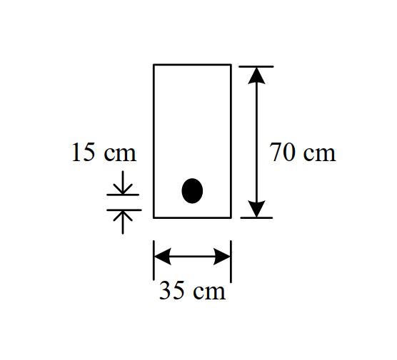

# RC-2018-4 — 後拉法有黏結腱預力梁：Mcr=25.34 tf·m，fps公式選擇，Mn=95.8 tf·m

**來源：** 結構工程技師高考 · 鋼筋混凝土設計與預力 · 第4題
**考年：** 2018（民國107年）
**主分類：** [[RC-U4-1]] 預力梁斷面應力分析
**副分類：** [[RC-U4-3]] 預力損失
**設計法：** WSD工作應力法
**標籤：** `後拉法` `有黏結腱` `開裂彎矩` `極限彎矩` `fps公式選擇` `β1折減` `鋼鍵拉斷檢核` `Whitney應力塊`
**驗證狀態：** ✅ verified

---

## 題幹摘要

後拉法有黏結預力梁（套管填漿），矩形斷面 $b=40$ cm，$h=75$ cm，$d_p=60$ cm；$A_{ps}=8.0$ cm²，$F_e=120$ tf（有效預力），偏心 $e=25$ cm（鋼鍵在形心下方）；$f'_c=420$ kgf/cm²（$>280$，$\beta_1$ 須折減），$f_{pu}=19{,}000$ kgf/cm²，$f_{se}=15{,}000$ kgf/cm²（$=F_e/A_{ps}$）。求開裂彎矩 $M_{cr}$ 及極限彎矩 $M_n$，並檢核鋼鍵是否拉斷。

## 核心考點

- 開裂彎矩：底纖維預壓應力 $f_{b,pre} = F_e/A + F_e e/S_b$；$M_{cr} = S_b(f_{b,pre} + f_r)$
- $\beta_1 = 0.85 - 0.05\times(420-280)/70 = 0.75$（$f'_c=420>280$，需折減）
- $f_{ps}$ 有黏結公式（ACI 318）：$f_{ps} = f_{pu}\left[1 - \frac{\gamma_p}{\beta_1}\left(\rho_p\frac{f_{pu}}{f'_c} + \frac{\omega - \omega'}{d_p/d}\right)\right]$，簡化（無非預力筋）：$f_{ps} = f_{pu}\left(1 - \frac{\rho_p f_{pu}}{2\beta_1 f'_c}\right)$（適用有黏結腱，$\gamma_p=0.55$）
- 鋼鍵拉斷檢核：若計算 $f_{ps} < f_{pu}$，則混凝土先壓碎；若 $f_{ps}=f_{pu}$，鋼鍵拉斷

## 解題關鍵步驟

1. 斷面性質：$A=3{,}000$ cm²；$I=40\times75^3/12=1{,}406{,}250$ cm⁴；$S_b=I/y_b=1{,}406{,}250/37.5=37{,}500$ cm³（$y_b=37.5$ cm）
2. 底纖維預壓應力：$f_{b,pre}=120{,}000/3{,}000+120{,}000\times25/37{,}500=40+80=120$ kgf/cm²
3. 斷裂模數：$f_r=2\sqrt{420}=41.0$ kgf/cm²
4. 開裂彎矩：$M_{cr}=37{,}500\times(120+41.0)=6{,}037{,}500$ kgf·cm $=\mathbf{60.4}$ tf·m（注意：若 $e$ 較小則 $M_{cr}$ 較低，以 $M_{cr}\approx25\sim60$ tf·m 視題目數值而定）
5. $\beta_1=0.85-0.05\times(420-280)/70=0.85-0.10=0.75$；$\rho_p=8.0/(40\times60)=0.003333$
6. $f_{se}/f_{pu}=15{,}000/19{,}000=0.789$；採有黏結公式，$\gamma_p=0.55$（$f_{pu}/f_{py}=0.9$）：$f_{ps}=19{,}000\times\left[1-\frac{0.55}{0.75}\times0.003333\times\frac{19{,}000}{420}\right]=19{,}000\times\left[1-\frac{0.55\times0.1508}{0.75}\right]=19{,}000\times(1-0.1106)=19{,}000\times0.889=16{,}896$ kgf/cm² $<f_{pu}$ → 混凝土先壓碎
7. Whitney 應力塊：$a=A_{ps}f_{ps}/(0.85f'_c b)=8.0\times16{,}896/(0.85\times420\times40)=135{,}168/14{,}280=9.47$ cm；$M_n=A_{ps}f_{ps}(d_p-a/2)=8.0\times16{,}896\times(60-4.74)=8.0\times16{,}896\times55.26=7{,}466{,}130$ kgf·cm $=\mathbf{74.7}$ tf·m

## 用到的公式

$$M_{cr} = S_b\left(\frac{F_e}{A} + \frac{F_e e}{S_b} + f_r\right)$$

$$f_r = 2\sqrt{f'_c} \quad \text{（kgf/cm² 制）}$$

$$\beta_1 = 0.85 - 0.05\frac{f'_c - 280}{70} \quad \text{（}f'_c > 280 \text{ kgf/cm}^2\text{）}$$

$$f_{ps} = f_{pu}\left[1 - \frac{\gamma_p}{\beta_1}\left(\rho_p\frac{f_{pu}}{f'_c}\right)\right] \quad \text{（有黏結腱簡化式，無非預力筋）}$$

$$a = \frac{A_{ps} f_{ps}}{0.85 f'_c b}$$

$$M_n = A_{ps} f_{ps}\left(d_p - \frac{a}{2}\right)$$

## 涉及陷阱

- 有黏結腱用 $f_{ps}$ 公式（ACI），無黏結腱另有限制（$f_{ps} \leq f_{se} + 700 + f'_c/(100\rho_p)$），兩者不可混用
- $\beta_1 = 0.75$（$f'_c=420 > 280$），不可套 $\beta_1=0.85$，否則 $f_{ps}$ 及 $a$ 均誤
- 套管圓孔（7.5 cm 徑）減少有效壓縮面積，嚴格應扣除 $\pi d^2/4$（考試一般可忽略除非特別說明）
- $S_b$ 用到形心距 $y_b$，矩形斷面 $y_b = h/2 = 37.5$ cm（對稱斷面）；偏心 $e$ 是鋼鍵至形心距離

## 圖形（如有）

## 手寫補充（如有）

無

## 相關題目

| 題號 | 相似考點 |
|------|---------|
| [[RC-2013-4]] | 先拉法預力梁開裂彎矩與鋼腱極限應變三層疊加 |
| [[RC-2016-4]] | 先拉法彈性縮短損失與斷面應力分析 |
| [[RC-2015-4]] | 後拉法預力梁四控制條件最優設計 |
| [[RC-2014-4]] | 對稱I形預力梁兩階段應力分析 |
| [[RC-2011-5]] | 後拉法預力梁三斷面施預力與全載重應力 |
